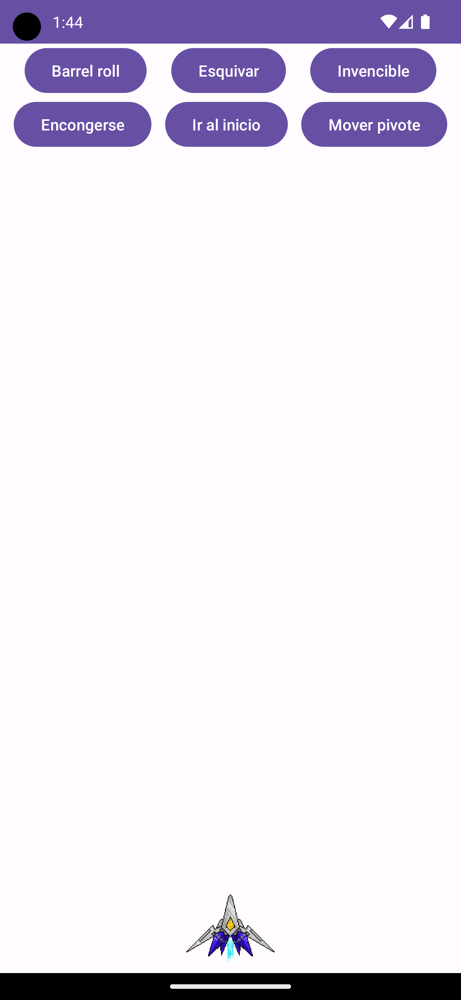

[`Kotlin Avanzado`](../../Readme.md) > [`Sesión 01`](../Readme.md) > `Ejemplo 1`

## Ejemplo 1: Animators

<div style="text-align: justify;">


### 1. Objetivos :dart:

- Comprender el funcionamiento esencial de las animaciones en Android
- Aplicar conocimientos para generar nuestras propias animaciones

### 2. Requisitos :clipboard:

1. Android Studio Instalado en nuestra computadora.

### 3. Desarrollo :computer:


#### Property Animations


Las propiedades son:

* ___translationX___ y ___translationY___: Mueve un ___View___ desde una posición inicial hsta una final, con respecto al sistema de coordenadas.
* ___rotation___, ___rotationX___ y ___rotationY___: controla la rotación, mientras que rotationX y rotationY controlan la rotación en un espacio tridimensional.
* ___scaleX___ y ___scaleY___: La escala con respecto a una dimensión (para x es el ancho, para y es el largo).
* ___pivotX___ y ___pivotY___: El pivote es un punto en el ___View___ de referencia para aplicar la tranformación de escalamiento y rotación, y por defecto está situado en su centro. Con estas propiedades podemos redefinir la posición del pivote.
* ___x___ y ___y___: Controla la posición del ___View___ con respecto a su container.
* ___alpha___: Determina la transparencia del ___View___, donde 0 es totalmente transparente y 1 es totalmente opaco.


#### Configuración inicial


El siguiente ejemplo consiste en realizar una serie de animaciones a una nave de Star Fox. El layout _main_activity.xml_ tiene la siguiente configuración:




Mediante los botones accionaremos dichas animaciones.


#### Value Animators


La clase ___ValueAnimator___ es una extensión 100% utilizable de la calse ___Animation___. Esta calcula los valores de la propiedad animada, y comunica las actualizaciones de dicho valor a través de un listener, donde podremos actualizar la propiedad de nuestro objeto a animar y hacer acciones extras.  


Vamos a animar un barrel roll (giro) mediante ___rotation___.


Creamos un método ___barrelRoll___ y ahí agregaremos lo necesario. Crearemos un ___ValueAnimator___ de valor flotante que rote dos veces, es decir 720°. 

```kotlin
val valueAnimator = ValueAnimator.ofFloat(0f, 720f)
```


A este objeto vamos a agregarle un listener que va a activarse cuando el flotante se actualice, aquí actualizaremos nuestra propiedad de rotación de nuestro ___View___. 

```kotlin
 valueAnimator.addUpdateListener {
        val value = it.animatedValue as Float //obteniendo el valor actual
        arwing.rotationX = value //asignando la posición de rotación
    }
```


Finalmente, configuraremos  la duración de la animación y la reproducimos. 


```kotlin
 valueAnimator.duration = 1000 
 valueAnimator.start()
```


El método queda así:

```kotlin
private fun barrelRoll() {
   
    valueAnimator.addUpdateListener {
        val value = it.animatedValue as Float
        arwing.rotation = value 
    }

    valueAnimator.duration = 1000 
    valueAnimator.start()
}
```


Jugamos ahora con las otras rotaciones  (___rotation___ y ___rotationX___ ) para ver cómo giran en torno a los 3 ejes.


#### Interpoladores

Una interpolación es el proceso de obtener puntos dentro de un rango de valores a partir de otros puntos. Los ___Interpolator___ son clases que interpolan valores con respecto del tiempo a partir de un rango de valores. Los interpoladores nos permitirán determinar el movimiento de una animación.


​							Ejemplos de curvas de animación con valores interpolados.


Agregaremos un interpolador a nuestro barrel Roll, de forma que el giro sea lineal:

```kotlin
valueAnimator.interpolator = LinearInterpolator()
```

Esto nos dará una velocidad de rotación constante. Ahora agregaremos una rotación que acelere y luego desacelere: 

```kotlin
valueAnimator.interpolator = AccelerateDecelerateInterpolator()
```


#### ObjectAnimator


Un ___ObjectAnimator___ es una clase que hereda de ___ValueAnimator___ y a diferencia de este último, solo requerimos pasar como parámetro el nombre de la propiedad a animar, sin requerir un listener. Esta clase se ocupa la mayor parte del tiempo, a menos que querramos realizar acciones personalizadas al actualizarse un valor de animación.


Vamos a animar la nave esquivando meteoritos a la izquierda y derecha, para esto oscilaremos los valores mediante un interpolador senoidal, que es cíclico por definición. Modificaremos la propiedad  ___translationX___.  

```kotlin
ObjectAnimator.ofFloat(arwing, "translationX", 200f).apply {
    duration = 3000
    interpolator = CycleInterpolator(1f)
    start()
```

El primer parámetro define el ___View___ que animaremos, el segundo es la propiedad a animar y el tercer parámetro es la cantidad a animar (para translation, son números de pixeles).


#### Animators como Resource Files


Ahora, animaremos el mismo movimiento a través de un archivo xml. 

Crearemos un directorio para almacenar nuestros animators, en ***res*** > ***new*** > ***android resource directory*** . En **Resource type** seleccionar ___animator___ y seleccionar OK.

Ahí crearemos nuestro recurso, donde describiremos nuestro animator. click derecho en ___animator___ > ___new___ > ***Animator Resource File***.

```xml
<objectAnimator xmlns:android="http://schemas.android.com/apk/res/android"
    android:propertyName="translationX"
    android:valueTo="200"
    android:valueType="floatType"
    android:interpolator="@android:anim/cycle_interpolator"
    android:duration="3000"
    />
```

Para hacer uso de este animator, añadimos lo siguiente:

```kotlin
AnimatorInflater.loadAnimator(this, R.animator.dodging).apply {
    setTarget(arwing)
    start()
}
```


___AnimatorSet___

La clase AnimatorSet sirve para ordenar y reproducir un bloque de animaciones de acuerdo al orden. Podemos declararlos como recurso o de forma programática.

Vamos a esquivar ahora mientras avanzamos en el eje y con la nave. Modificamos nuestro recurso ___dodging.xml___ para esto:

```xml
<?xml version="1.0" encoding="utf-8"?>
<set
    xmlns:android="http://schemas.android.com/apk/res/android"
    android:ordering="together">
    <objectAnimator
        android:propertyName="translationX"
        android:valueTo="200"
        android:valueType="floatType"
        android:interpolator="@android:anim/cycle_interpolator"
        android:duration="3000"
        />
    <objectAnimator
        android:propertyName="translationY"
        android:valueTo="-300"
        android:interpolator="@android:anim/decelerate_interpolator"
        android:valueType="floatType"
        android:duration="3000"
        />
</set>
```

tenemos dos ***objectAnimator*** dentro de un set, donde los animators se reproducen juntos (determinado en su atributo ___ordering___).

Lo reproducimos para comprobar. 


#### Transparencia eaccionando a eventos


Ahora vamos a volver invencible nuestra nave , esto se expresará en ocho intermitencias entre un color opaco a transparente, por lo que modificaremos la propiedad ___alpha___. Cada intermitencia durará 0.7 segundos. Dicho animator se llamará ___invincible.xml___.

```xml
<objectAnimator xmlns:android="http://schemas.android.com/apk/res/android"
    android:propertyName="alpha"
    android:valueFrom="0"
    android:valueTo="1"
    android:interpolator="@android:interpolator/accelerate_cubic"
    android:duration="700"
    android:repeatCount="8"
    android:valueType="floatType"
    />
```


Para utilizar la intermitencia, utilizaremos lo siguiente:

```kotlin
    AnimatorInflater.loadAnimator(this, R.animator.invincible).apply {
        setTarget(arwing)
        start()
    }
```


Podemos reaccionar a algunos eventos de nuestras animaciones a través de un listener para el animator. Podemos reaccionar a los siguientes eventos:

* Al su comienzo (***onAnimationStart***)
* A su finalización (***onAnimationEnd***) 
* Cuando este es cancelado (***onAnimationCancel***)
* Al repetirse (***onAnimationRepeat***)

Vamos a reaccionar a estos eventos declarando un listener para el animator, imprimiendo algo en un toast para cada ocasión:

```kotlin
addListener(object : AnimatorListener {
                override fun onAnimationStart(animation: Animator?) {
                    Toast.makeText(applicationContext, "iniciando blinking", Toast.LENGTH_SHORT)
                        .show()
                }

                override fun onAnimationEnd(animation: Animator?) {
                    Toast.makeText(applicationContext, "terminando blinking", Toast.LENGTH_SHORT)
                        .show()
                }

                override fun onAnimationCancel(animation: Animator?) {
                    Toast.makeText(applicationContext, "blinking cancelado", Toast.LENGTH_SHORT)
                        .show()
                }

                override fun onAnimationRepeat(animation: Animator?) {
                    Toast.makeText(applicationContext, "repitiendo parpadeo", Toast.LENGTH_SHORT)
                        .show()
                }

            })
```


#### AnimatorSet anidados

Vamos a encoger por dos segundos nuestra nave y regresamos a su tamaño natural, por lo cual estos son los pasos a realizar:

1. Encogemos en **x** y **y** nuestro objeto con una animación que dure 0.6 segundos.
2. Esperamos dos segundos.
3. Desencogemos en las dos dimensiones con una animación que dure 0.6 segundos.

Una forma de lograr esto es declarando sets anidados, para manipular dos animaciones al mismo tiempo, y luego las otras dos. La primera forma de hacer esto es mediante el siguiente archivo ___shrink.xml___:


```xml
<set
    xmlns:android="http://schemas.android.com/apk/res/android"
    android:ordering="sequentially">
    <set
        android:ordering="together">
        <objectAnimator
            android:propertyName="scaleX"
            android:valueTo="0.6"
            android:valueType="floatType"
            android:interpolator="@android:anim/decelerate_interpolator"
            android:duration="600"
            />
        <objectAnimator
            android:propertyName="scaleY"
            android:valueTo="0.6"
            android:valueType="floatType"
            android:interpolator="@android:anim/decelerate_interpolator"
            android:duration="600"
            />
    </set>
    <set>
        <objectAnimator
            android:propertyName="scaleX"
            android:valueTo="1"
            android:interpolator="@android:anim/accelerate_interpolator"
            android:valueType="floatType"
            android:duration="600"
            android:startOffset="2000"
            />
        <objectAnimator
            android:propertyName="scaleY"
            android:valueTo="1"
            android:interpolator="@android:anim/accelerate_interpolator"
            android:valueType="floatType"
            android:duration="600"
            android:startOffset="2000"
        />
        </set>

</set>
```

Cada ***AnimatorSet*** interno  reproduce sus animaciones al mismo tiempo, pero el externo determina que las animaciones son secuenciales, logrando que se reproduzca primero el ___set___ superior y después el interior. El offset en los dos últimos *objectAnimator* permiten la pausa de dos segundos en el estado pequeño de la nave.

```kotlin
AnimatorInflater.loadAnimator(this, R.animator.shrink).apply {
    setTarget(arwing)
    start()
}
```


#### Animando con ViewPropertyAnimator

Con esta clase podemos ejecutar una serie de animaciones paralelas a un View de forma sencilla.

Vamos a animar el regreso de nuestra nave al punto de inicio, para esto utilizaremos el método ___animate___ de nuestro view y haremos una traslación del eje x y y al punto inicial (el 0). Aplicaremos cada transformación de una propiedad como un método, así la propiedad _translationX()_ se convierte en ___translationX(0f)___ para mover el view en el eje x a la posición 0.

```kotlin
arwing.animate().apply {
            translationX(0f)
            translationY(0f)
            duration = 1000
            interpolator = AccelerateDecelerateInterpolator()
            start()
        }
```


#### PropertyValuesHolder

Tal y como lo dice su nombre, esta clase es un Holder, es decir, una clase que retiene algunas propiedades necesarias para reproducir una animación. Con un conjunto de estas, se pueden animar varias propiedades de un View con un solo Animator.


Vamos a cambiar el pivote en el eje ***x*** y ***y*** durante 4 segundos, aplicando una transparencia en ese intervalo como indicador del cambio. La animación durará 0.5 segundos. Para crear nuestro holder, utilizaremos la siguiente sintaxis:

```kotlin
PropertyValuesHolder.ofFloat("pivotX", 0f)
```

 Donde el primer parámetro corresponde al nombre de la propiedad a animar y el segundo (0f) implica el valor destino a animar. Por lo tanto, para hacer el cambio de pivote tenemos:


```kotlin
val initPivotX = PropertyValuesHolder.ofFloat("pivotX", 0f)
val initPivotY = PropertyValuesHolder.ofFloat("pivotY", 0f)
val transparent = PropertyValuesHolder.ofFloat("alpha", 0.6f)
val animation1 =
    ObjectAnimator.ofPropertyValuesHolder(arwing, initPivotX, initPivotY, transparent)
animation1.duration = 500
```

Ahora pretendemos regresar el pivote al centro de nuestro _View_, por lo cual tendremos qué calcular el centro de cada eje y utilizarlo en nuestros PropertyValuesHolder. Para el segundo animator, tenemos qué realizar un delay de 4 segundos.

```kotlin
     val pivotCenterX = arwing.width.toFloat() / 2f
        val pivotCenterY = arwing.height.toFloat() / 2f
        val centerPivotX = PropertyValuesHolder.ofFloat("pivotX", pivotCenterX)
        val centerPivotY = PropertyValuesHolder.ofFloat("pivotY", pivotCenterY)
        val opacy = PropertyValuesHolder.ofFloat("alpha", 1f)
val animation2 =
            ObjectAnimator.ofPropertyValuesHolder(arwing, centerPivotX, centerPivotY, opacy).apply {
                duration = 500
                startDelay = 4000
            }
```


Ahora que tenemos los dos ***ObjectAnimator***, debemos ser capaces de correrlos mediante un ___AnimatorSet___ y darle la instrucción de comenzar, por lo que implementamos el siguiente código:

```kotlin
AnimatorSet().apply {
    playSequentially(animation1, animation2)
    start()
}
```

 


[`Anterior`](../Readme.md) | [`Siguiente`](../Reto-01)

</div>

