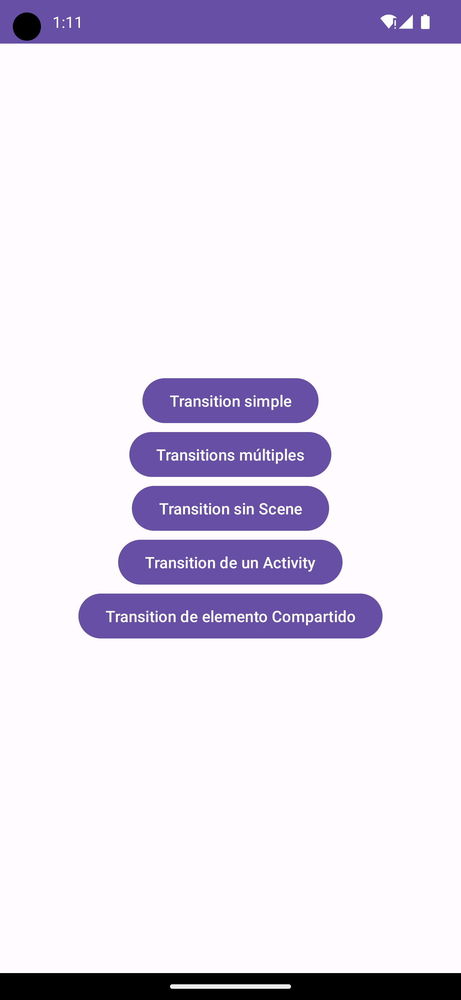
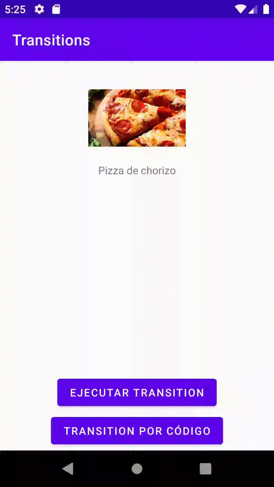
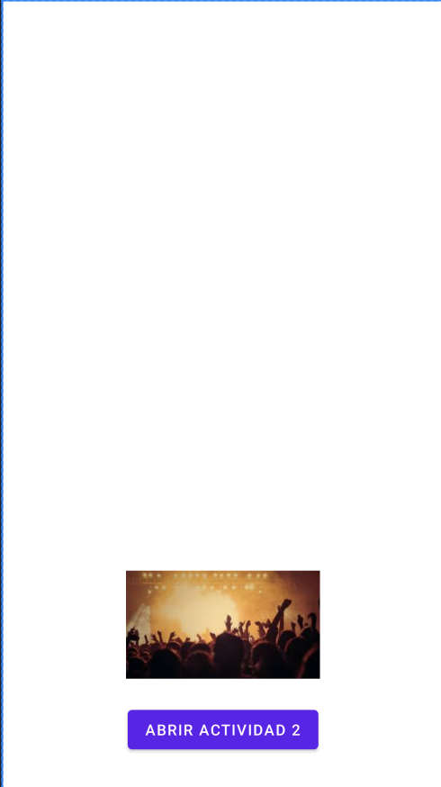
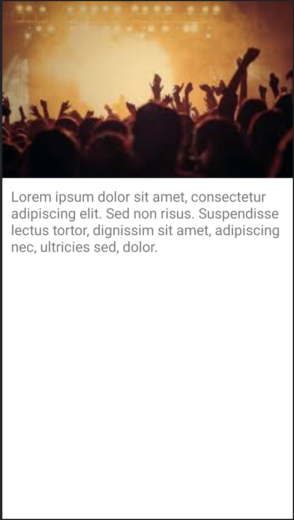

[`Kotlin Avanzado`](../../Readme.md) > [`Sesión 01`](../Readme.md) > `Ejemplo 2`

## Ejemplo 2: Transitions

<div style="text-align: justify;">


### 1. Objetivos :dart:

- Comprender el funcionamiento esencial de las animaciones en Android
- Aplicar conocimientos para generar nuestras propias animaciones

### 2. Requisitos :clipboard:

1. Android Studio Instalado en nuestra computadora.

### 3. Desarrollo :computer:

#### Configuración inicial

El menú principal de esta aplicación consta de una serie de botones que nos llevarán a distintas _Activities_, en cada una de estas se tratará un ejercicio distinto acerca de *Transitions*. El código que usaremos será la carpeta llamada [base]().




##### Scenes y Transitions


Previamente abordamos cómo animar Views a través de animators. Las animaciones requieren configurar ciertos parámetros para personalizarla. Esto resulta conveniente para varias ocasiones, pero qué pasa si queremos animar el cambio en un layout? Utilizar un _Animator_ podría ser problemático. Afortunadamente, android provee de un framework llamado que crea animaciones entre escenas, estos son los ___transitions___.

Un ***Transition*** es una clase capaz de crear una transición entre dos escenas, cada ___Scene___ representa el estado de una jerarquía de views, incluyendo sus propiedades (posición, tamaño, color, etc.). Dichas scenes se pueden representar mediante layouts o incluso de forma dinámica via código. Con dos Scenes, podemos establecer un estado inicial y uno final para una jerarquía de Views.


Primero, crearemos las dos escenas a animar: ___scene_one___ y ___scene_two___, que serán recursos en la carpeta ___layout___.

Dentro de ___scene_one___ pondremos el estado inicial de nuestro archivo:


Abriremos ___TransitionActivity___, aquí animaremos nuestras dos escenas:


Que corresponde al siguiente código:

```xml
<androidx.constraintlayout.widget.ConstraintLayout
    xmlns:android="http://schemas.android.com/apk/res/android"
    xmlns:app="http://schemas.android.com/apk/res-auto"
    xmlns:tools="http://schemas.android.com/tools"
    android:layout_width="match_parent"
    android:layout_height="match_parent">

    <ImageView
        android:id="@+id/imgPizza"
        android:layout_width="128dp"
        android:layout_height="86dp"
        android:layout_marginTop="32dp"
        app:layout_constraintEnd_toEndOf="parent"
        app:layout_constraintStart_toStartOf="parent"
        app:layout_constraintTop_toTopOf="parent"
        app:srcCompat="@drawable/pizza_chorizo" />

    <TextView
        android:id="@+id/textPizza"
        android:layout_width="wrap_content"
        android:layout_height="wrap_content"
        android:layout_marginTop="16dp"
        android:text="Pizza de chorizo"
        app:layout_constraintEnd_toEndOf="parent"
        app:layout_constraintStart_toStartOf="parent"
        app:layout_constraintTop_toBottomOf="@+id/imgPizza" />
</androidx.constraintlayout.widget.ConstraintLayout>
```


y esta será nuestra segunda escena:


Cuyo código es el siguiente:

```xml
<androidx.constraintlayout.widget.ConstraintLayout
    xmlns:android="http://schemas.android.com/apk/res/android"
    xmlns:app="http://schemas.android.com/apk/res-auto"
    xmlns:tools="http://schemas.android.com/tools"
    android:layout_width="match_parent"
    android:layout_height="match_parent">

    <ImageView
        android:id="@+id/imgPizza"
        android:layout_width="0dp"
        android:layout_height="128dp"

        android:scaleType="centerCrop"
        app:layout_constraintEnd_toEndOf="parent"
        app:layout_constraintStart_toStartOf="parent"
        app:layout_constraintTop_toTopOf="parent"
        app:srcCompat="@drawable/pizza_chorizo" />

    <TextView
        android:id="@+id/textPizza"
        android:layout_width="wrap_content"
        android:layout_height="wrap_content"
        android:text="Pizza de chorizo"
        android:textColor="#DDFFFFFF"
        android:textSize="24sp"
        android:textStyle="bold"
        app:layout_constraintBottom_toBottomOf="@+id/imgPizza"
        app:layout_constraintEnd_toEndOf="parent"
        app:layout_constraintHorizontal_bias="0.08"
        app:layout_constraintStart_toStartOf="parent"
        app:layout_constraintTop_toTopOf="@+id/imgPizza"
        app:layout_constraintVertical_bias="0.89" />
</androidx.constraintlayout.widget.ConstraintLayout>
```


Estas dos escenas contienen un ImageView y un TextView con los mismos id's, lo cual garantiza que sean equivalentes al momento de animarse.

Abrimos ahora nuestro ___TransitionActivity___, donde representaremos nuestras escenas y generaremos la transición.

creamos los siguientes atributos para almacenar las dos escenas y para representar la escena activa:

```kotlin
private lateinit var sceneOne: Scene
private lateinit var sceneTwo: Scene
private lateinit var currentScene: Scene=
```

En el método ___onCreate___, asignamos nuestras escenas.

```kotlin
sceneOne = Scene.getSceneForLayout(binding.container, R.layout.scene_one, this)
sceneTwo = Scene.getSceneForLayout(binding.container, R.layout.scene_two, this)
currentScene = sceneOne
```


Ahora, vamos a crear nuestra primera transición. Para el botón ___btnTransition___ declararemos un listener donde activemos nuestra transición a la escena dos (presuponiendo que estamos en la escena uno).

```kotlin
binding.btnTransition.setOnClickListener {
    TransitionManager.go(sceneTwo)
}
```


Dentro del ***FrameLayout*** de ___activity_transition.xml___, debemos incluir por defecto la escena uno:

```xml
<FrameLayout
             ...>
    <include layout="@layout/scene_one" />
</FrameLayout>
```


Ejecutamos el ejemplo y pulsamos al botón:




Debido a que no especificamos ninguna transición al _TransitionManager_, El ***Transition*** fue el default: __AutoTransition__, que reproduce un _fade out_, mueve y cambia tamaño, y al final ejecuta un *fade in*.

Para especificar un _Transition_ con nuestros propios parámetros, crearemos un nuevo directorio de recursos llamado _transition_ (que contenga valores transition). Dentro de él, creamos un recurso ___bounds.xml___ y especificamos nuestro transition, que será del tipo ___ChangeBounds___:

```xml
<changeBounds
    xmlns:android="http://schemas.android.com/apk/res/android"
    android:duration="500"
    android:interpolator="@android:interpolator/accelerate_cubic"
    />
```

Para obtener esta transición en el listener de nuestro botón, ponemos lo siguiente:

```kotlin
val transition = TransitionInflater.from(this).inflateTransition(R.transition.bounds)
```

Finalmente, pasamos al ___TransitionManager___ nuestro _transition_ como segundo parámetro.

```kotlin
TransitionManager.go(sceneTwo, transition)
```

La animación ahora se ajusta a nuestras especificaciones:


La implementación de un ___Transition___ de forma programática es similar. Ahora vamos a hacer la transición de la escena uno a la dos y viceversa, dependiendo de la escena activa. Primero, crearemos nuestro objeto _transition_:

```kotlin
val transition = ChangeBounds().apply {
    interpolator = AccelerateInterpolator()
    duration = 500
}
```

Ahora, para hacer el cambio dependiendo de la escena actual, implemenamos lo siguiente:

```kotlin
currentScene = if(currentScene == sceneOne){
    TransitionManager.go(sceneTwo,transition)
    sceneTwo
} else{
    TransitionManager.go(sceneOne,transition)
    sceneOne
}
```


#### Transition Sets

Similar a los Animator Sets, un ___TransitionSet___ tiene la capacidad de reproducir varias transiciones al mismo tiempo o de forma secuencia. Se pueden definir a través de recursos o programáticamente.

Ahora crearemos un TransitionSet llamado ___transition_set.mxl___ y dentro de él declaramos un ___transitionSet___ como elemento padre, cuyas transiciones se ejecutarán al mismo tiempo.


```xml
<transitionSet
    xmlns:android="http://schemas.android.com/apk/res/android"
    android:transitionOrdering="together"
    >
  </transitionSet>
```


El primer elemento será el changeBounds de nuestro xml anterior. 

```xml
<changeBounds
    xmlns:android="http://schemas.android.com/apk/res/android"
    android:duration="500"
    android:interpolator="@android:interpolator/accelerate_cubic"
    />
```

Como la transición que animaremos será similar a la del primer ejemplo, pero con un FAB cuando la imagen se vuelve header, tenemos qué crear una animación fade in (de transparente a opaco) para la aparición de nuestro botón por lo cual definiremos una transición específica y lo ligaremos al botón mediante su id.

```xml
<fade
    android:duration="300"
    android:startDelay="400"
    android:fadingMode="fade_in">
    <targets>
        <target
            android:targetId="@id/fab"/>
    </targets>
</fade>
```


En ___TransitionSetActivity___, podremos notar que las asignaciones de las *Scenes* están comentadas, por lo cual debemos des comentarlas. También definiremos el listener para el botón que reproducirá nuestra transición de acuerdo a la escena activa:

```kotlin
binding.btnTransitionSet.setOnClickListener {
    val transition = TransitionInflater.from(this).inflateTransition(R.transition.transition_set)
    currentScene = if(currentScene == sceneOne){
        TransitionManager.go(sceneThree,transition)
        sceneThree
    } else{
        TransitionManager.go(sceneOne,transition)
        sceneOne
    }
}
```

No olvidemos definir el layout inicial en el contenedor de nuestro ___activity_transition_set.xml___.

Corremos el proyecto y probamos nuestra transición. Podremos notar que la aparición del FAB es bastante fluída, no obstante, al cambiar de la escena tres a la uno, notamos que la desaparición del FAB es muy abrupta; para solucionar esto, creaermos una animación de fade out.

```xml
<fade
    android:duration="300"
    android:fadingMode="fade_out">
    <targets>
        <target
            android:targetId="@id/fab"/>
    </targets>
</fade>
```

Con esto, al reproducir nuestra transición obtenemos lo siguiente:


#### Transitions Sin Scene

Existen algunos casos en donde no es necesario definir dos layouts diferentes que creen una transición, esto sucede cuando los cambios entre las dos jerarquías son mínimos, como desaparecer algún elemento de la jerarquía o aplicar un cambio menor. Para estos casos, podemos utilizar una transición sin escenas, esto se realiza realizando el cambio menor en la jerarquía y ejecutando el método ___beginDelayedTransition()___ de nuestro __TransitionManager__.


En el layout correspondiente a ___ActivityNoScene___ Podemos encontral una pantalla que simula los ajustes de perfil, el objetivo es animar la desaparición del texto. Para agregar el código, tenemos qué gestionar el evento de cambio de estado en el switch, por lo que declaremos:

```kotlin
binding.switch1.setOnCheckedChangeListener{
            _, isChecked ->
        }
```

después de la flecha pondremos nuestro código. Para la animación, crearemos un efecto de _slide_ con desplazamiento a la derecha (por lo que su gravedad final queda al final horizontal). después de tener la transición, preparamos nuestro _delayed transition_ y después ejecutamos el estado (visible o invisible) según el estado del switch.

```kotlin
val transition = Slide(Gravity.END)
            TransitionManager.beginDelayedTransition(view,transition)
            binding.textEmail.visibility = if(isChecked) View.INVISIBLE else View.VISIBLE
```


Ahora, agregaremos la funcionalidad del botón para el campo de teléfono: 

1. Crearemos un ___EditText___ por código 

```kotlin
val editText = EditText(this).apply {
    id = View.generateViewId()
    hint = "Teléfono"
    layoutParams = ViewGroup.LayoutParams(
        ConstraintLayout.LayoutParams.MATCH_PARENT,
        ConstraintLayout.LayoutParams.WRAP_CONTENT
    )
}
```

2. Definiremos un ___TransitionSet___ con animaciones tanto para el nuevo _EditText_ como para el _botón_ que desaparecerá y correremos nuestro *delayed transition*.

   ```kotlin
   val editTextTransition = Fade(Fade.IN).apply {
       addTarget(editText)
   }
   
   val buttonTransition = Fade(Fade.OUT).apply {
       addTarget(binding.button)
   }
   
   
   val transitionSet = TransitionSet().apply {
       addTransition(editTextTransition)
       addTransition(buttonTransition)
   }
   TransitionManager.beginDelayedTransition(view, transitionSet)
   ```

3. Agregaremos el _EditText_ a nuestro ___ViewGroup___

   ```kotlin
   binding.constraintLayout.addView(editText)
   ```

4. Definiremos las restricciones del _EditText_ para el ___ConstraintLayout___ y los aplicaremos

   ```kotlin
   ConstraintSet().apply {
       clone(binding.constraintLayout)
       connect(
           editText.id,
           ConstraintSet.TOP,
           R.id.switch1,
           ConstraintSet.BOTTOM,
           32
       )
       connect(
           editText.id,
           ConstraintSet.START,
           R.id.constraintLayout,
           ConstraintSet.START,
           64
       )
       connect(
           editText.id,
           ConstraintSet.END,
           R.id.constraintLayout,
           ConstraintSet.END,
           64
       )
       applyTo(binding.constraintLayout)
   }
   ```

   

5. Desapareceremos nuestro botón

6. ```kotlin
   binding.button.visibility = View.GONE
   ```


Los resultados de las dos transiciones se visualizan así:


#### Transition en un Activity

Ahora animaremos una transición entre _Activities_. Este par de transiciones consiste en remover de la pantalla el layout del activity actual con sus elementos e introducir a la nueva de la jerarquía del activity llamado, lo cual equivaldría a dos sets de transiciones (uno para el saliente y otro para el entrante).

Para este ejemplo modificaremos la clase ___ActivitiesTransitionActivity___. Definiremos un set de transiciones para la primera pantalla (un fade para los elementos en general, un slide a la izquierda para la imagen de bedu y otro slide hacia abajo para el botón de iniciar sesión). Nuestro archivo de recursos queda así:

```xml
<transitionSet
    xmlns:android="http://schemas.android.com/apk/res/android">
    <fade/>
    <slide
        android:slideEdge="start">
        <targets>
            <target
                android:targetId="@id/imgBedu"/>
        </targets>
    </slide>
    <slide
        android:slideEdge="bottom">
        <targets>
            <target
                android:targetId="@id/btnLogin"/>
    </targets>
    </slide>
</transitionSet>
```


Inflamos nuestro recurso mediante la siguiente línea:

```kotlin
val transitionXml = TransitionInflater.from(this).inflateTransition(R.transition.transition_set_activity)
```

Ahora, requerimos definir la transición de salida para este activity (la transición a ejecutar cuando este arranque otro _activity_). 

```kotlin
window.exitTransition = transitionXml
```

Ahora solo resta escribir el código para abrir nuestro _activity_ al pulsar el botón de iniciar sesión, agregando una opción extra para que la transición se lleve a cabo.

```kotlin
binding.btnLogin.setOnClickListener {
    val intent = Intent(this, TransitionedActivity::class.java)
    startActivity(intent, ActivityOptions.makeSceneTransitionAnimation(this).toBundle())
}
```

Si ejecutamos ahora y pulsamos al botón de iniciar sesión, la transición de salida de este activity se ejecutará, sin embargo, para la transición de entrada de ___TransitionedActivity___, sólo se muestra un _fade_ genérico, por lo que aquí también personalizaremos su animación.

```kotlin
val transition = Slide(Gravity.TOP)
transition.duration = 500
window.enterTransition = transition
```

Esto hará que todas las _Views_ entren desde abajo hacia arriba en 0.5 segundos.


Ejecutamos el código, podemos ver que ahora ambas transiciones se ejecutan. Si se observa bien, podemos observar que algunos elementos como el _action bar_ o el _status bar_ también son afectados por los _transitions_, por lo que debemos excluirlos de la transición en ambos lados.


En ___ActivitiesTransitionActivity___, la restricción quedaría así:

```kotlin
val transitionXml = TransitionInflater
            .from(this).inflateTransition(R.transition.transition_set_activity).apply {
                excludeTarget(window.decorView.findViewById<View>(R.id.action_bar_container), true)
                excludeTarget(android.R.id.statusBarBackground, true)
                excludeTarget(android.R.id.navigationBarBackground, true)
            }
```


Mientras que en ___TransitionedActivity___, la transición tendría esta forma:

```kotlin
val transition = Slide(Gravity.TOP).apply {
            duration = 500
            excludeTarget(window.decorView.findViewById<View>(R.id.action_bar_container), true)
            excludeTarget(android.R.id.statusBarBackground, true)
            excludeTarget(android.R.id.navigationBarBackground, true)
        }
```


El resultado queda así:


#### Shared Transition

Un Shared Transition es una transición entre dos _activities_ o _fragments_ que comparten uno o más elementos en común, lo cual conlleva una animación entre ellas para reciclarlas, reescalarlas y posicionarlas en el nuevo layout.

Ahora continuamos con la transición compartida. Previamente, podemos observar un layout para nuestro ___SharedTransitionActivity___ que contiene una imagen y un botón. Nótese que en el ImageView vemos un atributo llamado transitionName con valor ___header_transition___.

```xml
<?xml version="1.0" encoding="utf-8"?>
<RelativeLayout xmlns:android="http://schemas.android.com/apk/res/android"
    android:layout_width="match_parent"
    android:layout_height="match_parent">

    <ImageView
         ...
        android:transitionName="header_transition" />
   ...
</RelativeLayout>
```

El layout de este, se ve de la siguiente forma:




Mientras que en el layout ___activity_shared_transitioned___ podemos ver otro ___ImageView___ que contiene la misma imagen, el mismo *id* y el mismo _transitionName_ que el anterior.


```xml
<LinearLayout xmlns:android="http://schemas.android.com/apk/res/android"
    android:layout_width="match_parent"
    android:layout_height="match_parent"
    android:orientation="vertical">
    <ImageView
        ...
        android:transitionName="header_transition" />
...
</LinearLayout>
```




 En la clase de nuestro activity, definiremos el listener de nuestro botón para generar una transición entre actividades que comparten un elemento que en esta caso es nuestra imagen. Para crear la transición, debemos hacer lo siguiente:

1. Obtener el transitionName que relaciona la imagen en los dos layouts de los _activities_.

2. Crear un nuevo objeto ___ActivityOptionsCompat___  que contiene lo necesario para animar nuestra imagen (hay qué brindarle tanto la imagen a animar como el ___transitionName___ para identificar al _view_ del siguiente layout).

3. Navegar a la siguiente _activity_.

El código para implementar los pasos anteriores es el siguiente:

```kotlin
val intent = Intent(this, SharedTransitionedActivity::class.java)

            //se obtiene el nombre de la transción para identificar nuestros diseños, crear las escenas
            //y la animación de la transición
            val options = ViewCompat.getTransitionName(binding.imgConcert)?.let {
                ActivityOptionsCompat.makeSceneTransitionAnimation(
                    this, binding.imgConcert, it
                )
            }
            startActivity(intent, options?.toBundle())
```


Lo anterior nos conlleva a obtener la siguiente transición:


[`Anterior`](../Reto-01) | [`Siguiente`](../Reto-02)

</div>

