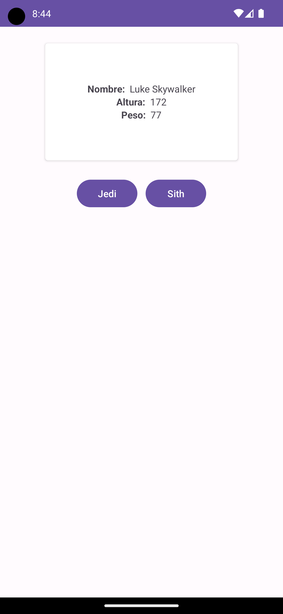

[`Kotlin Avanzado`](../../Readme.md) > [`Sesión 02`](../Readme.md) > `Ejemplo 1`

## Ejemplo 1: OkHttp y HttpUrlConnection

<div style="text-align: justify;">


### 1. Objetivos :dart:

* Que el alumno aprenda a manejar la librería OkHttp y sus funcionalidades para hacer peticiones a un servidor.

### 2. Requisitos :clipboard:

1. Tener conocimientos previos de protocolo HTTP y de clientes para comunicación web.
2. Haber tomado la sección de OkHttp de la sesión 3 del curso.

### 3. Desarrollo :computer:

OkHttp es un cliente http para aplicaciones android y Java. Goza de ser uno de los clientes más utilizados y por eso la importancia de ejemplificarla :shipit:. 


1. Creamos un proyecto con *Activity* en blanco.

2. Para instalar la dependencia, agregamos esta línea en nuestro *build.gradle* dentro de la carpeta *app*

```kotlin
implementation("com.squareup.okhttp3:okhttp:4.9.0")
```

3. Sincronizamos el proyecto con el botón *Sync project with gradle files* para aplicar los cambios e instalar la dependencia.

4. Debemos agregar el permiso de internet en nuestro *manifest*, de otra manera la aplicación crasheará al querer hacer una petición.

```xml
<uses-permission android:name="android.permission.INTERNET" />
```

y esta String en **strings.xml**:

```xml
    <string name="choosen_planet">El planeta elegido se llama: </string>
```

5. Creamos un layout con dos botones: Uno para hacer una llamada síncrona y otra para una asíncrona:

```xml
<?xml version="1.0" encoding="utf-8"?>
<androidx.constraintlayout.widget.ConstraintLayout xmlns:android="http://schemas.android.com/apk/res/android"
    xmlns:app="http://schemas.android.com/apk/res-auto"
    xmlns:tools="http://schemas.android.com/tools"
    android:layout_width="match_parent"
    android:layout_height="match_parent"
    tools:context=".MainActivity">
    
    <Button
        android:text="llamada asíncrona"
        android:id="@+id/btnRequest"
        android:layout_width="wrap_content"
        android:layout_height="wrap_content"
        app:layout_constraintBottom_toBottomOf="parent"
        app:layout_constraintEnd_toEndOf="parent"
        app:layout_constraintStart_toStartOf="parent"
        app:layout_constraintTop_toTopOf="parent" />

    <TextView
        android:id="@+id/textView"
        android:layout_width="wrap_content"
        android:layout_height="wrap_content"
        android:text="Aun no hay llamada"
        app:layout_constraintBottom_toTopOf="@+id/btnRequest"
        app:layout_constraintEnd_toEndOf="parent"
        app:layout_constraintStart_toStartOf="parent"
        app:layout_constraintTop_toTopOf="parent"
        app:layout_constraintVertical_bias="0.77" />

    <Button
        android:id="@+id/btnSincrono"
        android:layout_width="wrap_content"
        android:layout_height="wrap_content"
        android:text="Llamada síncrona"
        app:layout_constraintBottom_toBottomOf="parent"
        app:layout_constraintEnd_toEndOf="parent"
        app:layout_constraintStart_toStartOf="parent"
        app:layout_constraintTop_toBottomOf="@+id/btnRequest"
        app:layout_constraintVertical_bias="0.110000014" />

</androidx.constraintlayout.widget.ConstraintLayout>
```

6. Declaramos la url base como variable de nuestra clase: 

```kotlin
private val baseUrl = "https://swapi.dev/api/planets/"
```

y en *onCreate()*, setearemos el listener de nuestro botón asíncrono:

```kotlin
 btnRequest.setOnClickListener{
        llamadaAsincrona()
}
```

7.- vamos a crear la función *llamadaAsincrona()*, donde estableceremos el código para hacer una petición, recordemos que la petición se hará en un hilo y al momento de obtener la respuesta, un callback se ejecutara en otro hilo. La información que recopilaremos es acerca de los planetas de star wars.

Crearemos una instancia del cliente, generaremos la url con el número de planeta que queremos (uno random), generaremos el objeto de la petición y la enviamos con **enqueue()**, definiremos los callbacks de respuesta recibida y error, y correremos la aplicación.

```kotlin
fun llamadaAsincrona(){

        //instanciando al cliente
        val okHttpClient = OkHttpClient()

        //obteniendo la url completa
        val planetNumber = Random.nextInt(1,60) //son 60 planetas
        val url = "$baseUrl$planetNumber/"

        //El objeto Request contiene todos los parámetros de la petición (headers, url, body etc)
        val request = Request.Builder()
            .url(url)
            .build()

        //enviando y recibiendo las llamadas de forma asíncrona
        okHttpClient.newCall(request).enqueue(object : Callback {

            //el callback a ejecutar cuando hubo un error
            override fun onFailure(call: Call, e: IOException) {
                Log.d("Error",e.toString())
            }

            //el callback a ejectutar cuando obtuvimos una respuesta
            override fun onResponse(call: Call, response: Response) {
                val body = response.body?.string()
                Log.d("Response: ", body)

            }
        })
    }
```

8.-¡Bien! ahora, en vez de imprimir el json recibido, imprimiremos en el textView únicamente el nombre del planeta. Para ello utilizaremos JSONObject, que vuelve un objeto al json obtenido y corremos la app. El código de abajo va dentro del *onResponse*.

```kotlin
 val json = JSONObject(body)
val phrase = getString(R.string.choosen_planet)
val planet = json.getString("name")

Log.d("Response: ", "name: $planet")

```

9.- Ahora, vamos a reemplazar la impresión a consola en el nombre, para ponerlo en el textView

```kotlin
textView.text ="$phrase $planet"
```

¿Qué sucedió? consulten el *logcat* y comenten cuál es la causa.

10. saldrá un error parecido a esto:

```bash
 1576735063.300 15128-15156/org.bedu.okhttpexample E/AndroidRuntime: FATAL EXCEPTION: OkHttp Dispatcher
    Process: org.bedu.okhttpexample, PID: 15128
    android.view.ViewRootImpl$CalledFromWrongThreadException: Only the original thread that created a view hierarchy can touch its views.
```

Esto se debe a que estamos seteando el texto del textView en un hilo que no es el principal (ahí se infló la vista). Metemos entonces esa línea dentro de **runUiThread**

```bash
 runOnUiThread{
     textView.text ="$phrase $planet"
}
```

Y corremos la aplicación. Veremos algo similar a esto: 

<p align:"center">
        
</p>

11.- Ahora crearemos nuestra *llamadaSincrona()*

```kotlin
    //Nuestro thread se bloquea hasta recuperar la información
    fun llamadaSincrona(){

        val client = OkHttpClient()

        //obteniendo la url completa
        val planetNumber = Random.nextInt(1,61) //son 61 planetas
        val url = "$baseUrl$planetNumber/"

        val request =  Request.Builder()
                .url(url)
                .build()

        try {
            val response = client.newCall(request).execute()
            val body = response.body?.string()
            Log.d("Response: ", body)

            val json = JSONObject(body)
            val phrase = getString(R.string.choosen_planet)
            val planet = json.getString("name")
            runOnUiThread{
                textView.text ="$phrase $planet"
            }
        } catch (e: Error){
            Log.e("Error",e.toString())
        }
    }
```

y la metemos como listener de nuestro botón síncrono:

```kotlin
btnSincrono.setOnClickListener{
        llamadaSincrona()
}
```

corremos la app y ejecutamos el botón...

¿Qué sucedió? Coméntalo conn tus compañeros

12.- El error se debe a que no se puede pausar el hilo principal (Main Thread), por lo que tendremos qué meter nuestro callback dentro de un Thread alterno:

```kotlin
btnSincrono.setOnClickListener{
            Thread{
                llamadaSincrona()
            }.start()
        }
```

Corre la aplicación y ¡Éxito! la respuesta debe ser parecida a la anterior.

[`Anterior`](../Readme.md) | [`Siguiente`](../Reto-01)      

</div>

