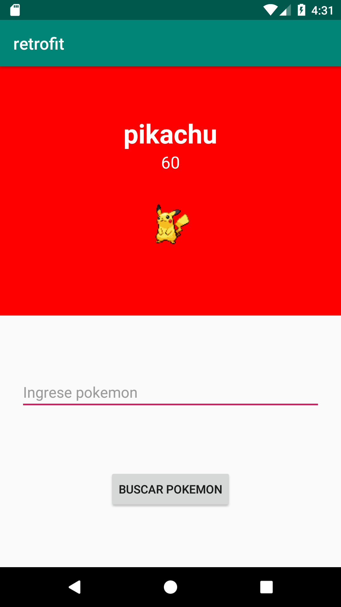

[`Kotlin Avanzado`](../../Readme.md) > [`Sesión 02`](../Readme.md) > `Ejemplo 2`

## Ejemplo 2: Interceptores y GSON

<div style="text-align: justify;">


### 1. Objetivos :dart:

- Que el usuario aprenda a interceptar peticiones y modificarlas 
- Que implemente la librería GSON para obtener en un mejor formato las respuestas de una petición

### 2. Requisitos :clipboard:

1. Haber terminado el [Ejemplo 01](../Ejemplo-01)
2. Haber terminado el [Reto 01](../Reto-01)
3. Haber estudiado previamente estos temas en las diapositivas

### 3. Desarrollo :computer:

El siguiente ejercicio será similar al primero

Contaremos con una tarjeta que contendrá datos esenciales de un jedi. Por medio de un Interceptor cambiaremos al jedi por un sith y la información la recuperaremos con GSON.


1. Crear un proyecto con actividad en blanco.

2. Agregar la dependencia Gson a gradle.

```kotlin
implementation 'com.google.code.gson:gson:2.8.6' 
```

3. En *AndroidManifest.xml*, agregar el permiso a Internet.

4. Utilizar este layout para mayor velocidad.

```xml
<?xml version="1.0" encoding="utf-8"?>
<LinearLayout xmlns:android="http://schemas.android.com/apk/res/android"
    xmlns:app="http://schemas.android.com/apk/res-auto"
    xmlns:tools="http://schemas.android.com/tools"
    android:gravity="center_horizontal"
    android:orientation="vertical"
    android:layout_width="match_parent"
    android:layout_height="match_parent"
    tools:context=".MainActivity">

    <androidx.cardview.widget.CardView
        xmlns:card_view="http://schemas.android.com/apk/res-auto"
        android:layout_width="280dp"
        android:layout_height="170dp"
        android:id="@+id/card_view"
        card_view:cardCornerRadius="4dp"
        android:layout_marginTop="24dp">
        <LinearLayout
            android:layout_width="match_parent"
            android:layout_height="match_parent"
            android:gravity="center"
            android:orientation="vertical"
                >
            <LinearLayout
                android:orientation="horizontal"
                android:layout_width="wrap_content"
                android:layout_height="wrap_content">
                <TextView
                    android:textStyle="bold"
                    android:text="Nombre:  "
                    android:layout_width="match_parent"
                    android:layout_height="match_parent" />
                <TextView
                    android:text="---"
                    android:id="@+id/tvName"
                    android:layout_width="match_parent"
                    android:layout_height="match_parent" />
            </LinearLayout>

            <LinearLayout
                android:orientation="horizontal"
                android:layout_width="wrap_content"
                android:layout_height="wrap_content">
                <TextView
                    android:textStyle="bold"
                    android:text="Altura:  "
                    android:layout_width="match_parent"
                    android:layout_height="match_parent" />
                <TextView
                    android:text="---"
                    android:id="@+id/tvHeight"
                    android:layout_width="match_parent"
                    android:layout_height="match_parent" />
            </LinearLayout>

            <LinearLayout
                android:orientation="horizontal"
                android:layout_width="wrap_content"
                android:layout_height="wrap_content">
                <TextView
                    android:textStyle="bold"
                    android:text="Peso:  "
                    android:layout_width="match_parent"
                    android:layout_height="match_parent" />
                <TextView
                    android:text="---"
                    android:id="@+id/tvWeight"
                    android:layout_width="match_parent"
                    android:layout_height="match_parent" />
            </LinearLayout>
        </LinearLayout>


    </androidx.cardview.widget.CardView>

    <LinearLayout
        android:orientation="horizontal"
        android:layout_width="wrap_content"
        android:layout_height="wrap_content">
        <Button
        android:text="Jedi"
        android:id="@+id/btnJedi"
            android:layout_marginRight="12dp"
        android:layout_width="wrap_content"
        android:layout_height="wrap_content"
        android:layout_marginTop="24dp"/>
        <Button
            android:text="Sith"
            android:id="@+id/btnSith"
            android:layout_width="wrap_content"
            android:layout_height="wrap_content"
            android:layout_marginTop="24dp"/>
    </LinearLayout>

</LinearLayout>
```

5. en MainActivity, definir la url de donde recuperaremos info, y setear los click listeners de cada botón (Jedi y Sith):

```kotlin
 private val url = "https://swapi.dev/api/people/1/"

    override fun onCreate(savedInstanceState: Bundle?) {
        super.onCreate(savedInstanceState)
        setContentView(R.layout.activity_main)

        btnJedi.setOnClickListener{
            llamarALaFuerza()
        }

        btnSith.setOnClickListener{
            llamarALaFuerza(true)
        }
    }
```

6. definimos nuestra función *llamarALaFuerza*, que se encarga de recuperar los datos del sitio:

```kotlin
    fun llamarALaFuerza(isSith: Boolean = false){

        //instanciando al cliente
        val okHttpClient = OkHttpClient()

        //El objeto Request contiene todos los parámetros de la petición (headers, url, body etc)
        val request = Request.Builder()
            .url(url)
            .build()

        val clientBuilder = okHttpClient.newBuilder()
            clientBuilder.build()
            .newCall(request)
            .enqueue(object : Callback {

            //el callback a ejecutar cuando hubo un error
            override fun onFailure(call: Call, e: IOException) {
                Log.d("Error",e.toString())
            }

            //el callback a ejectutar cuando obtuvimos una respuesta
            override fun onResponse(call: Call, response: Response) {
                val body = response.body?.string()
                try {
                   val json = JSONObject(body)
                    val name = json.getString("name")
                    val height = json.getString("height")
                    val mass = json.getString("mass")

                    runOnUiThread{
                        tvName.text = name
                        tvHeight.text = height
                        tvWeight.text = mass
                    }

                } catch (e: JSONException) {
                    e.printStackTrace()
                }
            }
        })
    }
```

y corremos con cualquier botón, qué información obtiene? Nada distinto a los ejercicios anteriores.



7.- Ahora vamos a hacer que cuando se aplaste el botón de los sith, nos aparezca darth vader en vez de Luke. Para eso usaremos nuestro Interceptor:

```kotlin
class InterceptCharacter : Interceptor{

    //la nueva url que va a sustituir a la anterior
    private val NEW_URL = "https://swapi.dev/api/people/4/"

    //override de la clase Interceptor
    override fun intercept(chain: Interceptor.Chain): Response {

        //creamos un new builder
        val requestBuilder = chain.request().newBuilder()

        //nuevo header agregado por el interceptor
        requestBuilder.addHeader("X-Been","Intercepted");

        //cambiamos la url
        requestBuilder.url(NEW_URL)

        //regresamos el builder modificado
        return chain.proceed(requestBuilder.build())
        //response.newBuilder.body(<a_new_body_response>);
    }
}
```

El interceptor forma parte de la dependencia de okhttp3 y es este caso, ccrea un nuevo builder con los parámetros que quería modificar, y lo devuelvo.

8. Vamos a agregar la línea de código que permitirá la intercepción:

```kotlin
val clientBuilder = okHttpClient.newBuilder()

        //si es sith, permitiremos que el interceptor modifique la url
        if(isSith){   <-------------AGREGAR
            clientBuilder.addInterceptor(InterceptCharacter()) <--------AGREGAR
        } <-----AGREGAR

            clientBuilder.build()
            .newCall(request)
            .enqueue(object : Callback {
```

estas tres líneas de códigos nos dicen que si nos volvemos sith, llamamos al interceptor que cambia la url y por eso darth vader se despliega en vez de luke.

9. Utilizaremos Gson para facilitar la serialización y conversión de JSON a objetos fáciles de tratar, a diferencia de los JsonObject.

Los datos que ocupamos son: nombre, altura y peso. Por lo tanto vamos a crear un modelo desde kotlin:

```kotlin
data class Jedi(
    val name: String? = "",
    val height: Int? = 0,
    val mass: Int? =0
)
```

El null safety en las variables nos sirvfe para evitar una excepción si en alguna de las respuestas no existitera uno de estos parámetros desde externo (si la info está demás, podemos omitir lo que no es necesario).

10. Por último, ocupamos una simple fusión de Gson para convertirlo a mi objeto y sea fácil de organizar.

```kotlin
 //el callback a ejectutar cuando obtuvimos una respuesta
            override fun onResponse(call: Call, response: Response) {
                val body = response.body?.string()
                Log.d("Response: ", body)

                try {

                    val jedi = Gson().fromJson(body,Jedi::class.java)

                    println(jedi.toString())

                    runOnUiThread{
                        tvName.text = jedi.name
                        tvHeight.text = jedi.height.toString()
                        tvWeight.text = jedi.mass.toString()
                    }
```


[`Anterior`](../Reto-01) | [`Siguiente`](../Reto-02)      

</div>