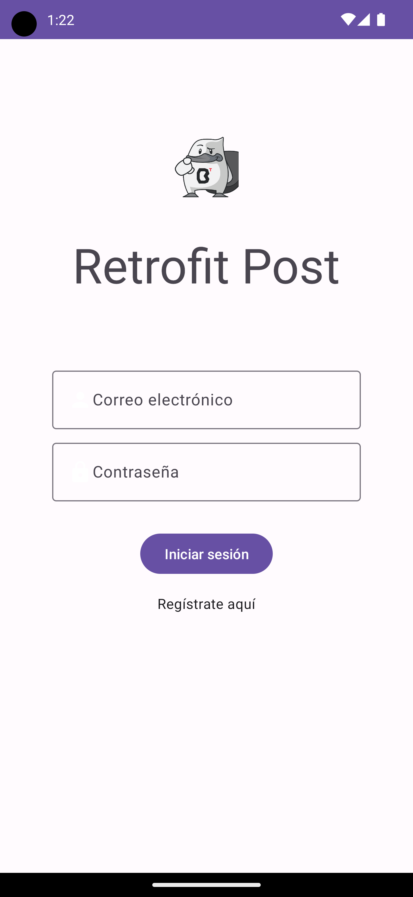

[`Kotlin Avanzado`](../../Readme.md) > [`Sesión 02`](../Readme.md) > `Ejemplo 3`

## Ejemplo 3: Introducción a Retrofit

<div style="text-align: justify;">


### 1. Objetivos :dart:

- Aplicar los conceptos vistos en los anteriores ejemplos.
- Utilizar la librería retrofit.

### 2. Requisitos :clipboard:

1. Haber terminado todos los ejercicios anteriores de esta sesión.
2. Haber leído el prework.
3. Tener conocimiento suficiente de API's Rest.

### 3. Desarrollo :computer:

Vamos a crear en esta ocasión un Pokedex para todos los entrenadores pokemon.

Para eso utilizaremos una API llamada PokeApi. Aquí queda el enlace de su sitio web https://pokeapi.co/.


1. Creamos un proyecto con actividad en blanco.

2.- Definimos una interfaz adecuada para nuestro dispositivo. Esta consta de un módulo indicador donde se despliega el nombre, el peso y la imagen del pokemon (es decir, dos TextViews y un ImageView). y como controles, utilizamos un EditText para escribir el nombre del pokemon y un botón para efectuar la transaccción.

```xml
<?xml version="1.0" encoding="utf-8"?>
<androidx.constraintlayout.widget.ConstraintLayout xmlns:android="http://schemas.android.com/apk/res/android"
    xmlns:app="http://schemas.android.com/apk/res-auto"
    xmlns:tools="http://schemas.android.com/tools"
    android:layout_width="match_parent"
    android:layout_height="match_parent"
    tools:context=".MainActivity">

    <LinearLayout
        android:id="@+id/pokecontainer"
        android:layout_width="0dp"
        android:orientation="vertical"
        android:gravity="center"
        android:layout_height="300dp"
        android:background="#FF0000"
        app:layout_constraintEnd_toEndOf="parent"
        app:layout_constraintStart_toStartOf="parent"
        app:layout_constraintTop_toTopOf="parent">
        <TextView
            android:id="@+id/tvPokemon"
            android:textStyle="bold"
            android:textSize="32sp"
            android:text="Pokemon"
            android:textColor="#FFF"
            android:layout_width="wrap_content"
            android:layout_height="wrap_content"/>
        <TextView
            android:id="@+id/tvWeight"
            android:textSize="20sp"
            android:text="peso"
            android:textColor="#FFF"
            android:layout_width="wrap_content"
            android:layout_height="wrap_content"/>
        <ImageView
            android:layout_marginTop="12dp"
            android:id="@+id/pokemon"
            android:layout_width="100dp"
            android:layout_height="100dp"/>
    </LinearLayout>

    <EditText
        android:id="@+id/etPokemon"
        android:layout_width="0dp"
        android:layout_height="wrap_content"
        android:layout_marginStart="24dp"
        android:layout_marginEnd="24dp"
        android:hint="Ingrese pokemon"
        android:ems="10"
        android:inputType="textPersonName"
        app:layout_constraintBottom_toTopOf="@+id/btnSearch"
        app:layout_constraintEnd_toEndOf="parent"
        app:layout_constraintStart_toStartOf="parent"
        app:layout_constraintTop_toBottomOf="@+id/pokecontainer"
        app:layout_constraintVertical_bias="0.19999999" />

    <Button
        android:id="@+id/btnSearch"
        android:layout_width="wrap_content"
        android:layout_height="wrap_content"
        android:text="Buscar pokemon"
        app:layout_constraintBottom_toBottomOf="parent"
        app:layout_constraintLeft_toLeftOf="parent"
        app:layout_constraintRight_toRightOf="parent"
        app:layout_constraintTop_toBottomOf="@id/etPokemon" />

</androidx.constraintlayout.widget.ConstraintLayout>
```

3. Pedimos permiso de internet en el *AndroidManifest.xml*:

```xml
<uses-permission android:name="android.permission.INTERNET"/>
```

4. Escribimos las dependencias necesarias en el *app/build.gradle*. **P.D.** Picasso es una librería de *Square* (los creadores de okHttp y de Retrofit) que facilita la implementación de imágenes en vistas (en este caso, para insertar la imagen del pokemon en el ImageView).

```kotlin
implementation "com.squareup.retrofit2:retrofit:2.7.0"
implementation 'com.squareup.retrofit2:converter-gson:2.7.0'
implementation 'com.google.code.gson:gson:2.8.5'
implementation 'com.squareup.picasso:picasso:2.71828'
```

5. Por compatibilidad, insertar esto también en *app/build.gradle*

```kotlin
android {
compileOptions {
        sourceCompatibility JavaVersion.VERSION_1_8
        targetCompatibility JavaVersion.VERSION_1_8
    }
}
```

6. Creamos un directorio llamado retrofit, conteniendo su interfaz, donde guardaremos los detalles de la API. Dentro irá el archivo WebServices, donde se encuentra la interfaz: 

```kotlin
interface WebServices {
    // Definimos el endpoint pokemont/{pokemon}, siendo este último una variable a ingresar por el usuario (en este caso, desde el edit text)
    @GET("pokemon/{pokemon}/")
    fun getPokemon(@Path("pokemon") pokemon: String): Call<Pokemon> //la clase Pokemon dentro de Call indica que el json de respuesta va a   ser transformado es un objeto de esa clase.                             

    @GET("type/{id}") //tipos de pokemon, se obtienen por id 
    fun getType(@Path("id") id: Int): Call<List<Type>>
}

```

7. Creamos la clase Pokemon, que será un Json transformado a objeto.

```kotlin
//de aquí, recuperaremos tres valores, uno de ellos es un objeto (sprites), por lo tanto, se tiene qué definir otra clase para él
data class Pokemon (
    val name : String? = "",
    val weight: Int? = 0,
    val sprites : sprites? = null

)

//la clase definida para sprites, sólo nos interesa la url, por lo cual ignoramos su(s) otro(s) parámetro(s).
data class sprites(
    @SerializedName("front_default")
    val photoUrl : String? = ""
)
```

8. seteamos el onClickListener en onCreate y ahí definimos el Builder de retrofit:

```kotlin 
        btnSearch.setOnClickListener{
            println("Esta es una prueba de que va bien todo")

                //Construcción de la instancia de retrofit
            val retrofit = Retrofit.Builder()
                .baseUrl("https://pokeapi.co/api/v2/")
                .addConverterFactory(GsonConverterFactory.create())
                .build()
                
                //obteniendo la interfaz donde se define la API
            val endpoint = retrofit.create(WebServices::class.java)

                ///obtener el valor insertado en el editText (nombre del pokemon), y enviarla al endpoint
            val pokeSearch = etPokemon.text.toString()
            val call = endpoint.getPokemon(pokeSearch)

                //poniendo en cola la llamada FGET
            call?.enqueue(object : Callback<Pokemon> {
            //imprimimos algo si no nos llegó respuesta
                override fun onFailure(call: Call<Pokemon>, t: Throwable) {
                    Log.e("error","Error: $t")
                }

                       //mostramos los archivos solo si el resultado es 200 
                override fun onResponse(call: Call<Pokemon>, response: Response<Pokemon>) {
                    if(response.code()==200){
                        val body = response.body()
                        Log.e("Respuesta","${response.body().toString()}")

                              
                        tvPokemon.text = body?.name
                        tvWeight.text = "peso: " + body?.weight.toString()
                        Picasso.get().load(body?.sprites?.photoUrl).into(pokemon); //esto es lobrd
                    } else{
                        Log.e("Not200","Error not 200: $response")
                    }
                }

            })
        }
```

El pokedex debería verse similar a esto.



[`Anterior`](../Reto-02) | [`Siguiente`](../Reto-03)      

</div>

