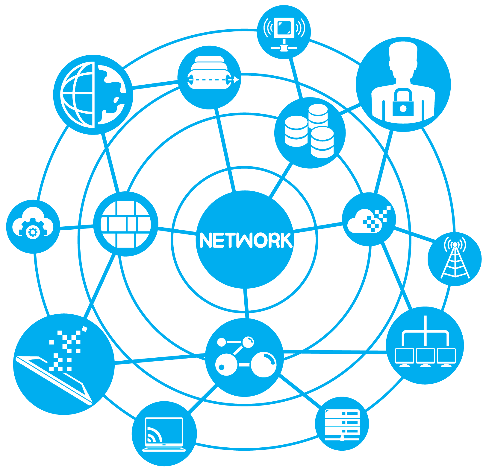

[`Kotlin-Avanzado`](../Readme.md) > `Sesión 1`

## Sesión 2: Networking

### 1. Objetivos :dart: 

- Comunicarse con sistemas remotos mediante sus API REST
- Parsear información de un modelo a una representación JSON
- Analizar el tráfico de datos en la comunicación
- Utilizar el cliente okHttp y retrofit

### 2. Contenido :blue_book:

 

#### <ins>OkHttp y HttpUrlConnection</ins>

Ejecutaremos una llamada a un servicio web mediante la clase de java ___HttpUrlConnection___ y el cliente externo ___OkHttp___. Concluímos sus diferencias. 

- [**`EJEMPLO 1`**](Ejemplo-01/Readme.md)
- [**`RETO 1`**](Reto-01/Readme.md)

---

<ins>Gson e Interceptores</ins>

Crearemos un data class para poder manipular la informaciǿn en formato JSON recolectada mediante _OkHttp_.

- [**`EJEMPLO 2`**](Ejemplo-02/Readme.md)
- [**`RETO 2`**](Reto-02/Readme.md)

---

 

<ins>Introducción a Retrofit</ins>

Ahora utilizaremos el cliente Retrofit diseñado para aplicaciones android, resaltando la ventaja de su uso frente a sus alternativas.

- [**`EJEMPLO 3`**](Ejemplo-03/Readme.md)
- [**`RETO 3`**](Reto-03/Readme.md)

 

---

### 3. Proyecto :hammer:

Aplica los lineamientos que vienen en esta guía para definir y comenzar el desarrollo de tu proyecto.

- [**`PROYECTO SESIÓN 2`**](Proyecto/Readme.md)

### 4. Postwork :memo:

Esta es una guía anexa de consejos para una mejor planeación de tu proyecto para este módulo.

- [**`POSTWORK SESIÓN 2`**](Postwork/Readme.md)

 

[`Anterior`](../Readme.md) | [`Siguiente`](../Sesion-03/Readme.md)      

