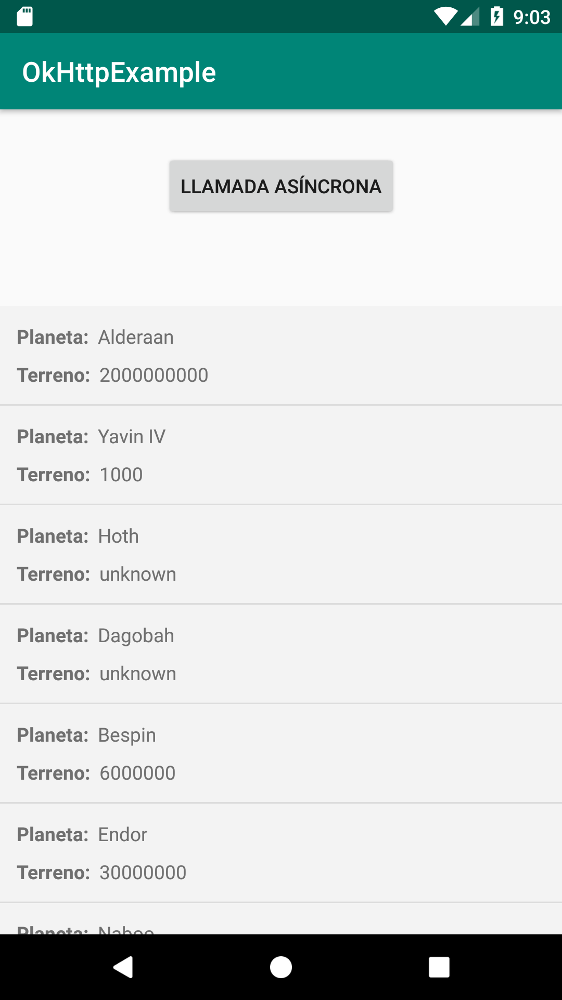

[`Kotlin Avanzado`](../../Readme.md) > [`Sesión 02`](../Readme.md) > `Reto 1`

## Reto 1: OkHttp y ListView

<div style="text-align: justify;">


### 1. Objetivos :dart:

- Que el alumnno asimile el uso del cliente OkHttp 
- Que se integre la información recuperada a algún componente

### 2. Requisitos :clipboard:

1. Haber leído el Prework de OkHttp3
2. Terminar el [Ejemplo 01](../Ejemplo-01)

### 3. Desarrollo :computer:

Tomando como referencia el primer Ejemplo, crearemos una app capaz de recuperar la información de 10 planetas de star wars y desplegarlos
en una lista (aplicar el conociemiento de la [Sesión 02](../../Sesion-02)). Cada elemento de la lista debe mostrar el planeta y el tipo de terreno (name y terrain).

La aplicación debe verse así:




* La vista de cada elemento de la lista tendrá el siguiente layout (llamado **item_planet.xml**): 

```xml
<?xml version="1.0" encoding="utf-8"?>
<LinearLayout xmlns:android="http://schemas.android.com/apk/res/android"
    android:orientation="vertical"
    android:background="#F3F3F3"
    android:paddingVertical="8dp"
    android:paddingHorizontal="12dp"
    android:layout_width="match_parent"
    android:layout_height="wrap_content">
    <LinearLayout
        android:orientation="horizontal"
        android:layout_width="wrap_content"
        android:layout_height="wrap_content">
        <TextView
            android:text="Planeta:  "
            android:textStyle="bold"
            android:layout_width="wrap_content"
            android:layout_height="wrap_content"/>
        <TextView
            android:id="@+id/tvPlanet"
            android:paddingVertical="4dp"
            android:text="tatooine"
            android:layout_width="wrap_content"
            android:layout_height="wrap_content"/>

    </LinearLayout>
    <LinearLayout
        android:orientation="horizontal"
        android:layout_width="wrap_content"
        android:layout_height="wrap_content">
        <TextView
            android:text="Terreno:  "
            android:textStyle="bold"
            android:layout_width="wrap_content"
            android:layout_height="wrap_content"/>
        <TextView
            android:id="@+id/tvTerrain"
            android:paddingVertical="4dp"
            android:text="Desierto"
            android:layout_width="wrap_content"
            android:layout_height="wrap_content"/>

    </LinearLayout>

</LinearLayout>
```

* la url de la petición ahora es la base, para recuperar toda la lista

```kotlin
private val url = "https://swapi.dev/api/planets/"
```
abajo también declaramos nuestro adaptador y nuestro arreglo (el nombre lo sugerimos, pero puedes poner cualquier otro)

```kotlin
private lateinit var adapter: PlanetAdapter
    var planetList = ArrayList<Planet>()
```


*La estructura del JSON recibido ahora es más compleja, siendo cada planeta un objeto dentro de un arreglo, dentro del objeto raíz:
```json
{
...
"results":[
{...},
{...},
{...},
]
}

```

Por lo tanto, para recuperar la info con los JSONObjects, se utiliza lo siguiente: 

```kotlin
try {
	val json = JSONObject(body) //se obtiene el objeto raíz
	val array = json.getJSONArray("results") //se obtiene el arreglo de planetas
	val numPlanets = array.length() -1 //el número máximo para ejecutar el ciclo for
        for (i in 0.. numPlanets){ //ciclo for para todos los planetas
		val planeta = array.getJSONObject(i)  //así obtenemos el planeta del arreglo

		//TODO: recuperar la información que requerimos del planeta y guardarla en el arreglo que va en el adapter
	}
```

*No olvidar que la actualización de los items en el ListView se hace de la siguiente forma:

```kotlin
fun populateAdapter(data: ArrayList<Planet>){
        planetList.clear()
        planetList.addAll(data)
        adapter.notifyDataSetChanged()
    }
```

[`Anterior`](../Ejemplo-01) | [`Siguiente`](../Ejemplo-02)      

</div>

