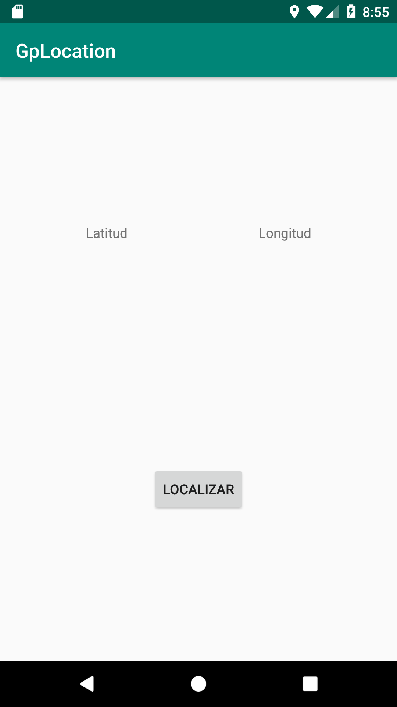
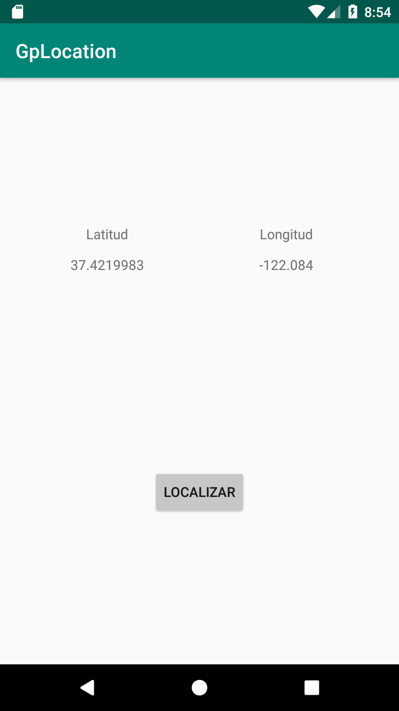

[`Kotlin Avanzado`](../../Readme.md) > [`Sesión 03`](../Readme.md) > `Ejemplo 1`

## Ejemplo 1: Localización y GPS

<div style="text-align: justify;">


### 1. Objetivos :dart:

- Utilizar el GPS del dispositivo para obtener la localización del usuario.

### 2. Requisitos :clipboard:

- Haber leído previamente todo lo relacionado a localización en el prework.

### 3. Desarrollo :computer:

1. nstalamos la dependencia e localización de google play services:

```kotlin
implementation 'com.google.android.gms:play-services-location:17.0.0'
```

2. Necesitamos pedir permiso para usar la localización 

```xml
<uses-permission android:name="android.permission.ACCESS_COARSE_LOCATION"/>
<uses-permission android:name="android.permission.ACCESS_FINE_LOCATION"/>
```

3. Creamos un layout con un botón para localizar y dos textview que guardarán la latitud y longitud de la localización

```xml
<?xml version="1.0" encoding="utf-8"?>
<androidx.constraintlayout.widget.ConstraintLayout xmlns:android="http://schemas.android.com/apk/res/android"
    xmlns:app="http://schemas.android.com/apk/res-auto"
    xmlns:tools="http://schemas.android.com/tools"
    android:layout_width="match_parent"
    android:layout_height="match_parent"
    tools:context=".MainActivity">

    <TextView
        android:id="@+id/tvLatitude"
        android:layout_width="wrap_content"
        android:layout_height="wrap_content"
        android:layout_marginTop="12dp"
        app:layout_constraintEnd_toEndOf="@+id/textView"
        app:layout_constraintLeft_toLeftOf="parent"
        app:layout_constraintStart_toStartOf="@+id/textView"
        app:layout_constraintTop_toBottomOf="@+id/textView" />

    <Button
        android:id="@+id/btnLocate"
        android:layout_width="wrap_content"
        android:layout_height="wrap_content"
        android:text="Localizar"
        app:layout_constraintBottom_toBottomOf="parent"
        app:layout_constraintEnd_toEndOf="parent"
        app:layout_constraintStart_toStartOf="parent"
        app:layout_constraintTop_toTopOf="@+id/guideline"
        app:layout_constraintVertical_bias="0.060000002" />

    <TextView
        android:id="@+id/textView"
        android:layout_width="wrap_content"
        android:layout_height="wrap_content"
        android:layout_marginStart="64dp"
        android:text="Latitud"
        app:layout_constraintEnd_toStartOf="@+id/textView3"
        app:layout_constraintHorizontal_bias="0.55"
        app:layout_constraintStart_toStartOf="parent"
        app:layout_constraintTop_toTopOf="@+id/guideline2" />

    <androidx.constraintlayout.widget.Guideline
        android:id="@+id/guideline"
        android:layout_width="wrap_content"
        android:layout_height="wrap_content"
        android:orientation="horizontal"
        app:layout_constraintGuide_percent="0.65" />

    <androidx.constraintlayout.widget.Guideline
        android:id="@+id/guideline2"
        android:layout_width="wrap_content"
        android:layout_height="wrap_content"
        android:orientation="horizontal"
        app:layout_constraintGuide_percent="0.25" />

    <TextView
        android:id="@+id/textView3"
        android:layout_width="wrap_content"
        android:layout_height="wrap_content"
        android:layout_marginStart="111dp"
        android:layout_marginEnd="64dp"
        android:text="Longitud"
        app:layout_constraintEnd_toEndOf="parent"
        app:layout_constraintStart_toEndOf="@+id/textView"
        app:layout_constraintTop_toTopOf="@+id/guideline2" />

    <TextView
        android:id="@+id/tvLongitude"
        android:layout_width="wrap_content"
        android:layout_height="wrap_content"
        android:layout_marginTop="12dp"
        app:layout_constraintEnd_toEndOf="@+id/textView3"
        app:layout_constraintStart_toStartOf="@+id/textView3"
        app:layout_constraintTop_toBottomOf="@+id/textView3" />

</androidx.constraintlayout.widget.ConstraintLayout>
```

El layout debe verse así:



4. Procedemos a implementar el código de GPS

Seteamos nuestras variables (un id de permiso y el cliente localizador)

```kotlin
companion object{
        const val PERMISSION_ID = 33
    }

    //Obeto que obtiene la localización
    lateinit var mFusedLocationClient: FusedLocationProviderClient
```

un método para consultar el status de algún permiso en la app, responde con bool

```kotlin
 private fun checkGranted(permission: String): Boolean{
        return ActivityCompat.checkSelfPermission(this, permission) == PackageManager.PERMISSION_GRANTED
    }
```


un código para checar si la app tiene permisos de localización, responde con un Booleano

```kotlin
private fun checkPermissions(): Boolean {
        if ( checkGranted(Manifest.permission.ACCESS_COARSE_LOCATION) &&
            checkGranted(Manifest.permission.ACCESS_COARSE_LOCATION) ){
            return true
        }
        return false
    }
```

una función para pedir el permiso de localización por si aún no se lo otorgamos en la app

```kotlin
//Pedir los permisos requeridos para que funcione la localización
    private fun requestPermissions() {
        ActivityCompat.requestPermissions(
            this,
            arrayOf(Manifest.permission.ACCESS_COARSE_LOCATION, Manifest.permission.ACCESS_FINE_LOCATION),
            PERMISSION_ID
        )
    }
```

consultamos si el GPS está prendido

```kotlin
private fun isLocationEnabled(): Boolean {
        var locationManager: LocationManager = getSystemService(Context.LOCATION_SERVICE) as LocationManager
        return locationManager.isProviderEnabled(LocationManager.GPS_PROVIDER) || locationManager.isProviderEnabled(
            LocationManager.NETWORK_PROVIDER
        )
    }
```

Mostramos la localización en formato latitud y longitud en los TextViews correspondientes

```kotlin
@SuppressLint("MissingPermission") 
private fun getLocation() {
        if (checkPermissions()) { //verificamos si tenemos permisos
            if (isLocationEnabled()) { //localizamos sólo si el GPS está encendido

                mFusedLocationClient.lastLocation.addOnSuccessListener(this) { location ->

                   tvLatitude.text = location?.latitude.toString()
                    tvLongitude.text = location?.longitude.toString()

                }
            }
        } else{
            //si no se tiene permiso, pedirlo
            requestPermissions()
        }
    }
```

Y asignamos el método getLocation al botón de localización

La primera vez que abramos la app, o hasta no dar permisos, aparecerá este mensaje cuando demos click al botón


Resultado final:



[`Anterior`](../Readme.md) | [`Siguiente`](../Reto-01)      

</div>

