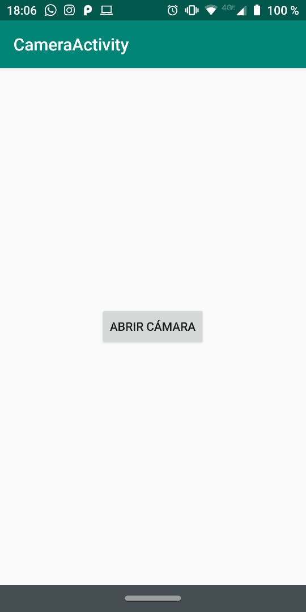
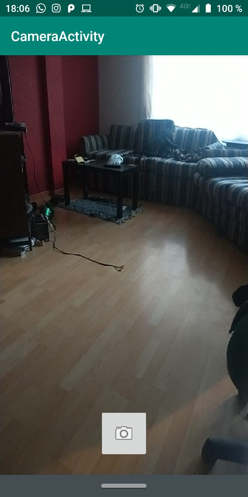
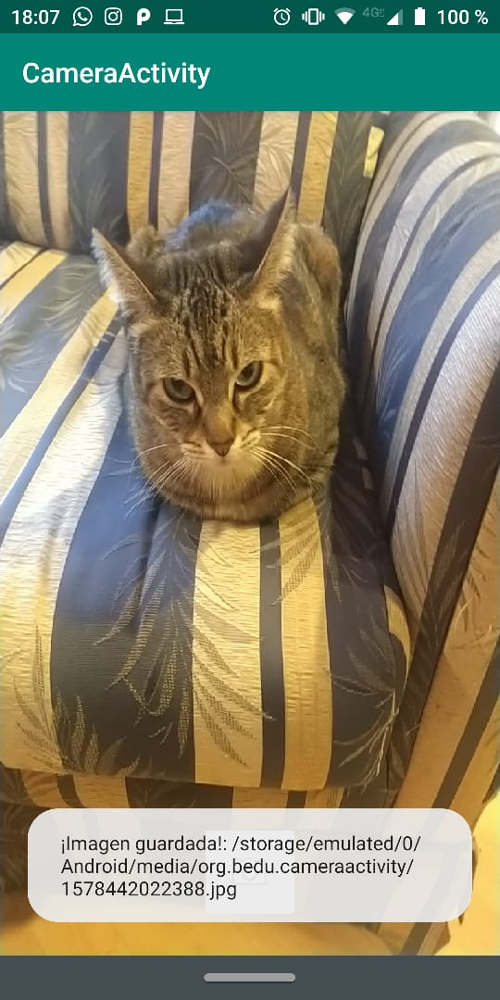
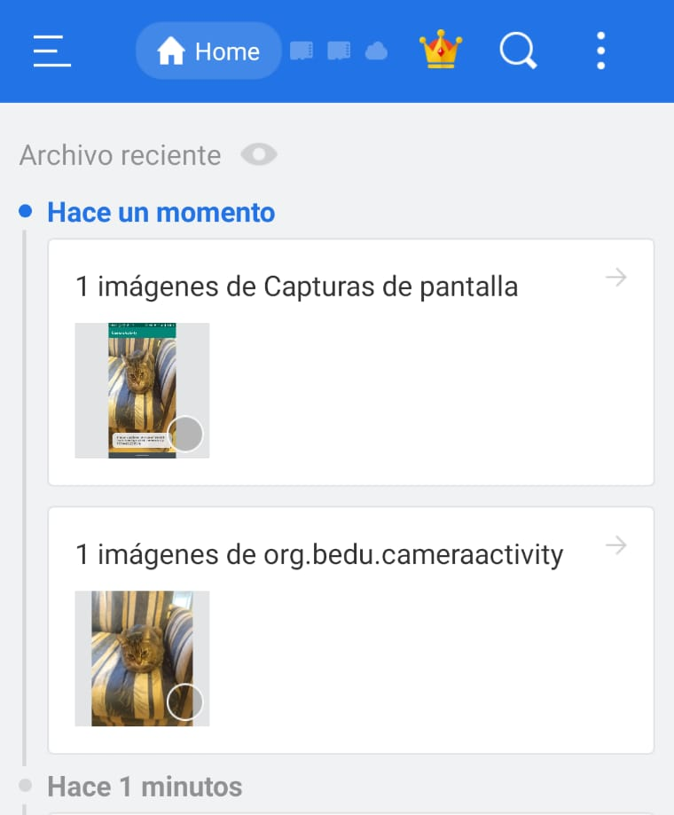

[`Kotlin Avanzado`](../../Readme.md) > [`Sesión 03`](../Readme.md) > `Ejemplo 2`

## Ejemplo 2: Cámara

<div style="text-align: justify;">


### 1. Objetivos :dart:

- Aprender a usar la cámara de android

### 2. Requisitos :clipboard:

- Haber leído los temas del Prework

### 3. Desarrollo :computer:

Vamos a aprender a cómo utilizar la cámara en una aplicación para tomar fotos.

1. en *app/build.gradle* vamos a instalar la dependencia de CameraX

```kotlin
implementation "androidx.camera:camera-core:1.0.0-alpha06"
    implementation "androidx.camera:camera-camera2:1.0.0-alpha06"
```

Al final del módulo *android*, hacer compatible con Java 1.8

```kotlin
android{
...

compileOptions {
        sourceCompatibility JavaVersion.VERSION_1_8
        targetCompatibility JavaVersion.VERSION_1_8
    }

}
```

2. Utilizamos los siguientes permisos en el *AndroidManifest.xml*

```xml
<uses-permission android:name="android.permission.CAMERA" />
    <uses-permission android:name="android.permission.WRITE_EXTERNAL_STORAGE"/>
    <uses-feature android:name="android.hardware.camera" />
    <uses-feature android:name="android.hardware.camera.autofocus" />
```

y Registramos esta Activity (posteriormente la crearemos)

```xml
<activity android:name=".CameraActivity"/>
```

3. En *activity_main*, dejamos un simple botón

```xml
<?xml version="1.0" encoding="utf-8"?>
<LinearLayout xmlns:android="http://schemas.android.com/apk/res/android"
    android:gravity="center"
    android:orientation="vertical" android:layout_width="match_parent"
    android:layout_height="match_parent">
    <Button
        android:id="@+id/btnOpenCamera"
        android:text="Abrir cámara"
        android:layout_width="wrap_content"
        android:layout_height="wrap_content"/>

</LinearLayout>
```

4. en *MainActivity*, pediremos permisos para acceder a la cámara para poder cambiarnos a la Activity de la cámara.

```kotlin
class MainActivity : AppCompatActivity() {

    val PERMISSION_ID = 34

    override fun onCreate(savedInstanceState: Bundle?) {
        super.onCreate(savedInstanceState)
        setContentView(R.layout.activity_main)

        btnOpenCamera.setOnClickListener {
            if(checkCameraPermission()){
                openCamera()
            } else{
                requestPermissions()
            }
        }

    }

    private fun openCamera(){
        val intent = Intent(this, CameraActivity::class.java)
        startActivity(intent)
    }

    override fun onRequestPermissionsResult(requestCode: Int, permissions: Array<String>, grantResults: IntArray) {
        if (requestCode == PERMISSION_ID) {
            if ((grantResults.isNotEmpty() && grantResults[0] == PackageManager.PERMISSION_GRANTED)) {
                openCamera()
            }
        }
    }

    private fun checkCameraPermission(): Boolean{
        return ActivityCompat
            .checkSelfPermission(this, Manifest.permission.CAMERA)== PackageManager.PERMISSION_GRANTED
    }

    private fun requestPermissions() {
        ActivityCompat.requestPermissions(
            this,
            arrayOf(Manifest.permission.CAMERA, Manifest.permission.ACCESS_FINE_LOCATION),
            PERMISSION_ID
        )
    }


}

```

5. Creamos el layout para nuestra Actividad de Cámara, estaa consta de un *TextureView* donde desplegaremos el Preview de la cámara, y el botón para hacer la captura:

```xml
<?xml version="1.0" encoding="utf-8"?>
<androidx.constraintlayout.widget.ConstraintLayout
    xmlns:android="http://schemas.android.com/apk/res/android"
    xmlns:app="http://schemas.android.com/apk/res-auto"
    android:orientation="horizontal"
    android:layout_width="fill_parent"
    android:layout_height="fill_parent"
    >

    <TextureView
        android:id="@+id/camera_preview"
        android:layout_width="0dp"
        android:layout_height="0dp"
        android:layout_weight="1"
        app:layout_constraintBottom_toBottomOf="parent"
        app:layout_constraintEnd_toEndOf="parent"
        app:layout_constraintStart_toStartOf="parent"
        app:layout_constraintTop_toTopOf="parent" />
    <ImageButton
        android:id="@+id/capture_button"
        android:layout_width="72dp"
        android:layout_height="72dp"
        android:layout_margin="24dp"
        android:background="@color/colorPrimary"
        app:srcCompat="@android:drawable/ic_menu_camera"
        app:layout_constraintBottom_toBottomOf="parent"
        app:layout_constraintEnd_toEndOf="parent"
        app:layout_constraintStart_toStartOf="parent" />

</androidx.constraintlayout.widget.ConstraintLayout>

```

6. y creamos nuestra clase *CameraActivity*

```kotlin
class CameraActivity : AppCompatActivity(){

    private val executor = Executors.newSingleThreadExecutor()

    override fun onCreate(savedInstanceState: Bundle?) {
        super.onCreate(savedInstanceState)
        setContentView(R.layout.activity_camera)

        startCamera()
    }


    fun startCamera(){

        //Creamos la configuración para el preview de nuestra cámara
        val previewConfig = PreviewConfig.Builder().apply {
            setTargetResolution(Size(640, 480)) //ajustando resolucción
        }.build()

        //Creamos nuestro Preview
        val preview = Preview(previewConfig)

        // Cuando nuestro preview se actualice, recreamos nuestro layout
        preview.setOnPreviewOutputUpdateListener {

            // desatamos y volvemos a atar nuestro preview del TextureView
            val parent =  camera_preview.parent as ViewGroup
            parent.removeView(camera_preview)
            parent.addView(camera_preview, 0)

            camera_preview.surfaceTexture = it.surfaceTexture

        }

        val imageCapture = captureConfig()

        //Agregamos la función de Preview y de Captura de imagen al ciclo de vida de la cámara
        CameraX.bindToLifecycle(this, preview,imageCapture)
    }


    fun captureConfig(): ImageCapture{
        // Creando el objeto para crear el caso de uso de captura de imagen
        val imageCaptureConfig = ImageCaptureConfig.Builder()
            .apply {
                setCaptureMode(ImageCapture.CaptureMode.MIN_LATENCY)
            }.build()

        // Creamos nuestro objeto de captura con su configuración
        val imageCapture = ImageCapture(imageCaptureConfig)


        //Capturar y guardar imagen cuando se de click al botón de captura
        capture_button.setOnClickListener {
            //Creando el archivo en la ruta
            val file = File(externalMediaDirs.first(),
                "${System.currentTimeMillis()}.jpg")

            //Tomamos la afoto y asignamos el listener
            imageCapture.takePicture(file, executor,
                object : ImageCapture.OnImageSavedListener {

                    //Enviamos el error a log y a un Toast
                    override fun onError(
                        imageCaptureError: ImageCapture.ImageCaptureError,
                        message: String,
                        exc: Throwable?
                    ) {
                        val msg = "Photo capture failed: $message"
                        Log.e("CameraXApp", msg, exc)
                        camera_preview.post {
                            Toast.makeText(baseContext, msg, Toast.LENGTH_SHORT).show()
                        }
                    }

                    //Mostramos un Toast y un log de imagen guardada
                    override fun onImageSaved(file: File) {
                        val msg = "¡Imagen guardada!: ${file.absolutePath}"
                        Log.d("Camera", msg)
                        camera_preview.post {
                            Toast.makeText(baseContext, msg, Toast.LENGTH_SHORT).show()
                        }
                    }
                })
        }

        return imageCapture
    }
```

La aplicación debe verse así



Entrando a la cámara 



Foto tomada



Mostramos la ubicación de la foto con la app nativa ___File___  buscando en la ruta especificada en el _Toast___ (la imagen de abajo es la app *ES Explorador de archivos*).



[`Anterior`](../Reto-01) | [`Siguiente`](../Reto-02)      

</div>

