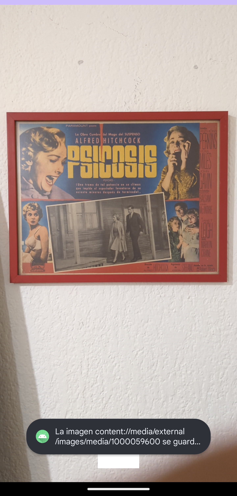

[`Kotlin Avanzado`](../../Readme.md) > [`Sesión 03`](../Readme.md) > `Ejemplo 2`

## Ejemplo 2: Cámara

<div style="text-align: justify;">


### 1. Objetivos :dart:

- Aprender a usar la cámara de android

### 2. Requisitos :clipboard:

- Haber leído los temas del Prework

### 3. Desarrollo :computer:

Vamos a aprender a cómo utilizar la cámara en una aplicación para tomar fotos.

1. en *app/build.gradle* vamos a instalar la dependencia de CameraX

```kotlin
// recursos para la camara
    implementation "androidx.camera:camera-core:1.2.3"
    implementation "androidx.camera:camera-camera2:1.2.3"
    implementation "androidx.camera:camera-lifecycle:1.2.3"
    
    // utilidades
    implementation "androidx.lifecycle:lifecycle-runtime-ktx:2.6.1"
    implementation "androidx.concurrent:concurrent-futures-ktx:1.1.0"
```

2. Utilizamos los siguientes permisos en el *AndroidManifest.xml*

```xml
<uses-permission android:name="android.permission.CAMERA" />
    <uses-permission android:name="android.permission.WRITE_EXTERNAL_STORAGE"/>
    <uses-feature android:name="android.hardware.camera" /> <!-- Puede ser camera.any para admitir dispositivos con únicamente cámara frontal -->
    <uses-feature android:name="android.hardware.camera.autofocus" />
```

y Registramos esta Activity (posteriormente la crearemos)

```xml
<activity android:name=".CameraActivity"/>
```

3. En *activity_main*, dejamos un simple botón

```xml
<?xml version="1.0" encoding="utf-8"?>
<LinearLayout xmlns:android="http://schemas.android.com/apk/res/android"
    android:gravity="center"
    android:orientation="vertical" android:layout_width="match_parent"
    android:layout_height="match_parent">
    <Button
        android:id="@+id/btnOpenCamera"
        android:text="Abrir cámara"
        android:layout_width="wrap_content"
        android:layout_height="wrap_content"/>

</LinearLayout>
```

4. en *MainActivity*, pediremos permisos para acceder a la cámara para poder cambiarnos a la Activity de la cámara.

```kotlin
class MainActivity : AppCompatActivity() {

    private val PERMISSION_ID = 34
    private lateinit var binding: ActivityMainBinding

    override fun onCreate(savedInstanceState: Bundle?) {
        super.onCreate(savedInstanceState)
        binding = ActivityMainBinding.inflate(layoutInflater)
        setContentView(binding.root)

        binding.btnOpenCamera.setOnClickListener {
            if(checkCameraPermission()){
                openCamera()
            } else{
                requestPermissions()
            }
        }

    }

    private fun openCamera(){
        val intent = Intent(this, CameraActivity::class.java)
        startActivity(intent)
    }

    @SuppressLint("MissingSuperCall")
    override fun onRequestPermissionsResult(requestCode: Int, permissions: Array<String>, grantResults: IntArray) {

        if (requestCode == PERMISSION_ID) {
            if ((grantResults.isNotEmpty() && grantResults[0] == PackageManager.PERMISSION_GRANTED)) {
                openCamera()
            } else {
                Toast.makeText(this,"Aun requieres permiso", Toast.LENGTH_SHORT).show()
            }
        }
    }

    private fun checkCameraPermission(): Boolean{
        return ActivityCompat
            .checkSelfPermission(this, Manifest.permission.CAMERA)== PackageManager.PERMISSION_GRANTED
    }

    private fun requestPermissions() {
        ActivityCompat.requestPermissions(
            this,
            arrayOf(Manifest.permission.CAMERA, Manifest.permission.ACCESS_FINE_LOCATION),
            PERMISSION_ID
        )
    }
}
```

5. Creamos el layout para nuestra Actividad de Cámara, estaa consta de un *TextureView* donde desplegaremos el Preview de la cámara, y el botón para hacer la captura:

```xml
<?xml version="1.0" encoding="utf-8"?>
<androidx.constraintlayout.widget.ConstraintLayout
    xmlns:android="http://schemas.android.com/apk/res/android"
    xmlns:app="http://schemas.android.com/apk/res-auto"
    android:orientation="horizontal"
    android:layout_width="match_parent"
    android:layout_height="match_parent"
    >
    <androidx.camera.view.PreviewView
        android:id="@+id/camera_preview"
        android:layout_width="0dp"
        android:layout_height="0dp"
        android:layout_weight="1"
        app:layout_constraintBottom_toBottomOf="parent"
        app:layout_constraintEnd_toEndOf="parent"
        app:layout_constraintStart_toStartOf="parent"
        app:layout_constraintTop_toTopOf="parent" />
    <ImageButton
        android:id="@+id/capture_button"
        android:layout_width="72dp"
        android:layout_height="72dp"
        android:layout_margin="24dp"
        android:background="@color/white"
        app:srcCompat="@android:drawable/ic_menu_camera"
        app:layout_constraintBottom_toBottomOf="parent"
        app:layout_constraintEnd_toEndOf="parent"
        app:layout_constraintStart_toStartOf="parent" />

</androidx.constraintlayout.widget.ConstraintLayout>


```

6. y creamos nuestra clase *CameraActivity*

```kotlin
class CameraActivity : AppCompatActivity(){

    private lateinit var binding: ActivityCameraBinding
    private var imageCapture: ImageCapture? = null

    override fun onCreate(savedInstanceState: Bundle?) {
        super.onCreate(savedInstanceState)

        binding = ActivityCameraBinding.inflate(layoutInflater)

        setContentView(binding.root)


        lifecycleScope.launch {
            startCamera()
        }

        binding.captureButton.setOnClickListener {
            takePhoto()
        }
    }


    private suspend fun startCamera(){

        val cameraProvider = ProcessCameraProvider.getInstance(this).await()

        // Construimos el preview (aquí podemos hacer configuraciones)
        val preview = Preview.Builder()
            .build()
            .also {
                it.setSurfaceProvider(binding.cameraPreview.surfaceProvider)
            }

        // Seleccionamos la cámara trasera
        val cameraSelector = CameraSelector.DEFAULT_BACK_CAMERA

        try {
            // Atamos nuestra cámara al ciclo de vida de nuestro Activity
            cameraProvider.run {
                unbindAll()
                imageCapture = ImageCapture.Builder().build()
                bindToLifecycle(this@CameraActivity, cameraSelector, preview,  imageCapture)
            }

        } catch(exc: Exception) {
            Toast.makeText(this, "No se pudo hacer bind al lifecycle", Toast.LENGTH_SHORT).show()
        }
    }

    fun takePhoto() {
        // Creamos un nombre único para cada foto
        val format = SimpleDateFormat("dd-MM-yyyyy-HH:mm:ss:SSS", Locale.US)
            .format(System.currentTimeMillis())
        val name = "beduPhoto $format"
    
        val contentValues = ContentValues().apply {
            put(MediaStore.MediaColumns.DISPLAY_NAME, name)
            put(MediaStore.MediaColumns.MIME_TYPE, "image/jpeg")
            if(Build.VERSION.SDK_INT > Build.VERSION_CODES.P) {
                put(MediaStore.Images.Media.RELATIVE_PATH, "Pictures/CameraX-Image") // La carpeta donde se guarda
            }
        }

        // Creamos el builder para la configuración del archivo y los metadatos
        val outputOptions = ImageCapture.OutputFileOptions
            .Builder(
                contentResolver,
                MediaStore.Images.Media.EXTERNAL_CONTENT_URI, contentValues)
            .build()

        // Seteamos el listener de cuando la captura sea efectuada
        imageCapture?.takePicture(
            outputOptions,
            ContextCompat.getMainExecutor(this),
            object : ImageCapture.OnImageSavedCallback {
                override fun onError(e: ImageCaptureException) {
                    Toast.makeText(
                        baseContext,
                        "Error al capturar imagen",
                        Toast.LENGTH_SHORT).show()
                    Log.e("CameraX",e.toString())
                }

                override fun onImageSaved(
                    output: ImageCapture.OutputFileResults
                ) {
                    Toast.makeText(
                        baseContext,
                        "La imagen ${output.savedUri} se guardó correctamente!",
                        Toast.LENGTH_SHORT).show()
                    Log.d("CameraX", output.savedUri.toString())
                }
            }
        )
    }
}

```

La aplicación debe verse así


Entrando a la cámara 


Foto tomada



Podremos abrir la imagen desde la aplicación de google Photos. A continuación los datos!


Si buscamos la aplicación desde un explorador de archivos (como el de Google), tendremos algo similar a esto:


[`Anterior`](../Reto-01) | [`Siguiente`](../Reto-02)      

</div>

