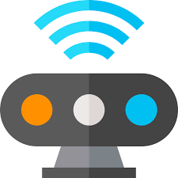

[`Kotlin-Avanzado`](../Readme.md) > `Sesión 3`

## Sesión 3: Acceso a Hardware

### 1. Objetivos :dart: 

- Utilizar el hardware disponible de los dispositivos android para dar al usuario una interacción más integral con la app.

### 2. Contenido :blue_book:

 

#### <ins>Localización y GPS</ins>

Gestionaremos los permisos de localización con una precisión definida y obtendremos la latitud y longitud donde se ubica nuestro dispositivo.

- [**`EJEMPLO 1`**](Ejemplo-01/Readme.md)
- [**`RETO 1`**](Reto-01/Readme.md)

---

<ins>Cámara</ins>

Visualizaremos un Preview en pantalla que muestre lo que la cámara registre, capturaremos unas fotografías y  las almacenaremos en un sitio relativo a la aplicación.

- [**`EJEMPLO 2`**](Ejemplo-02/Readme.md)
- [**`RETO 2`**](Reto-02/Readme.md)

---

 

### 3. Proyecto :hammer:

Aplica los lineamientos que vienen en esta guía para definir y comenzar el desarrollo de tu proyecto.

- [**`PROYECTO SESIÓN 3`**](Proyecto/Readme.md)

### 4. Postwork :memo:

Esta es una guía anexa de consejos para una mejor planeación de tu proyecto para este módulo.

- [**`POSTWORK SESIÓN 3`**](Postwork/Readme.md)

 

[`Anterior`](../Sesion-02/Readme.md) | [`Siguiente`](../Sesion-04/Readme.md)      

