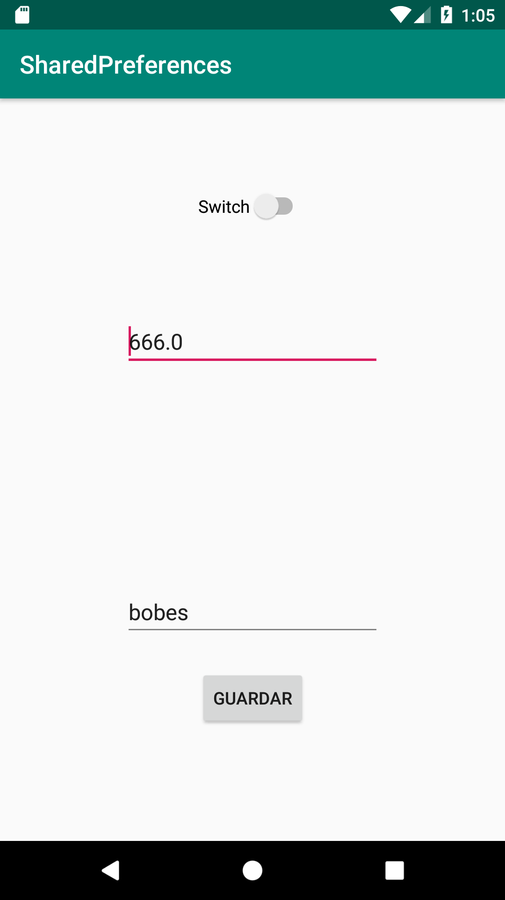

[`Kotlin Avanzado`](../../Readme.md) > [`Sesión 04`](../Readme.md) > `Ejemplo 1`

## Ejemplo 1: Shared Preferences

<div style="text-align: justify;">


### 1. Objetivos :dart:

- Aprender el funcionamiento de SharedPreferences
- Utilizarlo para guardar/cargar información

### 2. Requisitos :clipboard:

1. Haber leído previamente el Prework
2. Tomar la clase de de esta sesión

#### 

### 3. Desarrollo :computer:

Vamos a construir una aplicación sencilla pero capaz de almacenar y cargar tres tipos de dato:

- Un booleano
- Un String
- Un Float

Para ello utilizaremos un EditText de String, un EditText numérico y un Switch para el booleano

1. Abrir un nuevo proyecto con Activity en blanco
2. Editar el layout de main_activity, no importa el contenedor así que puede ser un LinearLayout, lo importante es elegir los EditText

```xml
android:inputType="textPersonName"
```

Esta propiedad es la que define qué tipo de input es, si se requiere un numérico, reemplazar por "number"

el layout que elegimos es el siguiente:

```xml
<?xml version="1.0" encoding="utf-8"?>
<androidx.constraintlayout.widget.ConstraintLayout xmlns:android="http://schemas.android.com/apk/res/android"
    xmlns:app="http://schemas.android.com/apk/res-auto"
    xmlns:tools="http://schemas.android.com/tools"
    android:layout_width="match_parent"
    android:layout_height="match_parent"
    tools:context=".MainActivity">

    <Button
        android:id="@+id/button"
        android:layout_width="wrap_content"
        android:layout_height="wrap_content"
        android:text="Guardar"
        app:layout_constraintBottom_toBottomOf="parent"
        app:layout_constraintEnd_toEndOf="parent"
        app:layout_constraintStart_toStartOf="parent"
        app:layout_constraintTop_toTopOf="@+id/guideline"
        app:layout_constraintVertical_bias="0.19999999" />

    <androidx.constraintlayout.widget.Guideline
        android:id="@+id/guideline"
        android:layout_width="wrap_content"
        android:layout_height="wrap_content"
        android:orientation="horizontal"
        app:layout_constraintGuide_begin="440dp" />

    <EditText
        android:id="@+id/etNumber"
        android:layout_width="wrap_content"
        android:layout_height="wrap_content"
        android:ems="10"
        android:inputType="number"
        app:layout_constraintBottom_toTopOf="@+id/etString"
        app:layout_constraintEnd_toEndOf="parent"
        app:layout_constraintStart_toStartOf="parent"
        app:layout_constraintTop_toTopOf="parent" />

    <Switch
        android:id="@+id/switch1"
        android:layout_width="wrap_content"
        android:layout_height="wrap_content"
        android:text="Switch"
        app:layout_constraintBottom_toTopOf="@+id/etNumber"
        app:layout_constraintEnd_toEndOf="parent"
        app:layout_constraintStart_toStartOf="parent"
        app:layout_constraintTop_toTopOf="parent" />

    <EditText
        android:id="@+id/etString"
        android:layout_width="wrap_content"
        android:layout_height="wrap_content"
        android:ems="10"
        android:inputType="textPersonName"
        android:text="Name"
        app:layout_constraintBottom_toTopOf="@+id/guideline"
        app:layout_constraintEnd_toEndOf="parent"
        app:layout_constraintStart_toStartOf="parent" />
</androidx.constraintlayout.widget.ConstraintLayout>
```

1. En el MainActivity, declaramos nuestras constantes: PREFS_NAME es el nombre de nuestra colección de preferencias, mientras que los otros tres son los keys en el key-pair

```kotlin
val PREFS_NAME = "org.bedu.sharedpreferences"
val STRING = "STRING"
val NUMBER = "NUMBER"
val BOOLEAN = "BOOLEAN"
```

1. Declaramos también nuestra variable preferences, sin asignarle valor aún:

```kotlin
lateinit var preferences: SharedPreferences
```

1. declaramos sharedPreferences

```kotlin
preferences = getSharedPreferences(PREFS_NAME, Context.MODE_PRIVATE) //Modo privado
```

1. para guardar los valores en nuestras vistas cada que abrimos la app, obtenemos los valores de SharedPreferences y los atamos a sus vistas

```kotlin
fun setValues(){
        //obtenemos los valores desde preferencias
        val string = preferences.getString(STRING,"")
        val boolean = preferences.getBoolean(BOOLEAN, false)
        val number = preferences.getFloat(NUMBER,0f)

        //los atamos a sus vistas
        etString.setText(string)
        switch1.isChecked = boolean
        etNumber.setText(number.toString())
    }
```

y lo ponemos después de crear sharedPreferences en onCreate() :

```kotlin
override fun onCreate(savedInstanceState: Bundle?) {
        ...
        setValues()
}
```

1. declaramos el listener del botón guardar,

```kotlin
button.setOnClickListener {
            //obtenemos los valores de las vistas
            val string = etString.text.toString()
            val number = etNumber.text.toString().toFloat()
            val checked = switch1.isChecked

           //las asignamos a nuestra colección y aplicamos
            preferences.edit()
                .putString(STRING, string)
                .putBoolean(BOOLEAN,checked)
                .putFloat(NUMBER,number)
                .apply()

        }
```

Corremos el proyecto, debemos tener algo similar a esto:



[`Anterior`](../Readme.md) | [`Siguiente`](../Reto-01)      

</div>

