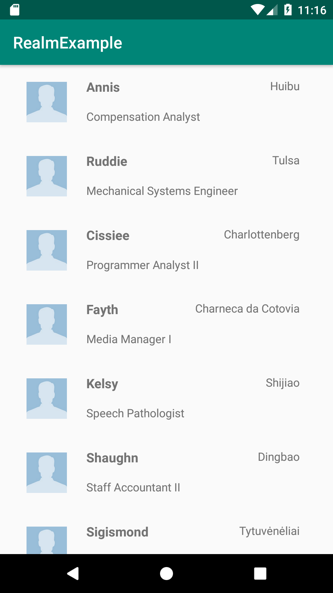

[`Kotlin Avanzado`](../../Readme.md) > [`Sesión 04`](../Readme.md) > `Ejemplo 3`

## Ejemplo 3: Aplicación de Realm

<div style="text-align: justify;">


### 1. Objetivos :dart:

* Que el alumno aprenda a instalar, configurar y utilizar Realm como motor de base de datos

### 2. Requisitos :clipboard:

1. Tener conocimiento básico de SQL
2. Haber Cursado la clase de Realm de la Sesión 04

### 3. Desarrollo :computer:

1. Instalar Realm en nuestro proyecto la dependencia

esto se agrega en *build.gradle* dentro de la carpeta raíz

```kotlin
buildscript {
    ...      
    }
    dependencies {
        ...
        classpath "io.realm:realm-gradle-plugin:6.0.2"
    }
}

```

También hay que aplicar el plugin dentro de *app/build.gradle*, en la cabeza del archivo

```kotlin
apply plugin: 'kotlin-android-extensions'

apply plugin: 'kotlin-kapt'

apply plugin: 'realm-android'  // Este es el plugin a aplicar, el anterior sólo está por referencia
```

Sincronizar el proyecto 

**NOTA:** es importante que realm android baja después de 'kotlin-android-extensions' y 'kotlin-kapt' (agregar este último si no está agregado), ya que aunque no esté documentado en el sitio web oficial, hay versiones de kotlin que tienen problemas con su aplicación

2. Crear una carpeta **assets** dentro de la carpeta main, y guardar el recurso *data.json* en él

3. Crear el objeto Contact, que es el Modelo de datos donde se mapearán los datos.

```kotlin
package org.bedu.realmexample

import io.realm.Realm
import io.realm.RealmModel
import io.realm.RealmObject
import io.realm.annotations.PrimaryKey

//Se escribe open para poder heredar
open public class Contact: RealmObject() {
        //con la anotación @PrimaryKey se indica que este es la llave primaria
    @PrimaryKey
    var id: Int? = null

    var name: String? = null

    var job: String? = null

    var company: String? = null

    var city: String? = null

}
```

4. Crear extensión de *Application*, e inicializar datos de realm ahí, lo nombraremos *MainApp*

```kotlin
class MainApp: Application() {

    override fun onCreate() {
        super.onCreate()
        
        //Aquí pondremos nuesto código para inicializar Realm
    }

```

en el *androidManifest.mxl* debemos declarar nuestra extensión de la Application

```xml
<application
        android:name=".MainApp"
             ...
```

5. Dentro del *MainApp*, seteamos el siguiente método para obtener el json en formato String:

```kotlin
fun getJsonFile(): String{

        return applicationContext
            .assets
            .open("data.json").bufferedReader().use {it.readText()}
    }
```

6. Con esto, ya podemos obtener nuestros datos y setearlos como datos de inicio en la base de datos, el siguiente código describe la descripción de la configuración, importante leer los comentarios.

```kotlin
//inicializamos Realm
        Realm.init(this)

        //guardar nuestro json en un JSON array
        val array = JSONArray(getJsonFile())

        //configuraciónn de nuestra base de datos
        val config = RealmConfiguration
            .Builder()
                //Aquí inicializamos los datos iterando cada objeto JSON
            .initialData { realm ->
                for ( i in 0 until array.length() ) {
                    //Seteando nuestros valores en Realm
                    val c = realm.createObject(Contact::class.java, i)
                    c.name = array.getJSONObject(i).getString("name")
                    c.job = array.getJSONObject(i).getString("title")
                    c.city = array.getJSONObject(i).getString("city")
                    c.company = array.getJSONObject(i).getString("company")
                }
            }
            .deleteRealmIfMigrationNeeded()
            .name("realmDB.realm") //seteando el nombre de la DB
            .build() 

        //Seteamos los datos de configuración en nuestra clase 
        Realm.setDefaultConfiguration(config) 
```

7. En el *onCreate()* del *MainActivity*, obtenemos los datos de la DB:

```kotlin
val realm = Realm.getDefaultInstance()
contacts = realm.where(Contact::class.java).findAll()

Log.d("Respuesta","$contacts")
```

¡Observa que se impriman los valores del JSON!

8. Para hacer visible la información, Usaremos un RecyclerView:

```xml
<?xml version="1.0" encoding="utf-8"?>
<LinearLayout
    xmlns:android="http://schemas.android.com/apk/res/android"
    xmlns:app="http://schemas.android.com/apk/res-auto"
    xmlns:tools="http://schemas.android.com/tools"
    android:layout_width="match_parent"
    android:layout_height="match_parent"
    tools:context=".MainActivity">

    <androidx.recyclerview.widget.RecyclerView
        android:id="@+id/recyclerContacts"
        android:layout_width="match_parent"
        android:layout_height="match_parent"
        app:layout_constraintBottom_toBottomOf="parent"
        app:layout_constraintLeft_toLeftOf="parent"
        app:layout_constraintRight_toRightOf="parent"
        app:layout_constraintTop_toTopOf="parent" />

</LinearLayout>
```

9. Completaremos el ActivityMain seteando el RecyclerView con el adapter y pasando la información requerida

```kotlin
class MainActivity : AppCompatActivity() {

    private lateinit var mAdapter : RecyclerAdapter
    private lateinit var contacts: List<Contact>

    override fun onCreate(savedInstanceState: Bundle?) {
        super.onCreate(savedInstanceState)
        setContentView(R.layout.activity_main)

        Log.d("resultados","INIT")

        val realm = Realm.getDefaultInstance()
        contacts = realm.where(Contact::class.java).findAll()

        setUpRecyclerView()

        Log.d("resultados","Results: ")
        Log.d("resultados","$contacts")
    }

    //configuramos lo necesario para desplegar el RecyclerView
    private fun setUpRecyclerView(){
        recyclerContacts.setHasFixedSize(true)
        recyclerContacts.layoutManager = LinearLayoutManager(this)
        mAdapter = RecyclerAdapter( this,contacts)
        recyclerContacts.adapter = mAdapter
    }
}
```

10. creamos el Adaptador llamado *RecyclerAdapter*

```kotlin
//Declaración con constructor
class RecyclerAdapter(
    var context:Context,
    var contacts: List<Contact>): RecyclerView.Adapter<RecyclerAdapter.ViewHolder>() {

    //Aquí atamos el ViewHolder
    override fun onBindViewHolder(holder: ViewHolder, position: Int) {
        val item = contacts.get(position)
        holder.bind(item, context)
    }


    override fun onCreateViewHolder(parent: ViewGroup, viewType: Int): ViewHolder {
        val layoutInflater = LayoutInflater.from(parent.context)
        return ViewHolder(layoutInflater.inflate(R.layout.item_contact, parent, false))
    }

    override fun getItemCount(): Int {
        return contacts.size
    }

    //El ViewHolder ata los datos del RecyclerView a la Vista para desplegar la información
    //También se encarga de gestionar los eventos de la View, como los clickListeners
    class ViewHolder(view: View) : RecyclerView.ViewHolder(view) {
        //obteniendo las referencias a las Views
        val nombre = view.findViewById(R.id.tvNombre) as TextView
        val job = view.findViewById(R.id.tvJob) as TextView
        val city = view.findViewById(R.id.tvCity) as TextView
        //val image = view.findViewById(R.id.userImage) as ImageView

        //"atando" los datos a las Views
        fun bind(contact: Contact, context: Context){
            nombre.text = contact.name
            job.text = contact.job
            city.text = contact.city
            //image.setImageResource(contact.idImage)

            //Gestionando los eventos e interacciones con la vista
            itemView.setOnClickListener{
               
            }
        }
    }
}
```

11. Y creamos el layout *item_contact.xml*:

```xml
<?xml version="1.0" encoding="utf-8"?>
<androidx.constraintlayout.widget.ConstraintLayout
    xmlns:android="http://schemas.android.com/apk/res/android"
    xmlns:app="http://schemas.android.com/apk/res-auto"
    xmlns:tools="http://schemas.android.com/tools"
    android:layout_width="match_parent"
    android:layout_height="wrap_content"
    android:paddingVertical="16dp">

    <ImageView
        android:id="@+id/userImage"
        android:layout_width="50dp"
        android:layout_height="50dp"
        android:src="@drawable/unknown"
        app:layout_constraintBottom_toTopOf="@+id/guideline"
        app:layout_constraintStart_toStartOf="@+id/guideline2"
        app:layout_constraintTop_toTopOf="@+id/guideline" />

    <androidx.constraintlayout.widget.Guideline
        android:id="@+id/guideline"
        android:layout_width="wrap_content"
        android:layout_height="wrap_content"
        android:orientation="horizontal"
        app:layout_constraintGuide_percent=".5" />

    <androidx.constraintlayout.widget.Guideline
        android:id="@+id/guideline2"
        android:layout_width="wrap_content"
        android:layout_height="wrap_content"
        android:orientation="vertical"
        app:layout_constraintGuide_percent="0.08" />

    <androidx.constraintlayout.widget.Guideline
        android:id="@+id/guideline3"
        android:layout_width="wrap_content"
        android:layout_height="wrap_content"
        android:orientation="vertical"
        app:layout_constraintGuide_percent="0.9" />

    <androidx.constraintlayout.widget.Guideline
        android:id="@+id/guideline4"
        android:layout_width="wrap_content"
        android:layout_height="wrap_content"
        android:orientation="vertical"
        app:layout_constraintGuide_percent="0.26" />

    <TextView
        android:id="@+id/tvNombre"
        android:layout_width="wrap_content"
        android:layout_height="wrap_content"
        android:layout_marginBottom="8dp"
        android:text="Nombre bato"
        android:textSize="16sp"
        android:textStyle="bold"
        app:layout_constraintBottom_toTopOf="@+id/guideline"
        app:layout_constraintStart_toStartOf="@+id/guideline4" />

    <TextView
        android:id="@+id/tvJob"
        android:layout_width="wrap_content"
        android:layout_height="19dp"
        android:layout_marginTop="8dp"
        android:text="Ya fue"
        app:layout_constraintStart_toStartOf="@+id/guideline4"
        app:layout_constraintTop_toTopOf="@+id/guideline" />

    <TextView
        android:id="@+id/tvCity"
        android:layout_width="wrap_content"
        android:layout_height="19dp"
        android:text="Ya fue"
        app:layout_constraintEnd_toStartOf="@+id/guideline3"
        app:layout_constraintTop_toTopOf="@+id/tvNombre" />


</androidx.constraintlayout.widget.ConstraintLayout>
```

La pantalla debe quedar así:



[`Anterior`](../Reto-02) | [`Siguiente`](../Reto-03)      

</div>


