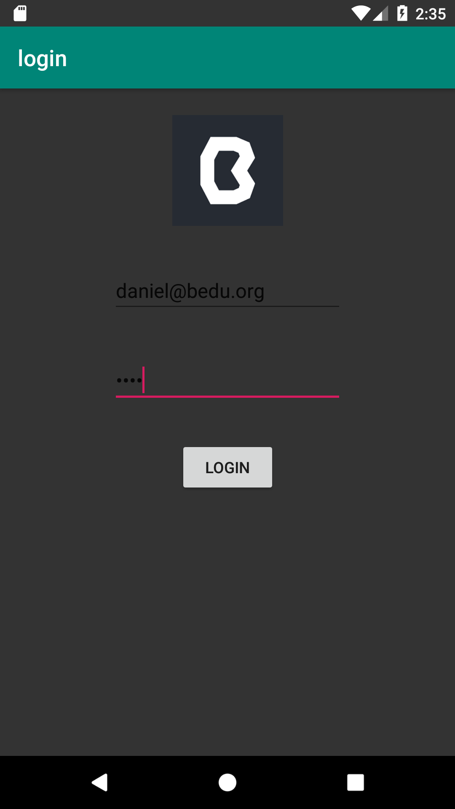
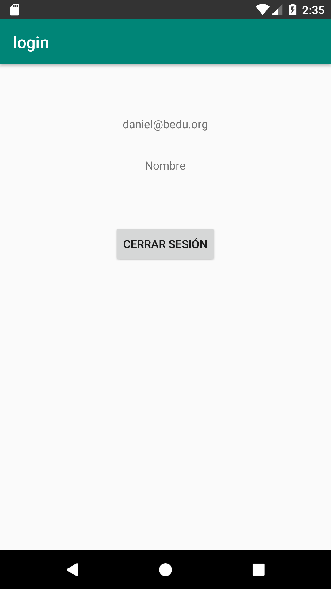

[`Kotlin Avanzado`](../../Readme.md) > [`Sesión 04`](../Readme.md) > `Reto 1` 

## Reto 1: Shared Preferences

<div style="text-align: justify;">


### 1. Objetivos :dart:

Aplicar SharedPreferences a través de un ejemplo

### 2. Requisitos :clipboard:

1. Haber tomado el primer tema de la sesión 1
2. Haber cursado el [Ejemplo 01](../Ejemplo-01)

### 3. Desarrollo :computer:

- Vamos a hacer un ejemplo de login con SharedPreferences, tomaremos un booleano como bandera para saber si se está loggeado o no. ***Nota: desaconsejamos utilizar una bandera para identificar que un usuario ha iniciado sesión, existen mecanismos más seguros y sofisticados*

1. Seteamos este login en el layout del MainActivity

```xml
<?xml version="1.0" encoding="utf-8"?>
<androidx.constraintlayout.widget.ConstraintLayout
    android:background="@color/colorPrimaryDark"
    xmlns:android="http://schemas.android.com/apk/res/android"
    xmlns:app="http://schemas.android.com/apk/res-auto"
    xmlns:tools="http://schemas.android.com/tools"
    android:layout_width="match_parent"
    android:layout_height="match_parent"
    tools:context=".MainActivity">

    <ImageView
        android:id="@+id/imgBedu"
        android:layout_width="100dp"
        android:layout_height="100dp"
        android:layout_marginTop="24dp"
        android:src="@drawable/bedu"
        app:layout_constraintEnd_toEndOf="parent"
        app:layout_constraintStart_toStartOf="parent"
        app:layout_constraintTop_toTopOf="parent" />

    <EditText
        android:id="@+id/etMail"
        android:layout_width="wrap_content"
        android:layout_height="wrap_content"
        android:layout_marginTop="36dp"
        android:ems="10"
        android:inputType="textEmailAddress"
        app:layout_constraintEnd_toEndOf="parent"
        app:layout_constraintStart_toStartOf="parent"
        app:layout_constraintTop_toBottomOf="@+id/imgBedu" />

    <EditText
        android:id="@+id/etPass"
        android:layout_width="wrap_content"
        android:layout_height="wrap_content"
        android:layout_marginTop="36dp"
        android:ems="10"
        android:inputType="textPassword"
        app:layout_constraintEnd_toEndOf="parent"
        app:layout_constraintStart_toStartOf="parent"
        app:layout_constraintTop_toBottomOf="@+id/etMail" />

    <Button
        android:id="@+id/btnLogin"
        android:layout_width="wrap_content"
        android:layout_height="wrap_content"
        android:layout_marginTop="32dp"
        android:text="Login"
        app:layout_constraintEnd_toEndOf="parent"
        app:layout_constraintStart_toStartOf="parent"
        app:layout_constraintTop_toBottomOf="@+id/etPass" />
</androidx.constraintlayout.widget.ConstraintLayout>
```

2. Guardamos el archivo adjunto ***bedu.png*** en la carpeta drawable, dentro de res. 


3. Para cambiar de pantalla sin poder regresar a la anterior con el botón back, aquí está el siguiente código.

```kotlin
val i = Intent(this, LoggedActivity::class.java)
            i.flags = Intent.FLAG_ACTIVITY_NEW_TASK or Intent.FLAG_ACTIVITY_CLEAR_TASK
            startActivity(i)
```

4. Utilizar este código para que en onStart cambiar de actividad (hay que declarar los métodos isLogged y goToLogged)

```kotlin
   override fun onStart() {
        super.onStart()

        if(isLogged()){
            goToLogged()
        }
    }
```

5. Guardar este archivo como *activity_logged.xml*

```xml
<?xml version="1.0" encoding="utf-8"?>
<LinearLayout xmlns:android="http://schemas.android.com/apk/res/android"
    android:orientation="vertical" android:layout_width="match_parent"
    android:layout_height="match_parent"
    android:gravity="center_horizontal">
    <TextView
    android:id="@+id/tvEmail"
        android:text="Correo"
    android:layout_marginTop="64dp"
    android:layout_width="wrap_content"
    android:layout_height="wrap_content"/>
    <TextView
        android:id="@+id/tvName"
        android:text="Nombre"
        android:layout_marginTop="32dp"
        android:layout_width="wrap_content"
        android:layout_height="wrap_content"/>
    <Button
        android:text="Cerrar sesión"
        android:id="@+id/btnClose"
        android:layout_marginTop="64dp"
        android:layout_width="wrap_content"
        android:layout_height="wrap_content"/>
</LinearLayout>
```

**Aconsejamos también declarar todos los tags en una sola actividad y que la otra los utilice, evitando así confusiones en ellas**

```kotlin
companion object{
        val PREFS_NAME = "org.bedu.login"
        val EMAIL = "email"
        val IS_LOGGED = "is_logged"
    }
```

utilizando:

```kotlin
getSharedPreferences(MainActivity.PREFS_NAME, Context.MODE_PRIVATE)
```

Las pantallas se deben ver así






[`Anterior`](../Ejemplo-01) | [`Siguiente`](../Ejemplo-02)      

</div>


