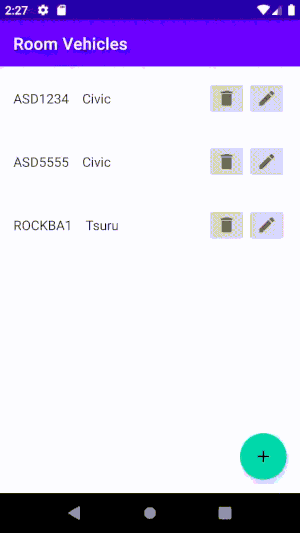

[`Kotlin Avanzado`](../../Readme.md) > [`Sesión 04`](../Readme.md) > `Reto 2`

## Reto 2: Room

<div style="text-align: justify;">
### 1. Objetivos :dart:

* Editar un elemento de la lista

### 2. Requisitos :clipboard:

* Haber cursado el [Ejemplo 2](../Ejemplo-02)

### 3. Desarrollo :computer:

El reto es implementar funcionalidad al botón editar. Cuando este botón sea presionado, debemos navegar a la pantalla de agregar vehículo, con la diferencia que esta vez en el botón se leerá __Actualizar__. 

La información puede ser enviada a través de un ___bundle___ en el método ___findNavController___.

```kotlin
findNavController().navigate(
                R.id.action_vehicleListFragment_to_addEditFragment,
                bundleOf("vehicle_id" to vehicle.id )
        )
```


Dependiendo de la existencia de ese valor en el bundle identificamos si estamos editando o agregndo un vehículo.


El siguiente gif muestra como se debe interactuar al agregar y al editar un elemento:




[`Anterior`](../Ejemplo-02) | [`Siguiente`](../Ejemplo-03/Readme.md)      

</div>