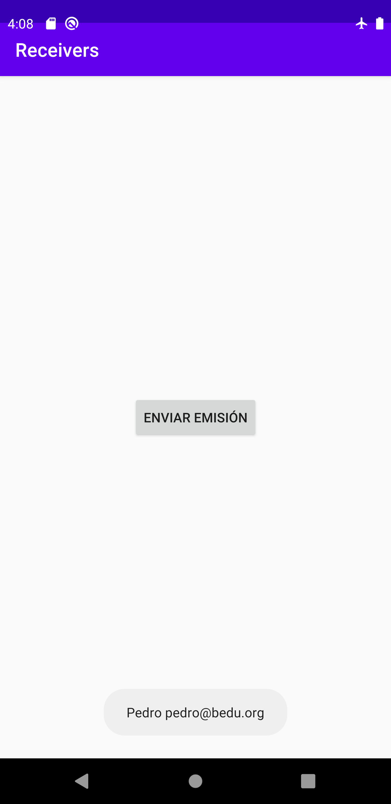
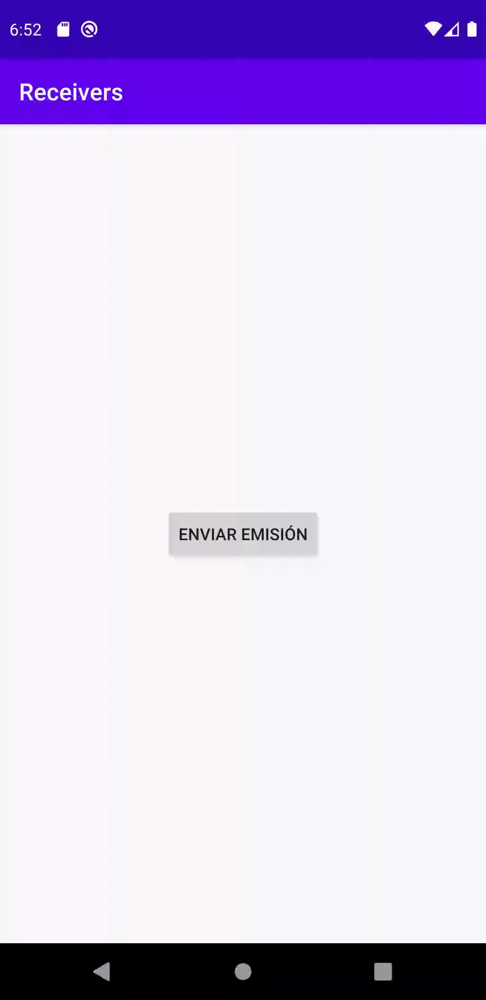

[`Kotlin Avanzado`](../../Readme.md) > [`Sesión 04`](../Readme.md) > `Ejemplo 1` 

## Ejemplo 1: Broadcast Receivers

<div style="text-align: justify;">


### 1. Objetivos :dart:

* Emitir una señal para un receiver específico

* Emitir una señal implícita desde una aplicación
* Escuchar señales explícitas y explícitas
* Implementar callbacks al recibir emisiones

### 2. Requisitos :clipboard:


### 3. Desarrollo :computer:


#### Definición

Un Broadcast Receiver es una clase que recibe una emisión hecha por una aplicación o por parte del sistema (por ejemplo, un aviso de batería baja) a partir de un Intent, estas emisiones las podemos interpretar como eventos. Para poder utilizarlos, hay que crear una clase que herede de este elemento y registrarlo en un componente de la app para que comience a recibir los mensajes.


#### Comunicación interna

Nuestro primer receiver escuchará un evento detonado desde nuestra misma aplicaciǿn.

Para esto, creamos un botón para detonar la emisión.

```xml
<androidx.constraintlayout.widget.ConstraintLayout ...>

    <Button
        android:id="@+id/button"
        android:layout_width="wrap_content"
        android:layout_height="wrap_content"
        android:text="Enviar emisión"
        app:layout_constraintBottom_toBottomOf="parent"
        app:layout_constraintEnd_toEndOf="parent"
        app:layout_constraintStart_toStartOf="parent"
        app:layout_constraintTop_toTopOf="parent" />

</androidx.constraintlayout.widget.ConstraintLayout>
```


Ahora, definiremos nuestro receiver; para esto, crearemos una subclase de ___BroadcastReceiver___ que implemente el método ___onReceive()___, dicho método se detona después de recibir una señal correspondiente y aquí es donde reaccionaremos a dicho evento. En nuestro ejemplo, obtendremos del evento los parámetros ___NAME___ y ___EMAIL___ mediante un bundle, como si de una comunicación entre activities se tratase. La información será mostrada en nuestro siempre confiable _Toast_.

```kotlin
class ReceiverOne : BroadcastReceiver() {

    override fun onReceive(context: Context, intent: Intent) {
        val bundle = intent.extras
        val name = bundle?.getString("NAME")
        val email = bundle?.getString("EMAIL")
        Toast.makeText(context,"$name $email",Toast.LENGTH_SHORT).show()
    }
}
```

 

En nuestro archivo _Manifest_ haremos la declaración estática de nuestro receiver creando nuestro _tag_ ___receiver___ . Este recibirá como atributo el nombre de la clase relacionada a este y contendrá un intent filter, que determinaa qué tipo de intent responderá nuestro componente, y se  definirá a través de una llave que permita identificar el evento cuando sea emitido que en este caso, será ___"org.bedu.actions.SALUDO"___. Consulta [Este enlace](https://developer.android.com/guide/topics/manifest/receiver-element) para visualizar todos sus atributos.

```xml
<receiver
            android:name=".ReceiverOne"
            android:enabled="true"
            android:exported="true">
            <intent-filter>
                <action
                    android:name="org.debu.actions.SALUDO"/>
            </intent-filter>
        </receiver>
```


Finalmente, para poder recibir la señal, hemos de detonarla mediante un _Intent_ y con apoyo del método ___sendBroadcast()___ dentro del listener de nuestro botón. Hay qué recordar que como en el ___receiver___ obtenemos info extra, tenemos qué declararla en nuestro _Intent_.


```kotlin
// Esta es nuestra información extra a enviar
val bundle = Bundle().apply {
                putString("NAME","Pedro")
                putString("EMAIL","pedro@bedu.org")
            }

// Creamos un Intent con nuestro bundle como extra y detonamos el evento con sendBroadcast()
Intent(this,ReceiverOne::class.java).apply {
                putExtras(bundle)
            }.let(::sendBroadcast)
```

si la sintaxis anterior (específicamente en el último bloque) no te cuadra, te mostramos el código equivalente sin _scope functions_

```kotlin
val intent = Intent(this,ReceiverOne::class.java)
intent.putExtras(bundle)
sendBroadcast(intent)
```

La pantalla debe verse así al pulsar el botón:




Si lo requieres, puedes dar un repaso al tema de ___Scope Functions___ en la [documentación oficial](https://kotlinlang.org/docs/reference/scope-functions.html#:~:text=Such%20functions%20are%20called%20scope,result%20of%20the%20whole%20expression.) y para ejemplos más detallados, en [este blog](https://medium.com/@fatihcoskun/kotlin-scoping-functions-apply-vs-with-let-also-run-816e4efb75f5).

### Broadcast implícito

___Nota: ___ para este punto específico, debemos apuntar a una versión anterior a la API 26, debido que desde esta versión solo podemos atender broadcasts implícitos si este se registra de forma dinámica ( abordaremos en seguida este tema).

Ahora, en vez de elegir directamente el receiver que va a escuchar nuestra emisión, vamos a lanzar al aire nuestra emisión, pero utilizaremos una clave para que quien quiera recibirla, pueda identificarla. Recuerdas el intent filter de nuestro manifest? ahí declaramos una acción :


```xml
...
<action
   android:name="org.debu.actions.SALUDO"/>
...
```

 

Con esta llave recibiremos nuestro intent.

```kotlin
Intent("org.debu.actions.SALUDO").apply {
	putExtras(bundle)
}.let(::sendBroadcast)
```

Corremos el código y debemos recibir el mismo mensaje!


#### Registro dinámico

A diferencia del ejemplo anterior, donde registramos por medio del _manifest_, en este caso lo haremos en nuestra _Activity_ por medio del contexto. Este método es igual de válido que el anterior e incluso nos da la opción de dar de baja al servicio si ya no es requerido.


Crearemos un segundo receiver para no alterar el anterior:

```kotlin
class ReceiverTwo : BroadcastReceiver() {

    override fun onReceive(context: Context, intent: Intent) {
        Toast.makeText(context,"Evento recibido 2",Toast.LENGTH_SHORT).show()

    }
}
```

Ahora hay que registrar nuestro receiver manualmente, en este caso lo haremos en onStart y onStop, garantizando que cuando la app pase a segundo plano, esta deje de recibir los mensajes y al llegar al primer plano, los reanude.

Primero, declaramos un miembro para tener una referencia del receiver.

```kotlin
private val receiverTwo = ReceiverTwo()
```

Registramos nuestro receiver, creando un filtro para escuchar la acción ___org.bedu.actions.SALUDO___:

```kotlin
override fun onStart(){
  super.onStart()

  IntentFilter().apply {
    addAction("org.debu.actions.SALUDO")
  }.also { filter -> registerReceiver(receiverTwo,filter) }

}
```

por último, damos de baja en ___onStop___.

```kotlin
    override fun onStop() {
        super.onStop()
        unregisterReceiver(receiverTwo)
    }
```


___NOTA:___ Si queremos que el registro dure todo el ciclo de vida del ___Activity___, debemos usar ___onCreate___ y ___onDestroy___, si lo usamos en ___onResume___ se debe dar de baja en ___onPause___ y así con los otros callbacks del ciclo de vida.


Ahora, copiamos el código del primer receiver en el segundo, para que las pruebas se hagan con un receiver registrado por contexto.


#### Local Broadcasts (Evitar su uso)

La clase ___LocalBroadcastManager___ es capaz de emitir un broadcast más óptimo para comunicación local (no se establece protocolos de intercomunicación entre otras cosas). Esta clase está obsoleta y existen alternativas más avanzadas para emular su función.


#### Broadcasts asíncronos

Si agregamos la siguiente línea de código a nuestro log, podemos ver en qué Thread se ejecuta el callback ___onReceive___ de nuestro receiver:

```kotlin
Thread: ${Thread.currentThread()}
```

 La salida queda así:

> Thread[main,5,main]

Lo cual significa que estamos en el _Main Thread_, por lo que el sistema puede terminar el proceso si considera necesario liberar memoria. Para evitar esto, podemos correr nuestro proceso en segundo plano mediante una coroutine. Haremos uso del paquete ViewModel para facilitar ciertos manejos del job en el ciclo de vida.

Creamos una clase que va a realizar la tarea asíncrone, esta heredará de ___ViewModel___, y recibirá el bundle para extraer los datos, y el context para mostrar nuestro Toast.

```kotlin
  private inner class ToastCoroutine(
        private val bundle: Bundle?,
        private val context: Context) : ViewModel() {
    
  }
```


Dentro de ella crearemos una función execute() que ejecutará nuestra tarea, aquí ejecutaremos el método ___doInBackground___ que correrá el proceso en un _Thread_ separado del main, y ___onPostExecute___ que correrá en el _Main Thread_ para poder renderizar nuestro _Toast_.

```kotlin
  fun execute() = viewModelScope.launch {
            doInBackground()
            onPostExecute()
        }
```

En ___doInBackground___ imprimimos el nombre y email recibido, junto con el thread en el que se esta corriendo. Hacemos un delay(1000) para probar que estamos suspendiendo la corrutina exitosamente. Debido a que solamente en el Hilo principal puedo interactuar con la UI, no es posible renderizar el _Toast_ aquí.

```kotlin
private suspend fun doInBackground(): String = withContext(Dispatchers.IO) {
            val name = bundle?.getString("NAME")
            val email = bundle?.getString("EMAIL")

            Log.d("Broadcast",
                """NAME: $name
                EMAIL: $email
                Thread: ${Thread.currentThread()}
            """.trimMargin())
            delay(3000) // simulate async work
            return@withContext "Resultado"
        }
```


en ___onPostExecute___ es donde mostramos el _Toast_.

```kotlin
private fun onPostExecute(){
    val name = bundle?.getString("NAME")
    val email = bundle?.getString("EMAIL")
    Toast.makeText(context,"$name $email",Toast.LENGTH_SHORT).show()

    Log.d("Broadcast", " Thread de post execute: ${Thread.currentThread()}")
}
```


Finalmente, el _onReceive_ ___ReceiverTwo___ debe lucir así:

```kotlin
ToastCoroutine(intent.extras,context).run {
    execute()
}
```


De esta forma comprobamos que al correr ___doInBackground___ obtenemos el siguiente _Thread_:

> Thread: Thread[DefaultDispatcher-worker-1,5,main]

Mientras que en ___onPostExecute___ se muestra el hilo principal:

> Thread: Thread[main,5,main]

___NOTA:___ Esta solución no es la más popular, debido a que reemplaza a ___AsyncTask___, que fue declarada obsoleta recientemente en la API 30.

Para una solución con AsyncTask, haríamos algo similar:

```kotlin
 private inner class ToastTask(
        private val pendingResult: PendingResult,
        private val bundle: Bundle?,
        private val context: Context,
    ): AsyncTask<String,Int,String>(){

        override fun doInBackground(vararg params: String?): String {

            val name = bundle?.getString("NAME")
            val email = bundle?.getString("EMAIL")

            Log.d("Broadcast",
                """NAME: $name
                EMAIL: $email
                Thread: ${Thread.currentThread()}
            """.trimMargin())

            return "Respuesta"
        }

        override fun onPostExecute(result: String?) {
            super.onPostExecute(result)

            val name = bundle?.getString("NAME")
            val email = bundle?.getString("EMAIL")

            Toast.makeText(context,"$name $email",Toast.LENGTH_SHORT).show()

            Log.d("Broadcast",
                " Thread de post execute: ${Thread.currentThread()}")

            pendingResult.finish()
        }

    }
```


La llamada en ___onReceive___ sería así:

```kotlin
val pendingResult: PendingResult = goAsync()
 ToastTask(pendingResult, intent.extras,context).run{
     execute()
 }
```


El output del log para ___doInBackground___ sería el siguiente:

> NAME: Pedro
> EMAIL: pedro@bedu.org
> Thread: Thread[AsyncTask #1,5,main]

mientras que para ___onPostExecute___ sería el siguiente:

> Thread de post execute: Thread[main,5,main]


#### Recibiendo señales del sistema

Ya escuchamos emisiones desde la propia aplicación, pero el sistema operativo también puede arrojar varias emisiones correspondientes a eventos que suceden en el sistema, algunos de esto son:


* __ACTION_DATE_CHANGED__ (al cambiar la fecha del sistema)
* ___DATA_SMS_RECEIVED_ACTION___ (Al recibir un SMS)
* ___ACTION_WIFI_AWARE_STATED_CHANGED___ 
* ___ACTION_BATTERY_LOW___ (Batería baja)
* ___ACTION_BATTERY_OKAY___ (Batería con carga considerable)

Para consultar todas las acciones disponibles para la API 30 [consulta aquí](https://developer.android.com/about/versions/11/reference/broadcast-intents-30), ten en cuenta que pueden haber algunas incompatibilidades si las acciones se prohibieron en esta o en anteriores APIs.

En este ejemplo utilizaremos el aviso de modo avión.

Primero crearemos nuestro receiver y luego lo registraremos (forzosamente dinámico porque la llamada será implícita).

Creamos un nuevo receiver


```kotlin
class AirplaneReceiver : BroadcastReceiver() {
    override fun onReceive(context: Context?, intent: Intent?) {

}
```


de acuerdo a la [documentación](https://developer.android.com/reference/android/content/Intent#ACTION_AIRPLANE_MODE_CHANGED), el nombre de la acción para el modo avión es ___ACTION_AIRPLANE_MODE_CHANGED___ y nos avisa que su estado cambió, para obtener el valor del estado, hay qué extraer la propiedad ___state___ que es un boolenao, por lo que lo extraeremos e imprimiremos su estado en un ___Toast___. 

```kotlin
       val airplaneState = intent?.let {
            if(it.getBooleanExtra("state",false)) "Prendido" else "Apagado"
        }

        Toast.makeText(context,
            "Modo avión $airplaneState",
            Toast.LENGTH_SHORT)
            .show()
    }
```


Creamos un miembro en nuestro _Activity_ para nuestro receiver:

```kotlin
private val airplaneReceiver = AirplaneReceiver()
```

Ahora lo registraremos. Como se desea que el mensaje se muestre aun cuando la app está en segundo plano debido a que abriremos nuestra menú de opciones, el registro sucederá en ___onCreate___.

```kotlin
override fun onCreate(savedInstanceState: Bundle?) {
        super.onCreate(savedInstanceState)
        setContentView(R.layout.activity_main)

				...
        IntentFilter().apply {
                  addAction(Intent.ACTION_AIRPLANE_MODE_CHANGED)
              }.also { filter -> registerReceiver(airplaneReceiver,filter) }
  
    }
```


Y le damos de baja en ___onDestroy___

```kotlin
 override fun onDestroy() {
        super.onDestroy()
        unregisterReceiver(airplaneReceiver)
    }
```


De esta forma, al prender o apagar el modo avión, la app debe hacer lo siguiente:




También debe funcionar con la aplicación minimizada (en segundo plano):


[`Anterior`](../Readme.md) | [`Siguiente`](../Reto-01)      

</div>

