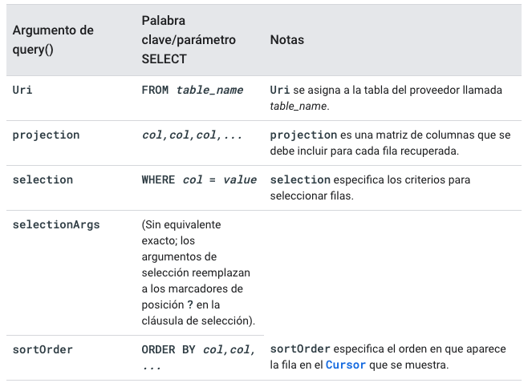

[`Kotlin Avanzado`](../../Readme.md) > [`Sesión 04`](../Readme.md) > `Ejemplo 2 `

## Ejemplo 2: Content Providers

<div style="text-align: justify;">


### 1. Objetivos :dart:

* Proveer contenido de la app a aplicaciones externas
* Acceder a información de una app externa

### 2. Requisitos :clipboard:


### 3. Desarrollo :computer:

Un Content Provider es una capa adicional a un repositorio central que tiene el objetivo de manejar el acceso a información de la aplicación con respecto a otras aplicaciones externas, quienes se comunican con el provider a través de un cliente. 

En resumen, un content provider tiene las siguientes aplicaciones: 

* Compartir información a otras aplicaciones

* Enviar datos a widgets

* Cargar datos a la UI

* usos extras a través de otras clases

  

El siguiente diagrama muestra el flujo entre clases para la manipulación de datos de una app a través del content provider.


#### Configuración inicial

Para este proyecto, hay qué utilizar el código [base](base).


Por defecto, los content providers abren un canal de escritura y lectura a cualquier aplicación externa conectándose al provider, por lo que existe un mecanismo de permisos para personalizar este comportamiento. Para este caso, daremos permiso de lectura y escritura:

```xml
<permission android:name="com.example.android.contentprovidersample.provider.READ_WRITE"/>
```


Ahora crearemos nuestra clase ___VehicleProvider___ que extenderá a ___ContentProvider___, donde crearemos en el futuro la lógica de nuestro proveedor.

```kotlin
class VehicleProvider: ContentProvider() {

}
```


Si creamos la clase de forma manual, deberemos agregar nuestro provider en el archivo _manifest_.

Hay qué declarar nuestro provider en el ___AndroidManifest.xml___:

```xml
<provider
    android:name=".provider.VehicleProvider"
    android:authorities="org.bedu.roomvehicles.provider"
    android:exported="true"
    android:permission="org.bedu.roomvehicles.provider.READ_WRITE"/>
```


#### Modificación del Dao

Para poder operar nuestra base de datos con un provider, se requieren hacer modificaciones a los métodos que abstraen las queries. Algunas de estas modificaciones implican que se nos devuelva un objeto de la clase ___Cursor___, que es una interfaz que provee de acceso al resultado de una query a la DB.

El resultado de nuestras modificaciones nos dará el siguiente Dao:

```kotlin
@Dao
interface VehicleDao {

    @Insert
    fun insertAll(vehicle: List<Vehicle>)

    @Insert
    fun insertVehicle(vehicle: Vehicle): Long

    @Update
    fun updateVehicle(vehicle: Vehicle): Int

    @Delete
    fun removeVehicle(vehicle: Vehicle)

    @Query("DELETE FROM ${Vehicle.TABLE_NAME} WHERE ${Vehicle.COLUMN_PK}=:id")
    fun removeVehicleById(id: Int): Int

    @Delete
    fun removeVehicles(vararg vehicles: Vehicle)

    @Query("SELECT * FROM ${Vehicle.TABLE_NAME}")
    fun getVehicles(): Cursor

    @Query("SELECT * FROM ${Vehicle.TABLE_NAME} WHERE ${Vehicle.COLUMN_PK} = :id")
    fun getVehicleById(id: Int): Cursor

    @Query("SELECT * FROM ${Vehicle.TABLE_NAME} WHERE plates_number = :platesNumber")
    fun getVehicleByPlates(platesNumber: String) : Cursor
}
```


#### Creando un UriMatcher

Un UriMatcher es una utilidad que nos ayuda a identificar una uri ingresada con una uri registrada a través de un identificador. Nosotros crearemos uno para identificar en el futuro las operaciones que hagamos a nuestro repositorio a través de nuestro provider. Creamos nuestro UriMatcher (definiendo las queries que efectuará). Este se llamará ___VehicleMatcher.kt___.

```kotlin
const val VEHICLE_DIR = 1
const val VEHICLE_ITEM = 2


val vehicleMatcher = UriMatcher(UriMatcher.NO_MATCH).apply {
    addURI(VehicleProvider.AUTHORITY, "${Vehicle.TABLE_NAME}", VEHICLE_DIR)
    addURI(VehicleProvider.AUTHORITY, "${Vehicle.TABLE_NAME}/*", VEHICLE_ITEM)
}
```


#### Diseñando el Content Provider

Ahora definiremos el contenido de nuestro content provider. Primero, declararemos un atributo que haga referencia a la base de datos que manipularemos, y otra referencia a su _Dao_, para efectuar las queries.


```kotlin
 // Acceso a la base de datos
    private lateinit var vehicleDb: BeduDb

    // Guarda la instancia de nuestro DAO
    private var vehicleDao: VehicleDao? = null
```

También declararemos algunas strings estáticas que serán útiles dentro de la clase:

```kotlin
 companion object{
        const val AUTHORITY = "org.bedu.roomvehicles.provider"
        const val URI_STRING = "content://$AUTHORITY/"
        const val URI_VEHICLE = "$URI_STRING${Vehicle.TABLE_NAME}"
        const val MIME_CONTENT_TYPE = "vnd.android.cursor.dir/$URI_VEHICLE"
        const val MIME_CONTENT_ITEM_TYPE = "vnd.android.cursor.item/$URI_VEHICLE"
    }
```


Las siguientes definiciones ayudarán un poco a entender el significado de las cadenas de textos anteriores.

* Content URI: Es una URI que apunta a una tabla o dato específico de un proveedor de contenido de una aplicación específica. Su estructura es la siguiente:

  ```xml
  content://<Authority>/<tabla>
  ```

  

  si se quiere recuperar un valor específico, agregamos al final su id:

  ```xml
  content://<Authority>/<tabla>/<id>
  ```

  ​	

* Authority: Es una cadena de texto que identifica al proveedor de contenido dentro de tu aplicación. Generalmente se ocupa la siguiente nomenclatura: 

* ```xml
  <dominio de primer nivel>.<dominio>.<nombre-paquete>.<provider>
  ```

  Por ejemplo:

  ​	org.bedu.roomvehicles.provider

* MIME Types: (Multipurpose Internet Mail Extensions) es un string que permite identificar el formato de un documento o archivo. Los navegadores lo utilizan para saber cómo procesar una URL. Su estructura es la siguiente:

  > tipo/subtipo

Algunos ejemplos son: 

	* text/plain
	* text/html
	* application/pdf
	* audio/mpeg
	* video/mp4

Para este ejercicio, los tipos de datos que obtenemos son tablas de datos o una fila singular de esta, por lo tanto MIME_CONTENT_TYPE (vnd.android.cursor.dir/...) representa una tabla, mientras que MIME_CONTENT_ITEM_TYPE (vnd.android.cursor.item/...)representa una fila() 

Para este caso, lo utilizaremos para identificar el tipo de dato a recuperar.


Al momento de crearse nuestra clase, crearemos una nueva instancia de nuestra DB y su Dao, para referenciarlas en las variables previamente creadas para esto.

```kotlin
  override fun onCreate(): Boolean {
        vehicleDb = BeduDb.getInstance(context!!)!!
        vehicleDao = vehicleDb.vehicleDao()
        return true
    }
```

El método ___getType___ servirá para identificar el tipo de dato que contiene un URI (una tabla o un elemento), esto se logra gracias a nuestro UriMatcher creado previamente.

```kotlin
   // muestra el MIME correspondiente al URI
    override fun getType(uri: Uri): String? {
        return when(vehicleMatcher.match(uri)){
            VEHICLE_DIR -> MIME_CONTENT_TYPE
            VEHICLE_ITEM -> MIME_CONTENT_ITEM_TYPE
            else -> throw IllegalArgumentException("Unknown Uri: $uri")
        }
    }
```

 

Ahora implementamos el código para insertar un nuevo vehículo a través del método ___insert___. Identificaremos el tipo de dato en nuestra URI, en caso de ser un ___VEHICLE_DIR___, creamos un nuevo vehículo a partir del modelo, la marca y las placas; para insertarlo, utilizaremos nuestro Dao(), daremos aviso al content resolver del cambio efectuado y finalmente regresaremos en un Uri el id del nuevo vehículo. Si el vehículo es un ___VEHICLE_ITEM___, regresamos un error debido a que no podemos insertar un vehículo ya que el id lo crea automáticamente el motor.

```kotlin
override fun insert(uri: Uri, values: ContentValues?): Uri? {
        return when(vehicleMatcher.match(uri)){
            VEHICLE_DIR -> {
                val vehicle = Vehicle(
                    model = values?.getAsString(Vehicle.COLUMN_MODEL),
                    brand = values?.getAsString(Vehicle.COLUMN_BRAND),
                    platesNumber = values?.getAsString(Vehicle.COLUMN_PLATES)
                )
                val id = context?.let { BeduDb.getInstance(it)?.vehicleDao()?.insertVehicle(vehicle) }
                context?.contentResolver?.notifyChange(uri,null)
                return ContentUris.withAppendedId(uri, id!!.toLong())
            }

            VEHICLE_ITEM -> throw IllegalArgumentException("Invalid URI: id should not be provided")

            else -> throw IllegalArgumentException("Unknown Uri: $uri")
        }
    }
```

Para el método ___delete___, implementaremos algo similar a lo anterior. Para el caso de ___VEHICLE_DIR___, regresaremos una excepción, debido a  que solo se permitirá eliminar un elemento a la vez. Para ___VEHICLE_ITEM___. obtenemos el ide dentro de la Uri, eliminamos desde el Dao y regresamos el número actual de vehículos.

```kotlin
    override fun delete(uri: Uri, selection: String?, selectionArgs: Array<out String>?): Int {
        return when(vehicleMatcher.match(uri)){
            VEHICLE_DIR -> throw IllegalArgumentException("Invalid URI: id should be provided")

            VEHICLE_ITEM -> {

                val id = ContentUris.parseId(uri)
                val count = BeduDb.getInstance(context!!)?.vehicleDao()?.removeVehicleById(id.toInt())
                return count!!
            }

            else -> throw IllegalArgumentException("Unknown Uri: $uri")
        }
    }
```


Para actualizar los datos, lanzaremos una excepción si el tipo de dato es __VEHICLE_DIR__, mientras que para ***VEHICLE_ITEM***, obtenemos el id y los valores del vehículo para crear un objecto _Vehicle_, que pasaremos como parámetro al método del Dao ___updateVehicle()___.

```kotlin
    override fun update(uri: Uri, values: ContentValues?, selection: String?, selectionArgs: Array<out String>?): Int {
        return when(vehicleMatcher.match(uri)){
            VEHICLE_DIR -> throw IllegalArgumentException("Invalid URI: id should be provided")

            VEHICLE_ITEM -> {

                val vehicle = Vehicle(
                        id = ContentUris.parseId(uri).toInt(),
                        model = values?.getAsString(Vehicle.COLUMN_MODEL),
                        brand = values?.getAsString(Vehicle.COLUMN_BRAND),
                        platesNumber = values?.getAsString(Vehicle.COLUMN_PLATES)
                )

                return BeduDb.getInstance(context!!)?.vehicleDao()?.updateVehicle(vehicle)!!

            }

            else -> throw IllegalArgumentException("Unknown Uri: $uri")
        }
    }
```

Antes de continuar con la implementación del método query(), mostraremos la siguiente tabla que explica la equivalencia de cada uno de sus argumentos.



Finalmente, para el método ___query___, la consulta que efectuaremos sera _select_, por lo tanto implementamos lo siguiente:

```kotlin

    // Select
    override fun query(
        uri: Uri,
        projection: Array<out String>?,
        selection: String?,
        selectionArgs: Array<out String>?,
        sortOrder: String?
    ): Cursor? {
        return when(vehicleMatcher.match(uri)){
            VEHICLE_ITEM,VEHICLE_DIR -> {
                val code = vehicleMatcher.match(uri)
                val dao = BeduDb.getInstance(context!!)!!.vehicleDao()
                val cursor=
                        if (code== VEHICLE_DIR) dao.getVehicles()
                        else dao.getVehicleById(ContentUris.parseId(uri).toInt())
                cursor.setNotificationUri(context?.contentResolver, uri)
                return cursor
            }
            else -> throw IllegalArgumentException("Unknown URI: $uri")
        }
    }
```


#### Haciendo uso del content provider

Ahora crearemos comunicación con el provider a través de un ___content resolver___. Para esto, definiremos lo siguiente:

* ContentResolver: Es una clase que se comunica con el proveedor y proporcionan funciones CRUD.
* CursorLoader: hace una consulta al ContentResolver y regresa un cursor.

Reescribiremos el método ___onDelete___, que es llamado al momento de dar click en la opción eliminar de un vehículo.

A través de un executor, ejecutaremos un proceso en segundo plano para llamar al método _delete_ de nuestro content resolver, enviando como parámetros la URI, la cláusula de nuestra query (el filtro) y el argumento de de esa cláusula (el id del vehículo a eliminar).

Después de ejecutar la query, eliminaremos el elemento de nuestro adapter y mostraremos un ***Toast*** con un mensaje de éxito.

```kotlin
    override fun onDelete(vehicle: Vehicle) {

        val executor: ExecutorService = Executors.newSingleThreadExecutor()

        executor.execute(Runnable {
            val selectionClause = "${Vehicle.COLUMN_PK} LIKE ?"
            val selectionArgs = arrayOf(vehicle.id.toString())


            context?.applicationContext?.contentResolver?.delete(
                    Uri.parse("${VehicleProvider.URI_VEHICLE}/${vehicle.id}"),
                    selectionClause,
                    selectionArgs

            )


            Handler(Looper.getMainLooper()).post(Runnable {
                adapter.removeItem(vehicle)
                Toast.makeText(context,"Elemento eliminado!",Toast.LENGTH_SHORT).show()
            })
        })
    }
```


Para recuperar los vehículos, hay qué declarar un callback para el cursor. 

```kotlin
private val loaderCallbacks: LoaderManager.LoaderCallbacks<Cursor> = object : LoaderManager.LoaderCallbacks<Cursor> {
...
}
```


El método ___onCreateLoader___ regresará un CursorLoader con la URI para una tabla y en segunda instancia un arreglo con los nombres de las columnas de un vehículo.

```kotlin
 override fun onCreateLoader(id: Int, @Nullable args: Bundle?): Loader<Cursor?> {
            return CursorLoader(requireContext().applicationContext,
                    Uri.parse("${VehicleProvider.URI_VEHICLE}"),
                    arrayOf(
                            Vehicle.COLUMN_PK,
                            Vehicle.COLUMN_BRAND,
                            Vehicle.COLUMN_MODEL,
                            Vehicle.COLUMN_PLATES,
                            Vehicle.COLUMN_WORKING
                    ),
                    null,
                    null,
                    null
            )
        }
```


Cuando la carga de datos finalice, se ejecuta el método ___onLoadFinished___, por lo que en este momento corresponde enlistar los vehículos en el _RecyclerView_. Mediante el método ___moveToNext___ de nuestro Cursor _data_, podemos iterar en cada uno de los elementos; puesto que requerimos tener un arreglo, los iremos guardando dentro de _vehicleArray_. Finalmente, este arreglo se asignará al adapter de nuestra lista.

```kotlin
 private val loaderCallbacks: LoaderManager.LoaderCallbacks<Cursor> = object : LoaderManager.LoaderCallbacks<Cursor> {
       

        override fun onLoadFinished(loader: Loader<Cursor?>, data: Cursor?) {
            data?.apply {
                val pkIndex: Int = getColumnIndex(Vehicle.COLUMN_PK)
                val brandIndex: Int = getColumnIndex(Vehicle.COLUMN_BRAND)
                val modelIndex: Int = getColumnIndex(Vehicle.COLUMN_MODEL)
                val platesIndex: Int = getColumnIndex(Vehicle.COLUMN_PLATES)
                val workingIndex: Int = getColumnIndex(Vehicle.COLUMN_WORKING)

                while (moveToNext()) {
                    val pk = getInt(pkIndex)
                    val brand = getString(brandIndex)
                    val model = getString(modelIndex)
                    val plates = getString(platesIndex)

                    val vehicle = Vehicle(
                            id = pk,
                            brand = brand,
                            model = model,
                            platesNumber = plates,
                            isWorking = true
                    )


                    vehicleArray.add(vehicle)
                }
            }


            adapter = VehicleAdapter(vehicleArray, getListener())
            recyclerVehicle.adapter = adapter
        }

        override fun onLoaderReset(loader: Loader<Cursor?>) {
            recyclerVehicle.adapter = null
        }
    }
```


Para ejecutar el ___CursorLoader___, lo llamamos de la siguiente forma:

```kotlin
LoaderManager.getInstance(this).initLoader(1,null,loaderCallbacks)
```


Para prepoblar nuestra base de datos, podemos recurrir al método prepopulate() (usarlo una sola vez en onCreateView).

Paso 5: para gregar un nuevo vehículo, usaríamos esto.

```kotlin
addButton.setOnClickListener{

            val executor: ExecutorService = Executors.newSingleThreadExecutor()

            executor.execute(Runnable {
                val values = ContentValues().apply {
                    put(Vehicle.COLUMN_BRAND, brandEdit.text.toString())
                    put(Vehicle.COLUMN_MODEL, modelEdit.text.toString())
                    put(Vehicle.COLUMN_PLATES, platesEdit.text.toString())
                    put(Vehicle.COLUMN_WORKING, workingSwitch.isEnabled)
                }


                context?.applicationContext?.contentResolver?.insert(
                        Uri.parse("${VehicleProvider.URI_VEHICLE}"),
                        values
                )

                Handler(Looper.getMainLooper()).post(Runnable {
                    findNavController().navigate(
                            R.id.action_addEditFragment_to_vehicleListFragment
                    )
                })
            })

        }
```


[`Anterior`](../Reto-01) | [`Siguiente`](../Reto-02)      

</div>

