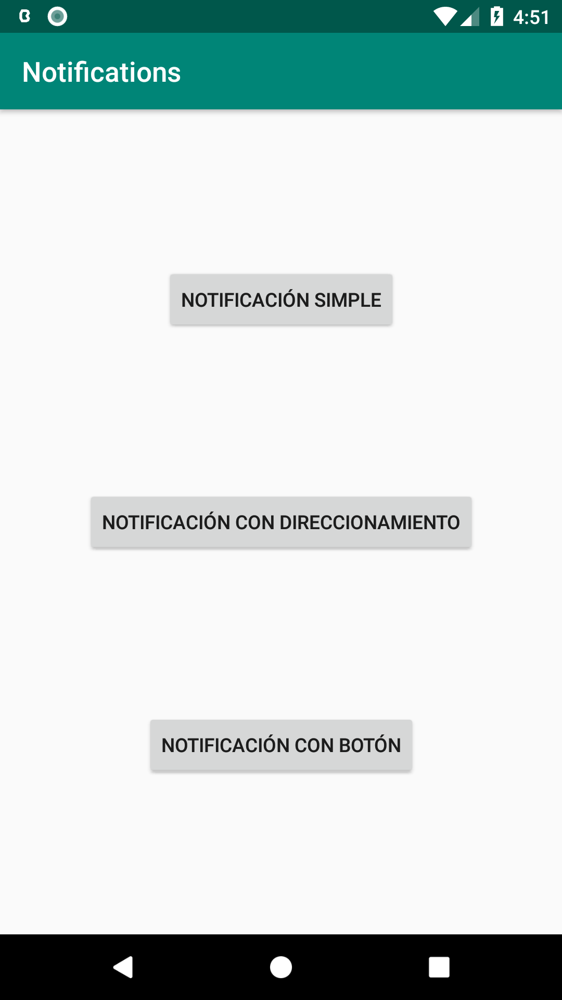
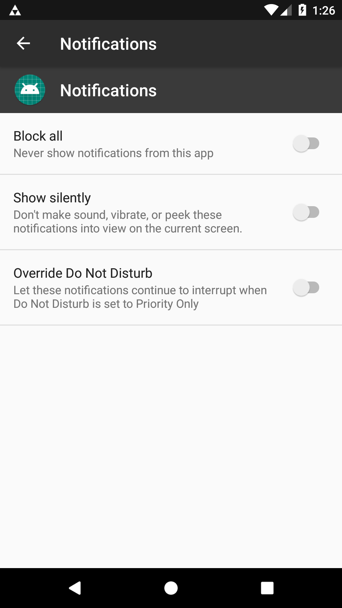
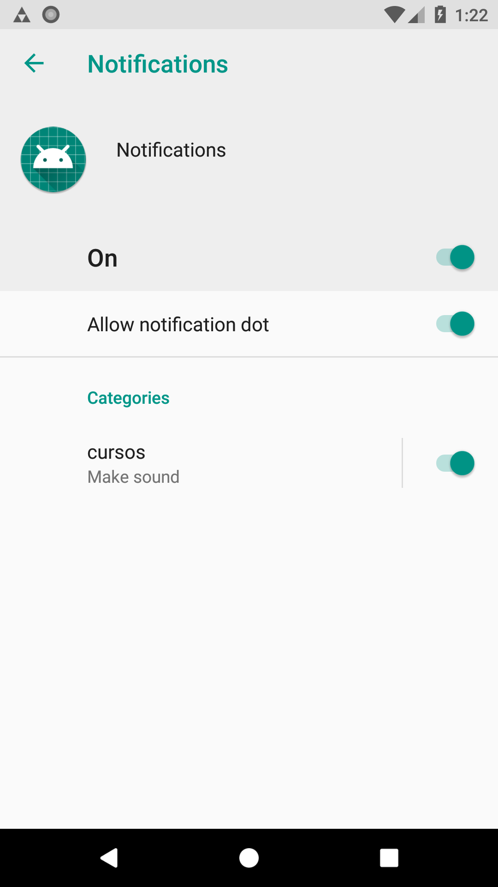
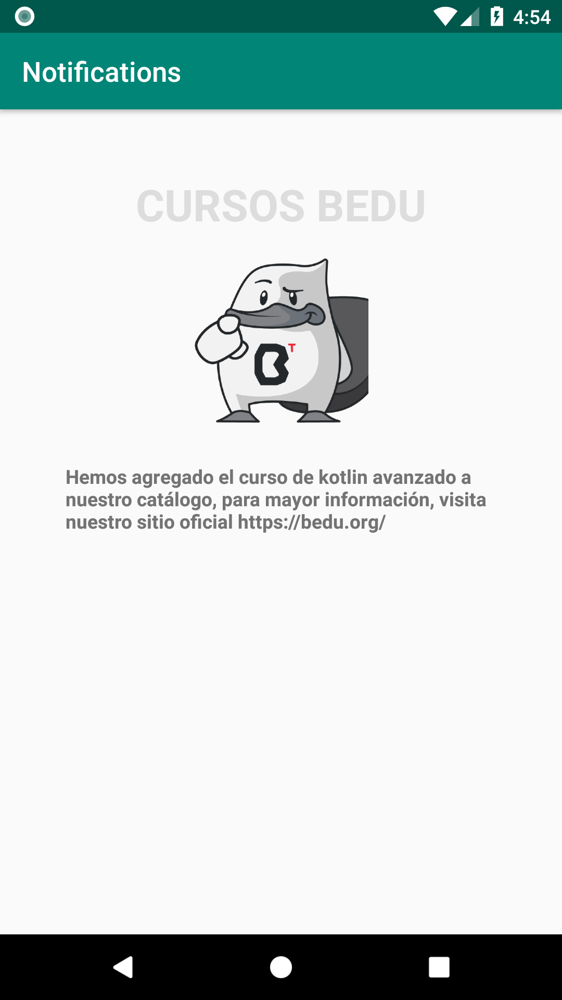
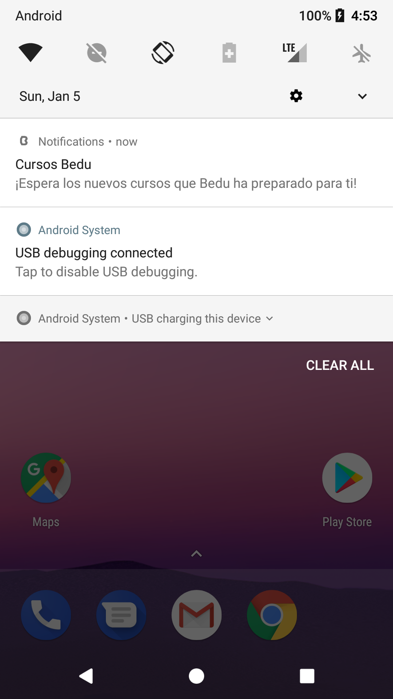
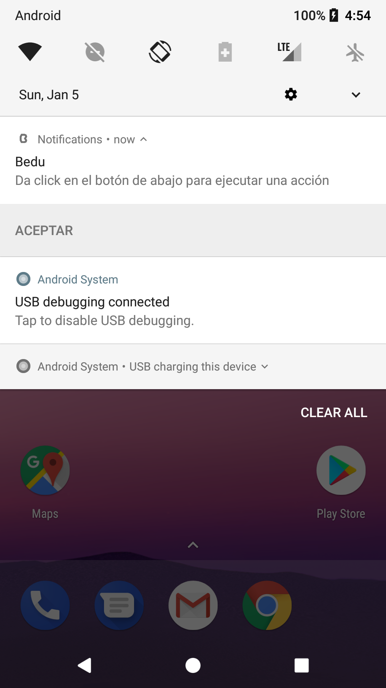
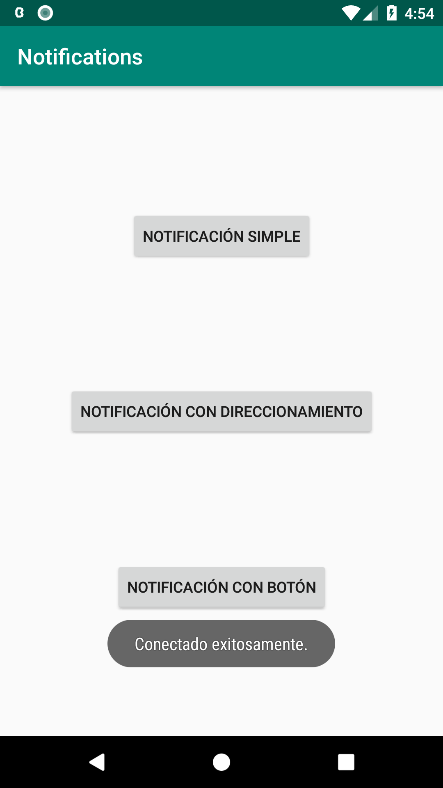

[`Kotlin Avanzado`](../../Readme.md) > [`Sesión 06`](../Readme.md) > `Ejemplo 1`

## Ejemplo 1: Notificaciones

<div style="text-align: justify;">


### 1. Objetivos :dart:

- Crear una notificación básica y activarla desde la aplicación.

### 2. Requisitos :clipboard:


### 3. Desarrollo :computer:

Las pruebas los haremos con dos dispositivos (virtuales o no): uno con Android API 25 o menor, y otro con API 26.


1. Debemos verificar que nuestro proyecto incluya la librería de compatibilidad. 

```kotlin
implementation "com.android.support:support-compat:28.0.0"
```

2. Crearemos una pantalla con tres botones para invocar diferentes tipos de notificaciones.

```xml
<?xml version="1.0" encoding="utf-8"?>
<androidx.constraintlayout.widget.ConstraintLayout xmlns:android="http://schemas.android.com/apk/res/android"
    xmlns:app="http://schemas.android.com/apk/res-auto"
    xmlns:tools="http://schemas.android.com/tools"
    android:layout_width="match_parent"
    android:layout_height="match_parent"
    tools:context=".MainActivity">

    <Button
        android:id="@+id/btnNotify"
        android:layout_width="wrap_content"
        android:layout_height="wrap_content"
        android:text="Notificación simple"
        app:layout_constraintBottom_toTopOf="@id/btnActionNotify"
        app:layout_constraintLeft_toLeftOf="parent"
        app:layout_constraintRight_toRightOf="parent"
        app:layout_constraintTop_toTopOf="parent" />

    <Button
        android:id="@+id/btnActionNotify"
        android:layout_width="wrap_content"
        android:layout_height="48dp"
        android:text="Notificación con direccionamiento"
        app:layout_constraintBottom_toTopOf="@id/btnNotifyWithBtn"
        app:layout_constraintLeft_toLeftOf="parent"
        app:layout_constraintRight_toRightOf="parent"
        app:layout_constraintTop_toBottomOf="@id/btnNotify" />

    <Button
        android:id="@+id/btnNotifyWithBtn"
        android:layout_width="wrap_content"
        android:layout_height="48dp"
        android:text="notificación con botón"
        app:layout_constraintBottom_toBottomOf="parent"
        app:layout_constraintLeft_toLeftOf="parent"
        app:layout_constraintRight_toRightOf="parent"
        app:layout_constraintTop_toBottomOf="@id/btnActionNotify" />


</androidx.constraintlayout.widget.ConstraintLayout>
```

Agregamos estos strings a nuestro recurso *strings.xml*:

```xml
 <!-- textos para la push simple -->
    <string name="simple_title">Bedu</string>
    <string name="simple_body">¡Esta es nuestra primera notificación creada!</string>

    <!-- textos para la push con acción -->
    <string name="action_title">Cursos Bedu</string>
    <string name="action_body">¡Espera los nuevos cursos que Bedu ha preparado para ti!</string>

    <!-- textos para la push con botón -->
    <string name="button_title">Bedu</string>
    <string name="button_body">Da click en el botón de abajo para ejecutar una acción</string>
    <string name="button_text">Aceptar</string>


    <string name="large_text">Lorem ipsum dolor sit amet, consectetur adipiscing elit, sed do eiusmod tempor incididunt ut labore et dolore magna aliqua. Ut enim ad minim veniam, quis nostrud exercitation ullamco laboris nisi ut aliquip ex ea commodo consequat. Duis aute irure dolor in reprehenderit in voluptate velit esse cillum dolore eu fugiat nulla pariatur. Excepteur sint occaecat cupidatat non proident, sunt in culpa qui officia deserunt mollit anim id est laborum.</string>


    <!-- CANAL CURSOS -->
    <string name="channel_courses">cursos</string>
    <string name="courses_description">Notificaciones acerca de cursos impartidos</string>
```

y este color a *colors.xml*

```xml
<color name="triforce">#CC9900</color>
```

arrastrar todos los recursos de [Res](res) a la carpeta en *res/drawable*

la pantalla debe quedar de esta forma:



3. Desde android Oreo, tenemos qué registrar canales de push notifications, que agruparan estos en diferentes clasificaciones. los canales llevan un nombre, una descripción y un grado de importancia:

```kotlin
private fun setNotificationChannel(){
        val name = getString(R.string.channel_courses)
        val descriptionText = getString(R.string.courses_description)
        val importance = NotificationManager.IMPORTANCE_DEFAULT
        val channel = NotificationChannel(CHANNEL_ID, name, importance).apply {
            description = descriptionText
        }

        val notificationManager: NotificationManager =
            getSystemService(Context.NOTIFICATION_SERVICE) as NotificationManager

        notificationManager.createNotificationChannel(channel)
    }
```

y lo implementamos en el método onCreate de la siguiente forma:

```kotlin
//Para android Oreo en adelante, s obligatorio registrar el canal de notificación
        if (Build.VERSION.SDK_INT >= Build.VERSION_CODES.O) {
            setNotificationChannel()
        }
```

4. Creamos una notificación simple:

```kotlin
 private fun simpleNotification(){

        var builder = NotificationCompat.Builder(this, CHANNEL_ID)
            .setSmallIcon(R.drawable.triforce) //seteamos el ícono de la push notification
            .setColor(getColor(R.color.triforce)) //definimos el color del ícono y el título de la notificación
            .setContentTitle(getString(R.string.simple_title)) //seteamos el título de la notificación
            .setContentText(getString(R.string.simple_body)) //seteamos el cuerpo de la notificación
            .setPriority(NotificationCompat.PRIORITY_DEFAULT) //Ponemos una prioridad por defecto

        //lanzamos la notificación
        with(NotificationManagerCompat.from(this)) {
            notify(20, builder.build()) //en este caso pusimos un id genérico
        }
    }
```

y reproducimos esa función como listener del botón de notificaciones simples.

5. Corremos la aplicación en el dispositivo con OS menor a android Oreo (API 26), abrimos la configuración de nuestra app y damos click a notficaciones. Veremos esta pantalla: 



Ahora hacemos el mismo proceso con el dispositivo con API 26 para arriba. Veremos esta pantalla:



Cuál es la diferencia entre las dos? Por qué se da esta(s) diferencia(s)? Discutir en clase.


6. Damos click al botón de notificaciones simples, se emitirá una notificación. Desplaza hacia abajo el menú desplegable de arriba y visualiza la notificación: 


7. Creamos una nueva Activity ***NewBeduActivity*** para poder ser redireccionado a ella, Quedando el layout así:

```xml
<?xml version="1.0" encoding="utf-8"?>
<LinearLayout xmlns:android="http://schemas.android.com/apk/res/android"
    android:orientation="vertical"
    android:gravity="center_horizontal"
    android:paddingTop="48dp"
    android:layout_width="match_parent"
    android:layout_height="match_parent">
    <TextView
        android:layout_width="wrap_content"
        android:layout_height="wrap_content"
        android:text="CURSOS BEDU"
        android:textSize="32sp"
        android:textColor="#DDDDDD"
        android:textStyle="bold"
        />
    <ImageView
        android:scaleType="fitCenter"
        android:layout_width="128dp"
        android:layout_height="128dp"
        android:src="@drawable/bedu"
        android:layout_marginTop="16dp"
        />
    <TextView
        android:layout_width="wrap_content"
        android:layout_height="wrap_content"
        android:text="Hemos agregado el curso de kotlin avanzado a nuestro catálogo, para mayor información, visita nuestro sitio oficial https://bedu.org/"
        android:textSize="14sp"
        android:textStyle="bold"
        android:layout_marginTop="24dp"
        android:paddingHorizontal="48dp"
        />

</LinearLayout>
```

la pantalla debe quedar así:



No olvidar registrar la Activity en el *AndroidManifest.xml*.


8. Ahora crearemos una notificación que nos redireccione a otra pantalla al hacer click sobre ella, para eso usaremos un PendingIntent (un Intent que puede ejecutar una acción de la app con permisos de la misma app pero desde afuera). El PendingIntent pasa como parámetro en *setContentIntent*, que ejecuta el Intent como acción del click y *setAutoCancel* borra la notificación al ser pulsada.

```kotlin
    private fun touchNotification(){
        //Un PendingIntent para dirigirnos a una actividad pulsando la notificación
        val intent = Intent(this, NewBeduActivity::class.java).apply {
            flags = Intent.FLAG_ACTIVITY_NEW_TASK or Intent.FLAG_ACTIVITY_CLEAR_TASK
        }
        val pendingIntent: PendingIntent = PendingIntent.getActivity(this, 0, intent, 0)

        val builder = NotificationCompat.Builder(this, CHANNEL_ID)
            .setSmallIcon(R.drawable.bedu_icon)
            .setContentTitle(getString(R.string.action_title))
            .setContentText(getString(R.string.action_body))
            .setPriority(NotificationCompat.PRIORITY_DEFAULT)
            .setContentIntent(pendingIntent) //se define aquí el content intend
            .setAutoCancel(true) //la notificación desaparece al dar click sobre ella

        with(NotificationManagerCompat.from(this)) {
            notify(20, builder.build())
        }
```

Seteamos este métoodo como listener de su respectivo botón y corremos la app. Debe mostrarse una notificación similar a esta: 



dar Click sobre ella, debe ser redirigido a la pantalla que creamos anteriormente.


9. Creamos una nueva notificación que tenga un botón, que emitirá un Toast cuando se pulse. Para eso, asignamos un nombre a la acción que detonará el botón como un valor estático:

```kotlin
companion object{
        //el nombre de la acción a ejecutar por el botón en la notificación
        const val ACTION_RECEIVED = "action_received"
    }
```

La acción del botón se creará por medio de un BroadcastReceiver (escucharemos la acción), creamos una nueva clase:

```kotlin
class NotificationReceiver: BroadcastReceiver() {

    override fun onReceive(context: Context?, intent: Intent?) {

        //Sólo escucharemos las acciones del tipo ACTION_RECEIVED (detonada por la notificacción)
        if(intent?.action == MainActivity.ACTION_RECEIVED){
            Toast.makeText(context, "Conectado exitosamente", Toast.LENGTH_SHORT).show()
        }
    }
}
```

Creamos el método que ejecutará nuestra notificación. Para ejecutar la acción, creamos otro *PendingIntent* que ejecutará el *NotificationManager* y lo asignamos a la función *addAction* que pide como parámetros un drawable, el texto de nuestro botón y el *PendingIntent*.

```kotlin
private fun buttonNotification(){

        //Similar al anterior, definimos un intent comunicándose con NotificationReceiver
        val acceptIntent = Intent(this, NotificationReceiver::class.java).apply {
            action = ACTION_RECEIVED
        }
        //creamos un PendingIntent que describe el pending anterior
        val acceptPendingIntent: PendingIntent =
            PendingIntent.getBroadcast(this, 0, acceptIntent, 0)

        val builder = NotificationCompat.Builder(this, CHANNEL_ID)
            .setSmallIcon(R.drawable.bedu_icon)
            .setContentTitle(getString(R.string.button_title))
            .setContentText(getString(R.string.button_body))
            .setPriority(NotificationCompat.PRIORITY_DEFAULT)
            .addAction(R.drawable.bedu_icon, getString(R.string.button_text),//agregamos la acción
                acceptPendingIntent)

        with(NotificationManagerCompat.from(this)) {
            notify(20, builder.build())
        }

    }
```

asignamos la función al listener del respectivo botón. Corremos la app y damos click al tercer botón, deberá salir una push notification como la siguiente:



al darle click al botón, deberá reproducirse el Toast, tal como en la imagen:




[`Anterior`](../Readme.md) | [`Siguiente`](../Reto-01)      

</div>

