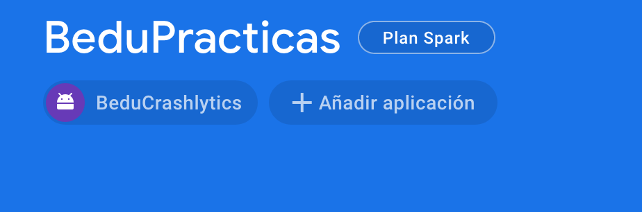
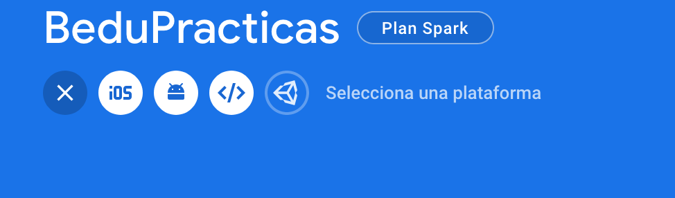
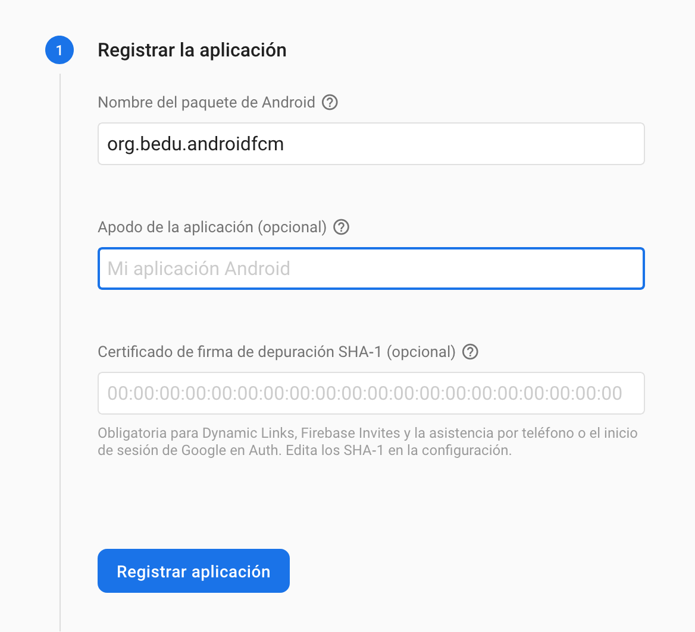
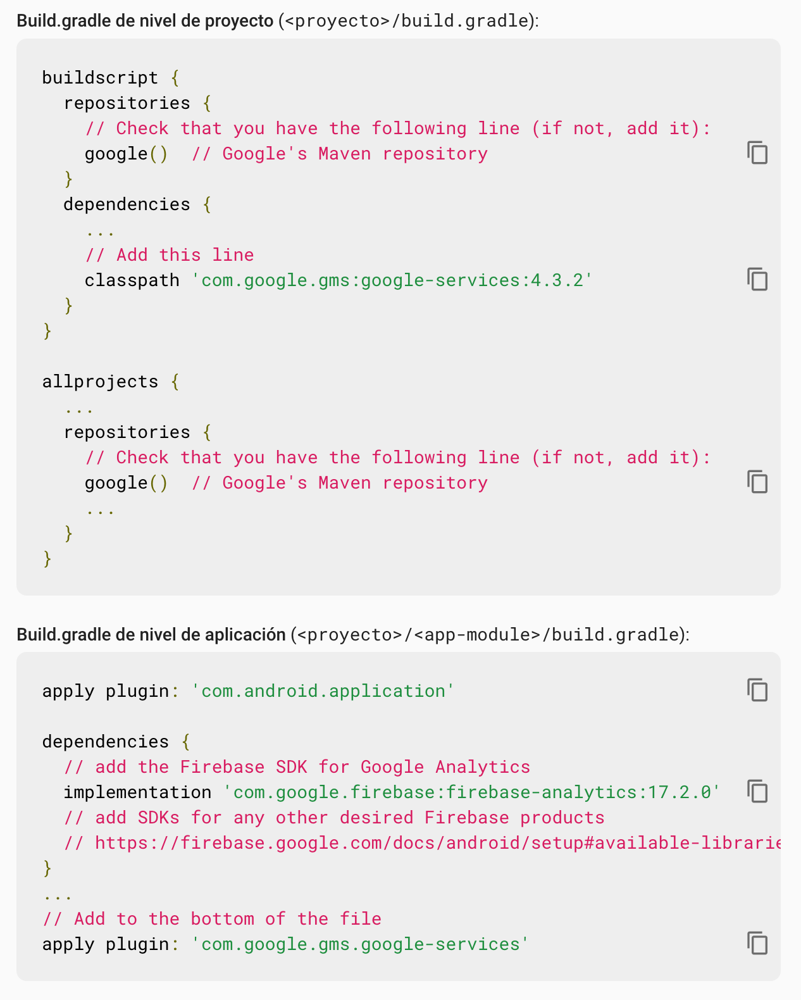
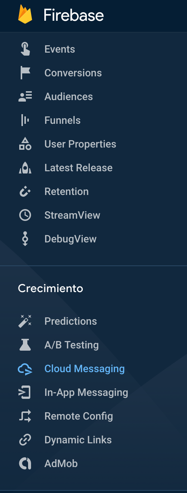
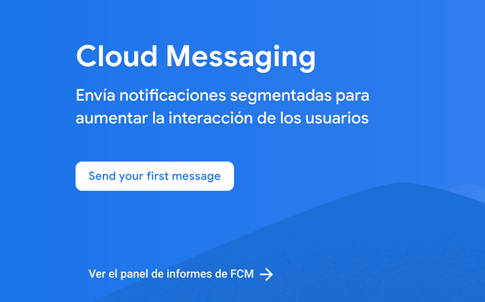
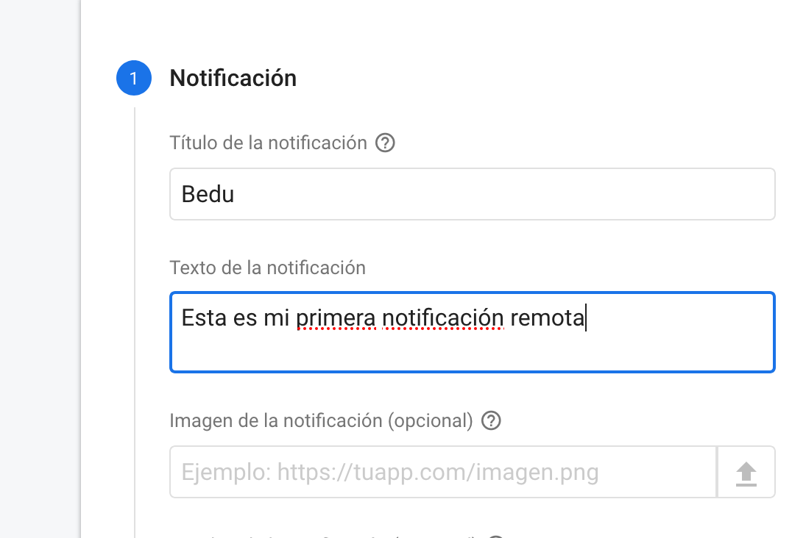
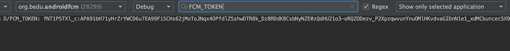
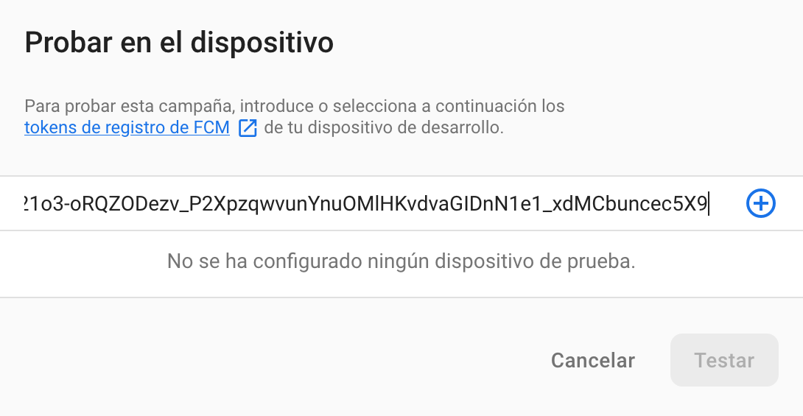
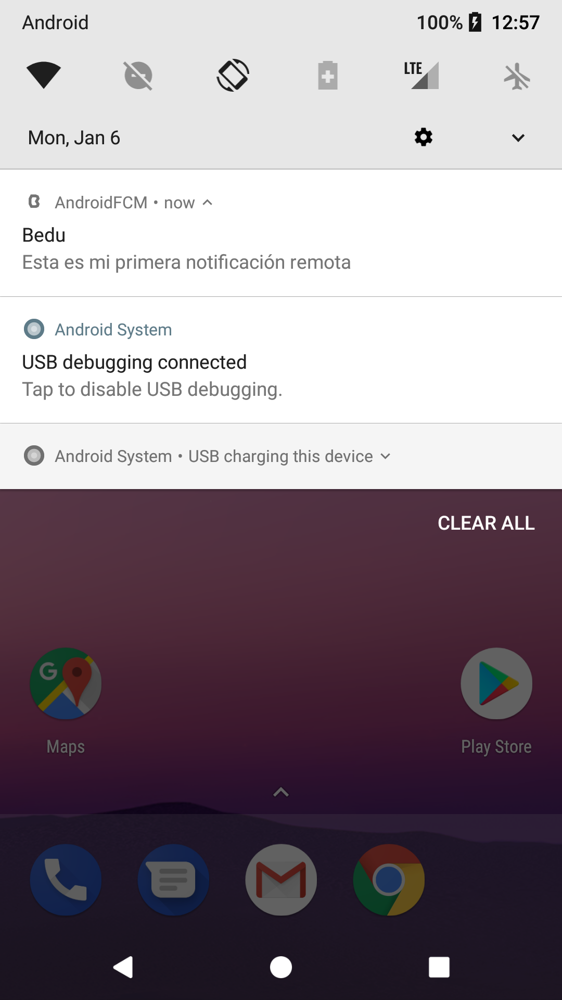

[`Kotlin Avanzado`](../../Readme.md) > [`Sesión 06`](../Readme.md) > `Ejemplo 3`

## Ejemplo 3: Notificaciones y FCM

<div style="text-align: justify;">


### 1. Objetivos :dart:

* Instalar y utilizar el SDK de Firebase Message Cloud para el uso de push notifications

### 2. Requisitos :clipboard:

1. Haber cursado los temas previos sobre notificaciones
2. Leer todo lo relacionado a FCM en el prework
3. Un dispositivo (emulador o físico) con Google Play Services

### 3. Desarrollo :computer:

Vamos a instalar la SDK de FCM Para android, y después la utilizaremos. Para ello, hay que configurar la aplicación en nuestro proyecto de Firebase (creado previamente en la [Sesión 5](../../Sesión-05) ), en el [Ejemplo 1](../../Sesion-05/Ejemplo-01) para ser exactos.


**IMPORTANTE**: Debido a que FCM hace uso del SDK de Play Services, Se requiere una imagen de Android que tenga una versión compatible de Google Play Services.

a) En la pantalla de inicio del proyecto, click la opción *Añadir aplicación* y al ícono de android





b) Registrar el nombre del paquete de la aplicación y su nickname



c) Descargar el archivo *google-services.json* y moverlo a la carpeta app del proyecto, como se indica en la imagen


***Opcional:*** *el paso de comprobación puede ser saltado*

d) Instalar las dependencias, tal cual se muestra en las instrucciones y sincroniza el proyecto.



**¡LISTO!** Ya tienes firebase en tu proyecto.


1. Agregar la dependencia en gradle de FCM

```groovy
implementation 'com.google.firebase:firebase-messaging-ktx'
```

2. Creamos un clase que extienda de FirebaseMessagingService e Incluimos el servicio de FCM como service en el Manifiesto de nuestra aplicación. Esto sirve para opciones más allá de recibir notificaciones en background (mensajes en foreground, entre otras opciones).

```kotlin
class FirebaseMessaging: FirebaseMessagingService() {

}
```

```xml
 <service
            android:name=".FirebaseMessaging"
            android:exported="false">
            <intent-filter>
                <action android:name="com.google.firebase.MESSAGING_EVENT" />
            </intent-filter>
        </service>
```

3. Agregar el ícono bedu_icon del proyecto anterior a *drawable*. En el manifest pondremos estas líneas para agregaar un ícono si desde el servicio no se define uno, al igual que el otro metadata para notification channels.

```xml
<meta-data
    android:name="com.google.firebase.messaging.default_notification_icon"
    android:resource="@drawable/bedu_icon" />
<meta-data
    android:name="com.google.firebase.messaging.default_notification_channel_id"
    android:value="DEFAULT_CHANNEL" />
```

4. En el *onCreate* del *MainActivity*, obtener el token FCM de nuestro dispositivo cliente e imprimirlo en el log (para pruebas).

```kotlin
FirebaseMessaging.getInstance().token.addOnCompleteListener(OnCompleteListener { task ->
            if (!task.isSuccessful) {
                Log.w("Error", "Fetching FCM registration token failed", task.exception)
                return@OnCompleteListener
            }

            val token = task.result

            Log.d("FCM_TOKEN",token)
            Toast.makeText(baseContext,"FCM token: $token", Toast.LENGTH_SHORT).show()
        })
```


5. Ejecutaremos una prueba de notificación desde nuestra consola Firebase. En la barra lateral del menú principal, click a la opción *CloudMessaging*.



6. Click en ***Send your first message***



6. Escribir el título y el contenido de nuestra notificación.



7. Correr la aplicación, copiar el token como viene en el logcat (Filtrar el resultado del logcat con el Tag *FCM_TOKEN*) y cerrar la app.



8. Dar click en *Enviar mensaje de prueba*

9. Ingresar el token copiado en la ventana, agregarlo y pulsar Test. **Nota: Importante cerrar la app o minimizarla**

  

10. Recibirán una notificación como esta: 

    

#### Declarando el canal de notificación

Vamos a declarar el canal de notificación a utilizar, En el *MainActivity*.

```kotlin
companion object{
        const val CHANNEL_ID = "CANAL_GENERICO"
    }

...

override fun onCreate(savedInstanceState: Bundle?) {
...
if (Build.VERSION.SDK_INT >= Build.VERSION_CODES.O) {
            setNotificationChannel()
        }
...
}

...
private fun setNotificationChannel(){
        val channel = NotificationChannel(
            CHANNEL_ID,
            "Canal Generico",
            NotificationManager.IMPORTANCE_DEFAULT
        ).apply {
            description = "CANAL GENERICO"
        }

        val notificationManager: NotificationManager =
            getSystemService(Context.NOTIFICATION_SERVICE) as NotificationManager

        notificationManager.createNotificationChannel(channel)
    }
```


#### Aplicación en primer plano

Ahora vamos a correr la aplicación, mantenerla en primer plano y enviar otro mensaje de prueba por medio de la consola ¿Qué sucedió? No se recibe ningún mensaje porque se necesita habilitar un servicio que gestione la notificación en primer plano (la clase vacía que creamos previamente y que la declaramos como servicio en el Manifiesto).

En nuestra clase *FirebaseMessaging*, haremos un *override* del método onMessageReceived para gestionar el mensaje arrivante. Los parámetros de la notificación (como título y cuerpo) los obtenemos de nuestro objeto ___remoteMessage___:

```kotlin
override fun onMessageReceived(remoteMessage: RemoteMessage) {
        if (remoteMessage.notification != null) {
            sendNotification(remoteMessage.notification?.title, remoteMessage.notification?.body)
        }
    }
```

En el método anterior, mandamos a llamar al método ___sendNotification()___, cuyo propósito es detonar nuestra notificación a través de nuestro ___NotificationManager___. Por lo cual la declaramos de la siguiente forma:

```kotlin
    private fun sendNotification(title: String?, body: String?){
        Log.d("FCM_MESSAGE", "Cuerpo de la notificación: $body")

        val notificationBuilder = NotificationCompat.Builder(this,MainActivity.CHANNEL_ID)
            .setSmallIcon(R.drawable.bedu_icon)
            .setContentTitle(title)
            .setContentText(body)


        //lanzamos la notificación
        with(NotificationManagerCompat.from(this)) {
            notify(0, notificationBuilder.build()) //en este caso pusimos un id genérico
        }
    }
```

Esta función nos permite mostrar una notificación personalizada con el título y el cuerpo de nuestra notificación. Sin embargo, podemos personalizar nuestra notificación de acuerdo a la función a cumplir (botones personalizados, poder enviar un mensaje, rechazar una llamada, etc.).

[`Anterior`](../Reto-02) | [`Siguiente`](../Ejemplo-04)      

</div>
