[`Kotlin Avanzado`](../../Readme.md) > [`Sesión 06`](../Readme.md) > `Ejemplo 4`

## Ejemplo 4: Crashlytics

<div style="text-align: justify;">


### 1. Objetivos :dart:

- Instalar Crashlytics
- Hacer las primeras pruebas 
- Utilizar las configuraciones y características adicionales que brinda Crashlytics

### 2. Requisitos :clipboard:

* Instalar el sdk de Firebase

### 3. Desarrollo :computer:

##### Configuración

Antes de instalar y aplicar Crashlytics, debemos configurar nuestro proyecto en la Firebase console para crashlytics. Iremos a la barra izquierda y daremos click en Crashlytics, daremos en siguiente para todas las instrucciones.

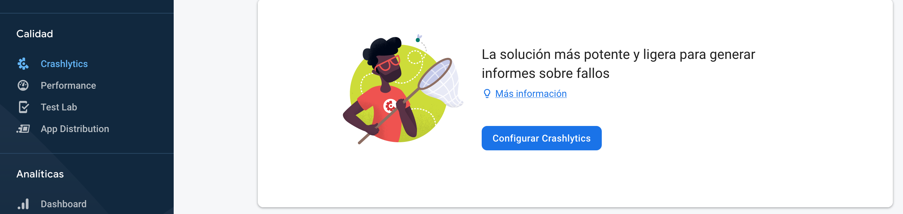

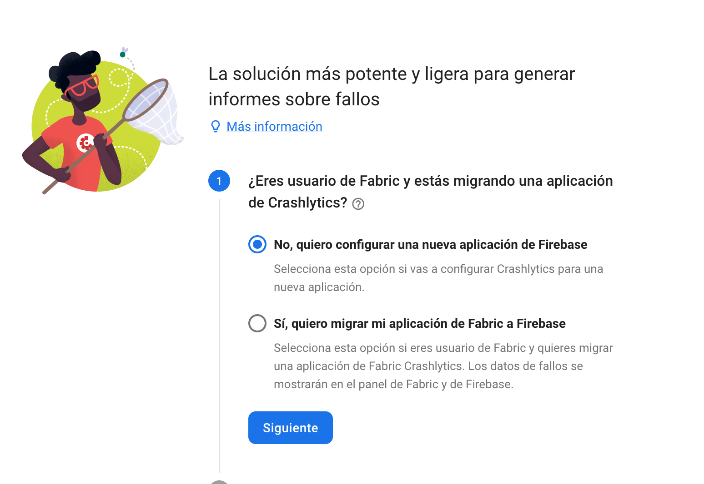


Ahora, agregaremos el plugin de Gradle de Crashlytics en ___build.gradle___

```groovy
classpath 'com.google.firebase:firebase-crashlytics-gradle:2.5.2'
```


En nuestro archivo ***app/build.gradle*** activaremos el plugin de crashlytics

```groovy
plugins{
    id 'com.google.firebase.crashlytics'
}
```

E implementamos nuestra dependencia de crashlytics.

```kotlin
 implementation 'com.google.firebase:firebase-crashlytics-ktx' // Dependencia de crashlytics
```

Sincronizamos nuestro proyecto y corremos.


##### Primer error

Vamos a provocar nuestro primer error. En el arcchivo *activity_main.xml*, hay qué crear un botón para generar el crash:

```xml
...
    <Button
        android:id="@+id/btnError"
        android:layout_width="wrap_content"
        android:layout_height="wrap_content"
        android:text="Provocar error"
        app:layout_constraintBottom_toBottomOf="parent"
        app:layout_constraintLeft_toLeftOf="parent"
        app:layout_constraintRight_toRightOf="parent"
        app:layout_constraintTop_toTopOf="parent" />
...
```

7. Setear el click listener del botón para generar el error en el *MainActivity*:

```kotlin
 btnError.setOnClickListener{
            throw RuntimeException("Ejemplo de crash")
        }
```

Corremos y pulsamos el botón, la aplicación debe crashear y mostrar un mensaje similar a este: 

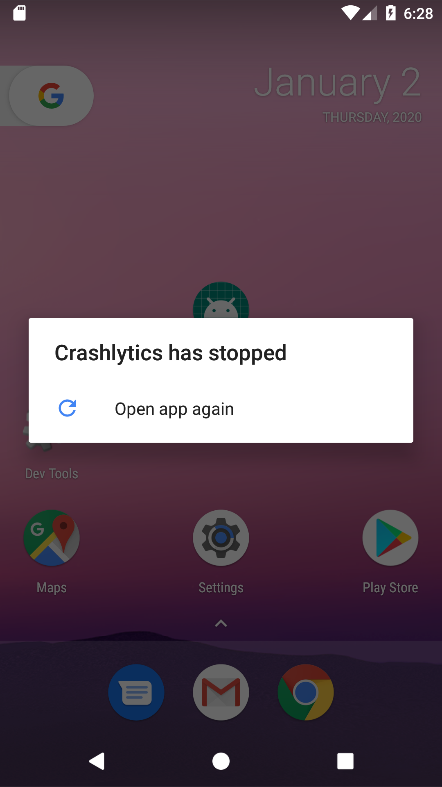

Refrescaremos el panel de crashlytics en la consola, deberá salir un *Bloqueo* (ese es el error que provocamos).

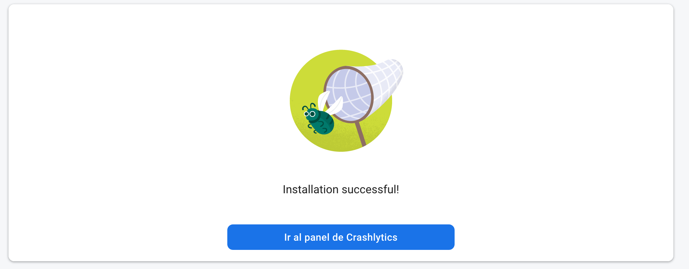

- Al dar click sobre el botón, debe aparecer el siguiente panel, hacer todo lo que dice la imagen: 

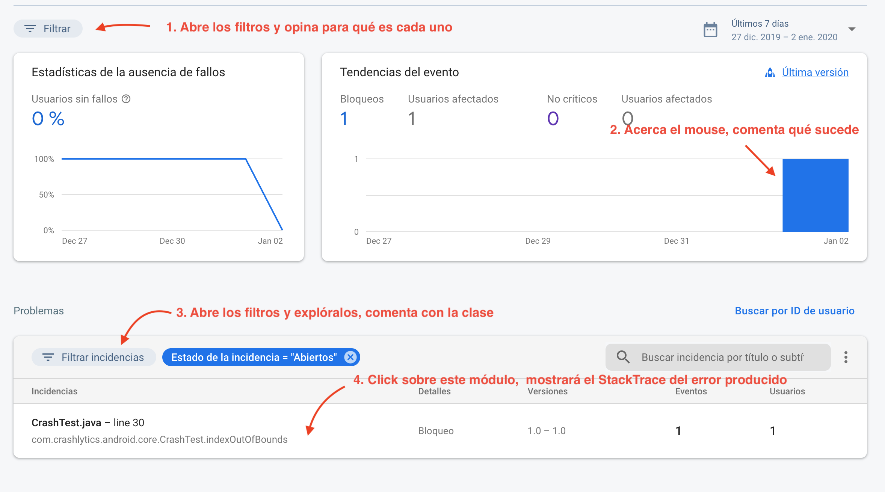

- Al dar click al StackTrace, saldrá el siguiente panel, analizarlo y explorar las pestañas

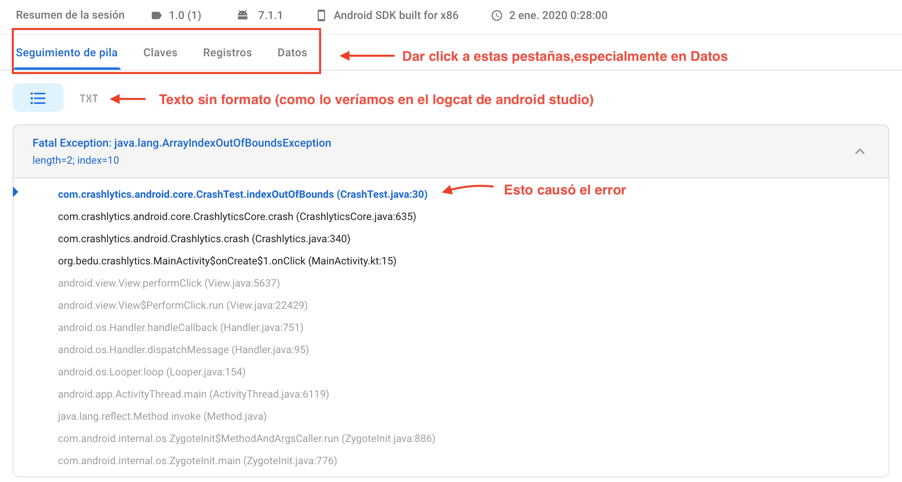

- La última pestaña son datos del dispositivo que tuvo los errores

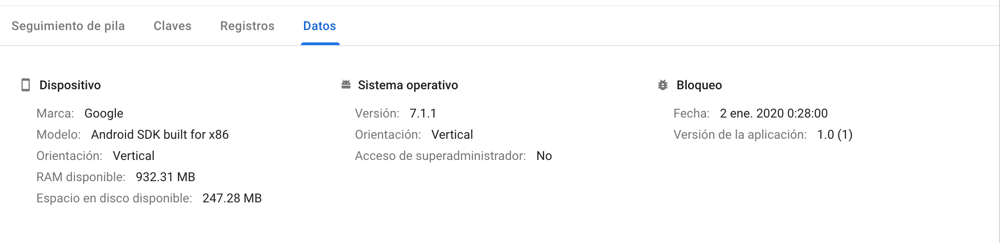


##### Crashlytics Log


Primero, crearemos una instancia de ___FirebaseCrashlytics___ para poder ejecutar sus métodos.

```kotlin
val crashlytics = FirebaseCrashlytics.getInstance()
```

La pestaña de registros corresponde a logs que se imprimen desde la aplicación por medio del comando: 

```kotlin
CrashLytics.getInstance().log(ms: String)//De esta forma sólo se reporta el log
```

 el log de un crash report se envía en la siguiente vez que la aplicación se abra para evitar problemas de tráfico, por lo cual en los errores no críticos, hay que cerrar y volver a abrir nuestra app

Vamos a implementar estos métodos en nuestro botón de de error


```kotlin
 btnError.setOnClickListener{
            try {
                throw NullPointerException()
            } catch (ex: NullPointerException) {
                crashlytics.log(Log.ERROR, "CrashError", "NullPointer Provocado para pruebas!")
		crashlytics.recordException(ex) //para que se pueda reportar el non fatal exception
            }
        }
```

***Nota: crashlytics guarda máximo 64kb del log en memoria para evitar realentamiento en la app***

***Nota 2: Los errores pueden tardar hasta 5 minutos en aparecer, tener paciencia si no aparece rápido***

En el dashboard, se deben ver reflejadas las tareas de la siguiente forma: 

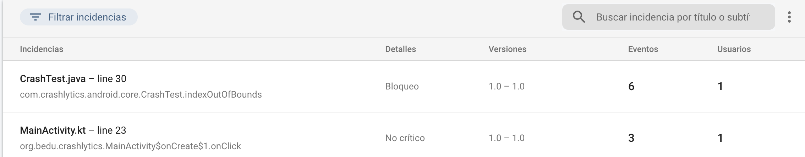

Como ya no se usa el error provocado por Crashlytics, sino un NullPointerException provocado por nosotros, ahora se muestra que el origen del error 09fue en *MainActivity.kt*. Notamos también que dice *No crítico* (son errores que se cachan en un try catch)

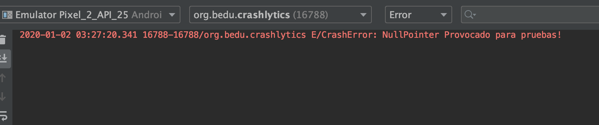

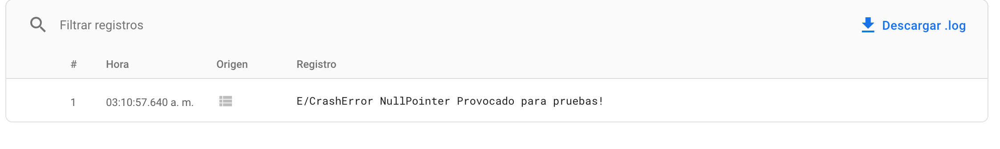

Tanto en el logcat como en el registro aparece el error log que escribimos.


##### Agregando datos adicionales

Vamos a agregar datos extra, en este caso, simularemos algún identificador de usuario y otros datos que pueden ser útiiles para saber a quién le está sucediendo el error y bajo qué términos.

con el siguiente método, llamados en el onCreate: 

```kotlin
crashlytics.setUserIdentifier("Bedu-LmtvK4ge-Fqox-blRy")
```

Esperamos un momento y consultamos el dashboard de Crashlytics, abrimos el último registro y abrimos la pesataña *datos*:

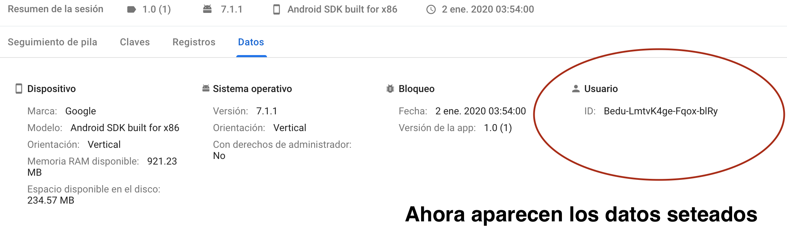

En el anterior error, al entrar a la pestaña de Claves, podemos observar que el log está vacío:


Pondremos ahora valores clave a los errores, llamando a los siguientes métodos en el *onCreate*:

```kotlin
crashlytics.setCustomKey("email","manuel@bedu.org")
crashlytics.setCustomKey("name","Manuel Bedu")
crashlytics.setCustomKey("Edad", 23)
```


También podemos agregar una serie de claves a través del método ___setCustomKeys___.

```kotlin
crashlytics.setCustomKeys {
    key("Trabajo", "Developer")
    key("Bloqueado",false)
    key("Crédito",1350.23f)
}
```

corremos la aplicación y volvemos a generar el error. Consultamos el log y nos vamos a la pestaña *Claves*, debería salir un log similar al siguiente:

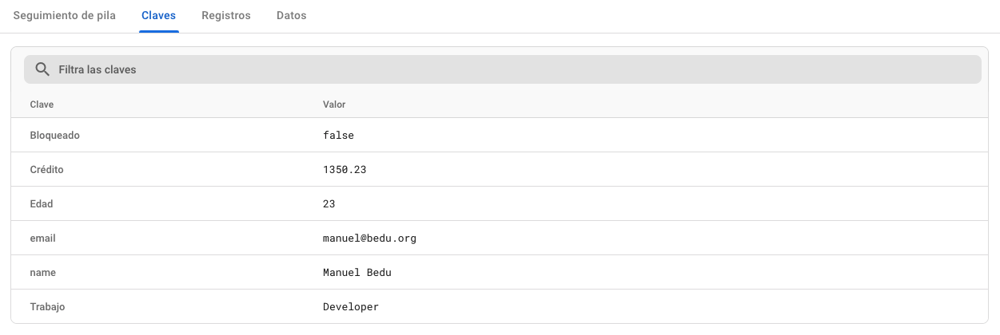


##### Activar correo de aviso

Vamos a activar un correo de aviso cuando se genere un nuevo error. Para ello, tenemos qué dar click a la campana en la pantalla superior derecha (estando en el dashboard de Crashlytics).

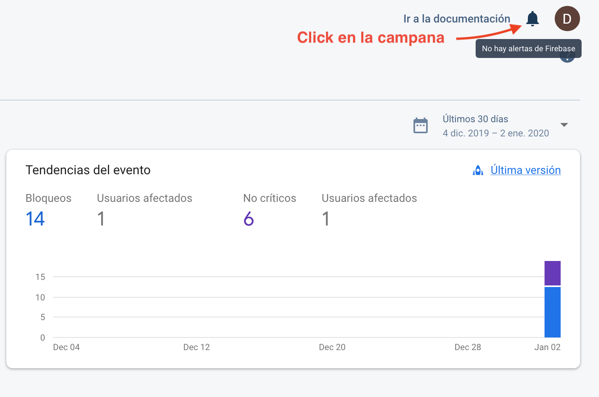

Se desplegará un menú lateral, Dar click al enlace *Manage your alerts for this project*.

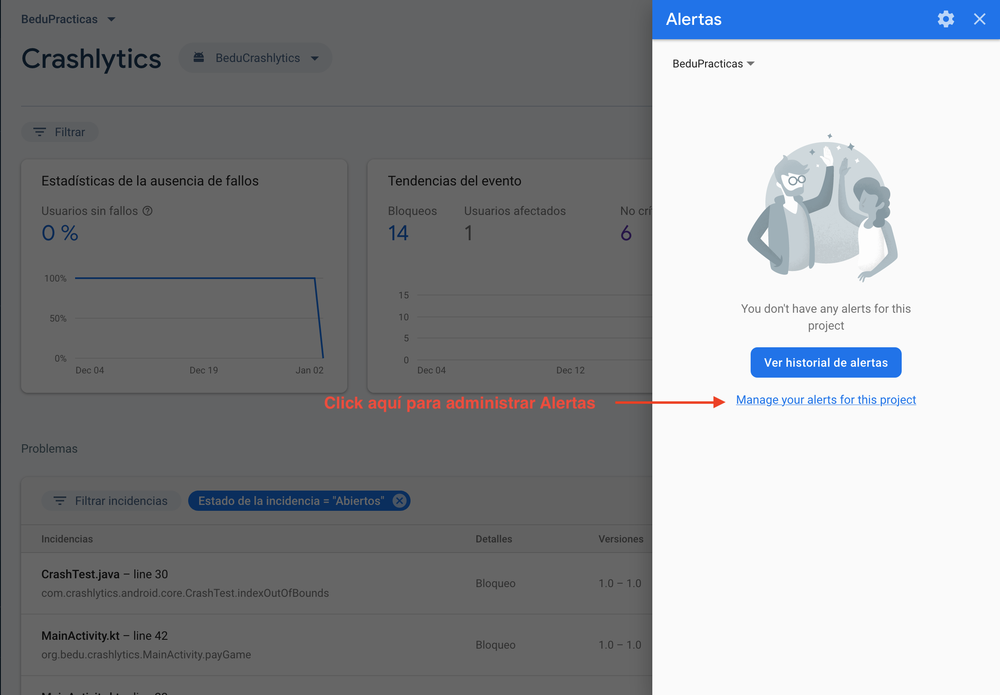

Se abrirá una nueva ventana con opciones de alerta para varios servicios, buscar Crashlytics y activar las casillas restantes (para nuevos errors urgentes y no urgentes).

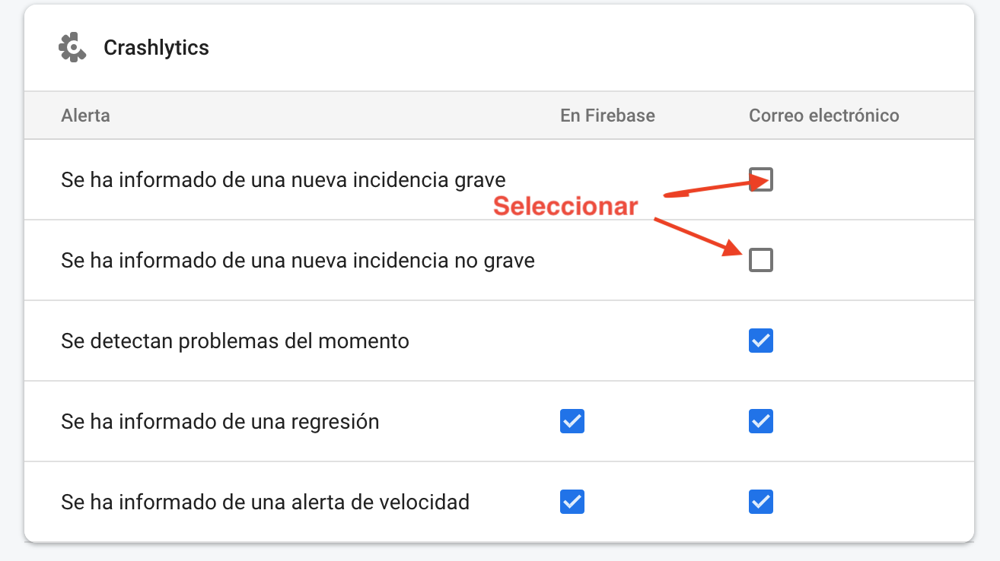

Debemos mover un par de líneas de código al  error generado por nosotros para que Crashlytics lo reconozca como uno nuevo. Después de esto, reproduce nuevamente el error.

Abrir la bandeja de la cuenta google que alberga el proyecto Firebase. Consultar el correo electrónico que ha llegado.

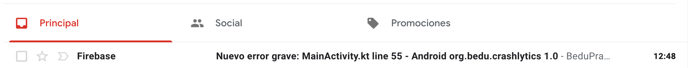

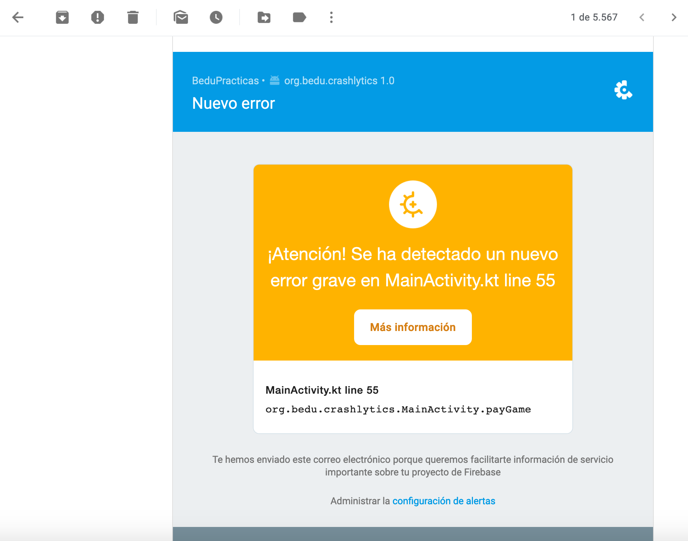

##### Estados de incidencias

Ahora vamos a modificar los estados de incidencias de errores, agregar notas y filtrarlos

En el menú de Crashlytics, visualizar y clickar el filtro de *Problemas*.

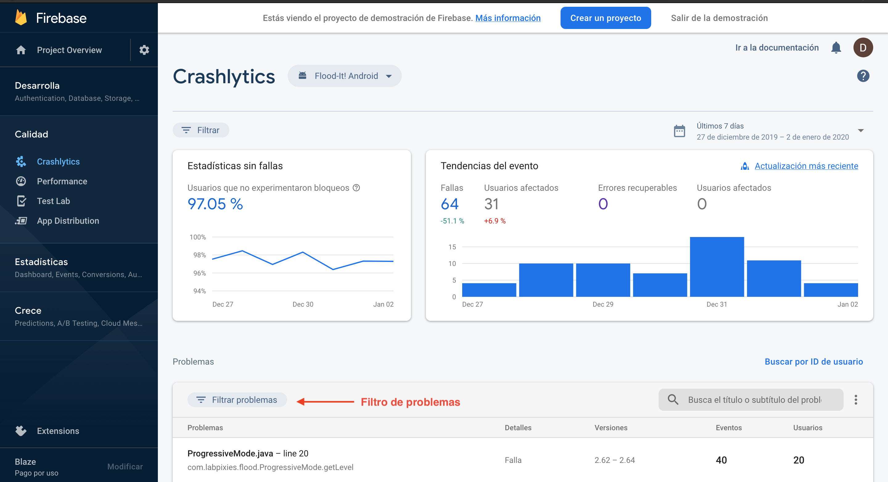

1. En las opciones, enfocar *Estado de la incidencia*, se muestran tres opciones con cuatro estados

- Abiertas
- Cerradas
- Silenciadas
- Datos

Vamos a manipular al menos tres de esos estados.

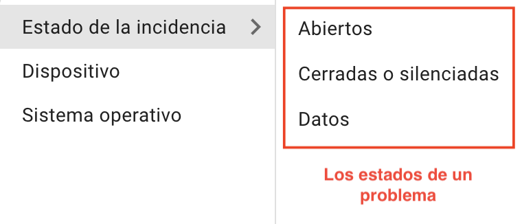

Abrimos cualquier problema Abierto (no dice ni cerrado ni silenciado y no se muestra opaco)

en la siguiente página,debemos  buscar el botón azul *cerrar* y dar click a la flecha hacia abajo, aquí está la opción para cambiar a silenciado o cerrado un problema.

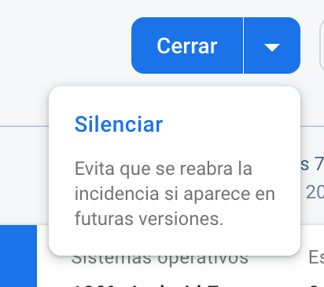

Cambiar a silenciado (el bicho capturado es azul)

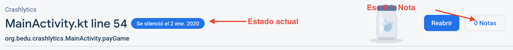

Agregar una nota,  deberá visualizarse de la siguiente forma:

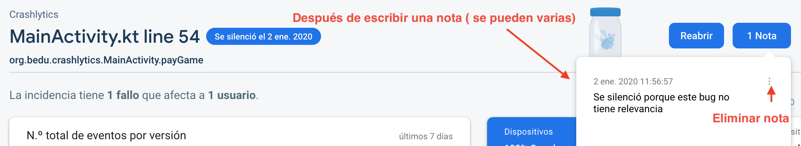

Cambiar a cerrado y agregar otra nota(el bicho capturado es verde con tapa roja)

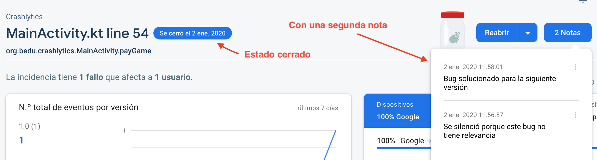

Regresar a la pantalla principal de Crashlytics. Modificar otra incidencia aplicar el filtro de *Cerradas o silenciadas*, se deben visualizar únicamente las que modificaste.

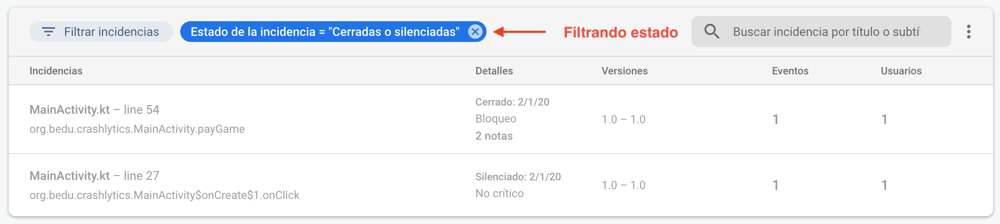

##### Alertas de velocidad y Configuración de datos de fallos

Si no deseas compartir la información de los crashes de tu app o quieres modificar el rango de tolerancia a incidencias repetidas por un periodo de tiempo, hay que abrir el DropDown menu en la esquina superior derecha del módulo de problemas.

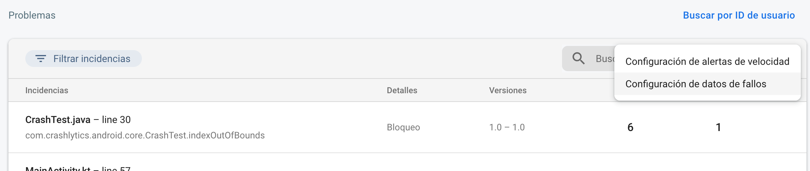

\--


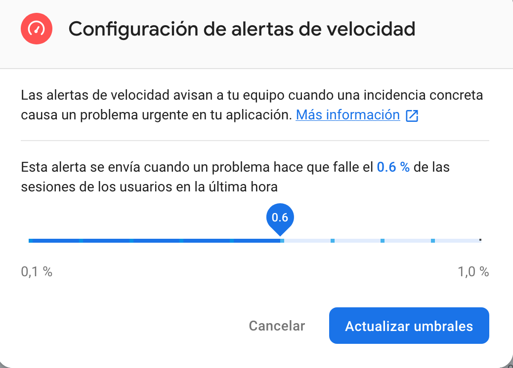

\--

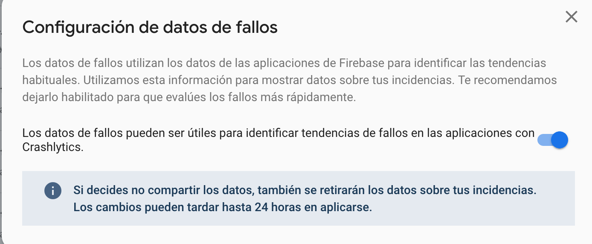


[`Anterior`](../Ejemplo-03) | [`Siguiente`](../Reto-03)      

</div>

