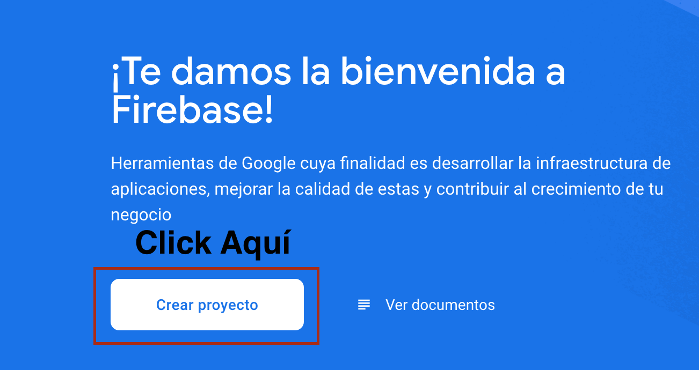
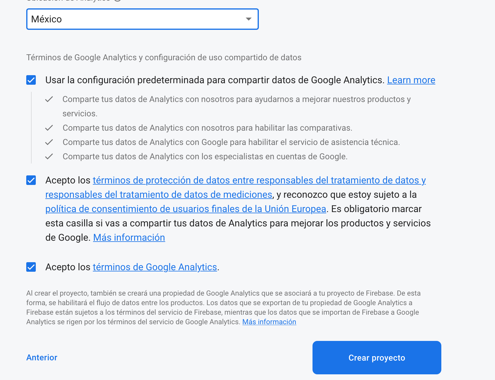
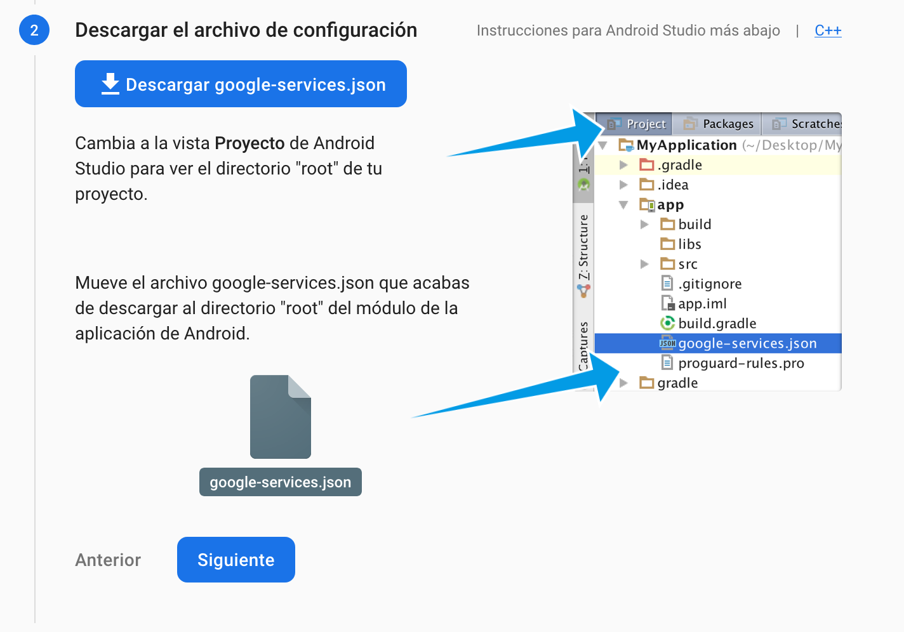

[`Kotlin-Avanzado`](../Readme.md) > `Sesión 6`

## Sesión 6: Firebase y Notifications


<div style="text-align: justify;">


### 1. Objetivos :dart: 

- Manejar el funcionamiento de una push notification el alcance de dicha herramienta y su configuración.
- Notificar al usuario de acciones realizadas a través de elementos gráficos estandarizados.
- Configurar un servicio de push notifications en Firebase para recibir y customizar el comportamiento de estos.


### 2. Contenido :blue_book:

### Firebase - Setup inicial

Antes de implementar firebase en nuestra app, debemos configurar un proyecto en la Firebase console. Para esto seguiremos los siguientes pasos:

a) Abriremos la [Firebase Console](https://console.firebase.google.com/?hl=es) con una cuenta google que poseamos y crearemos un proyecto nuevo.


b) Asignamos un nombre (en este caso, le llamaremos BeduPracticas)

c) Aceptaremos Google Analytics 


d) Seleccionamos México como *Ubicación de Analytics*, aceptaremos todos los términos y click en *Crear proyecto*



e) En la pantalla de inicio del proyecto, buscar el ícono de android y dar click sobre él


f) Registrar el nombre del paquete de la aplicación y su nick


g) Descargar el archivo *google-services.json* y moverlo a la carpeta app del proyecto, como se indica en la imagen




Vamos a comenzar instalando lo necesario para hacer funcionar Crashlytics

1. Abrir el archivo *build.gradle* que está en la raíz de nuestro proyecto.

2. Copiar los repositorios necesarios tal como se muestra a continuación:

```kotlin
buildscripts {
    repositories {
        // ...
        google() //si no estaba, agregarlo
    }

    dependencies {
        // ...
         classpath 'com.google.gms:google-services:4.3.5'  // plugin de Google Services
          classpath 'com.google.firebase:firebase-crashlytics-gradle:2.5.2' //el plugin de crashlytics
    }
}

allprojects {
    // ...
    repositories {
       // ...
       google() //si no estaba, agragarlo
    }
}

```

2. Abrir *app/build.gradle* y aplicar el plugin de fabric después del plugin *com.android.application*:

```groovy
plugins{
	id 'com.android.application'
	id 'com.google.gms.google-services'
}
```


3. Ahora, agregaremos la BoM de Firebase (Bill of Materials), que nos sirve para tener qué declarar nuestra versión de firebase únicamente en el mismo BoM.

   ```groovy
   implementation platform('com.google.firebase:firebase-bom:27.0.0')
   ```

4. En el mismo archivo, agregar la dependencia opcional de analytics

```kotlin
implementation 'com.google.firebase:firebase-analytics-ktx' // Opcional, pero la agregaremos
```

 

#### <ins>Notifications</ins>

<ins>Notificaciones básicas</ins>

Crearemos notificaciones locales sencillas desde nuestra app.

- [**`EJEMPLO 1`**](Ejemplo-01/Readme.md)
- [**`RETO 1`**](Reto-01/Readme.md)

---


<ins>Notificaciones avanzadas</ins>

Agregaremos elementos a las notificaciones que las personalizar y ajustan al contexto en que se utilizan. 

- [**`EJEMPLO 2`**](Ejemplo-02/Readme.md)
- [**`RETO 2`**](Reto-02/Readme.md)

---

<ins>Firebase Cloud Messaging -Push Notifications</ins>

* [**`EJEMPLO 3`**](Ejemplo-03/Readme.md)

#### <ins>Crashlytics</ins>

Crearemos reportes de errores en nuestra aplicación y los visualizaremos dentro de la consola de Firebase.

* [**`EJEMPLO 4`**](Ejemplo-04)

* [**`RETO 3`**](Reto-03)

### 3. Proyecto :hammer:

Aplica los lineamientos que vienen en esta guía para definir y comenzar el desarrollo de tu proyecto.

- [**`PROYECTO SESIÓN 6`**](Proyecto/Readme.md)

### 4. Postwork :memo:

Esta es una guía anexa de consejos para una mejor planeación de tu proyecto para este módulo.

- [**`POSTWORK SESIÓN 6`**](Postwork/Readme.md)

<br/>

[`Anterior`](../Sesion-03/Readme.md) | [`Siguiente`](../Sesion-05/Readme.md)      

</div>

