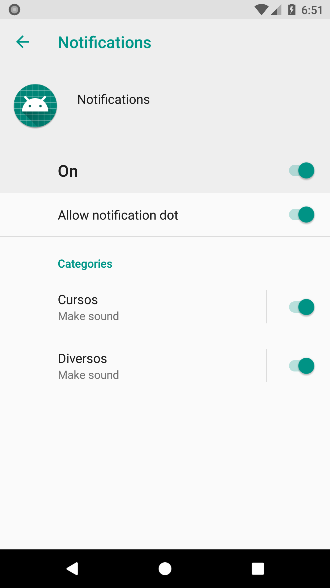

[`Kotlin Avanzado`](../../Readme.md) > [`Sesión 06`](../Readme.md) > `Reto 1`

## Reto 1: Notificaciones

### 1. Objetivos :dart:

* Aplicar el conocimiento adquirido en el [Ejemplo 1](../Ejemplo-01)

### 2. Requisitos :clipboard:

* Haber cursado el [Ejemplo 1](../Ejemplo-01)

### 3. Desarrollo :computer:

Reforzaremos ciertos conceptos del ejemplo anterior.

1. Corremos la app en un dispositivo con OS menor a la API 26 Reproduciremos en secuencia y rápidamente los tres botones de la aplicación ¿Qué sucede? Se generaron nuevas notificaciones o se reemplazaron las mismas? Por qué creen que sucede esto? (Comentar y resolver con el instructor) y hacer que las notificaciones no se reemplacen.

	
Solucion

	en cada generación de notificacción, hacer las id's diferentes para el método notify(id,builder.build()) 

2. Ahora, crear otro canal de push notifications, de modo que se vean como en la siguiente pantalla

la notificación simple y con botón deben pertenecer al canal *Diversos*, mientras que el de redireccionamiento debe estar en *Cursos*.

	
Solucion

	Crear otro canal, suscribirlo en onCreate y asignarlo a las notificaciones correspondientes.

Apagar el switch del canal *Diversos*, abrir la app y accionar los tres botones ¿Qué sucede ahora? comentar la causa.

3. Hacer que la notificación de redireccionamiento también implemente el botón que acciona el Toast.

	
Solucion

	Utiliza el cógido del PendingIntent y el método addAction del builder de la notificación en la función *buttonNotification*

[`Anterior`](../Ejemplo-01) | [`Siguiente`](../Ejemplo-02)      

