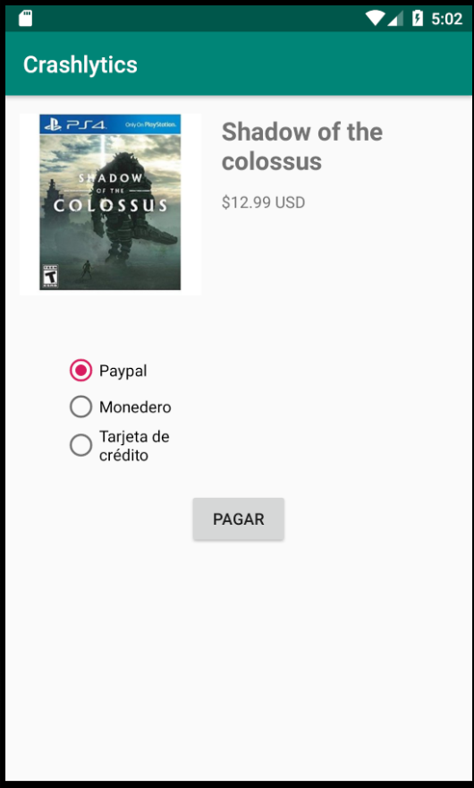

[`Kotlin Avanzado`](../../Readme.md) > [`Sesión 06`](../Readme.md) > `Reto 3 `

## Reto 3: Detectar un error

<div style="text-align: justify;">


### 1. Objetivos :dart:

* Detectar un bug a través de Crashlytics.

### 2. Requisitos :clipboard:

* Instalar previamente firebase y la dependencia de crashlytics

### 3. Desarrollo :computer:

Vamos a crear una nueva aplicación de pago de un producto. Esta contiene un error que detectaremos mediante crashlytics. La instalación de las dependencias fue abordada previamente y por lo tanto, corren por cuenta del alumno.

1. Se debe diseñar la primera pantalla de la siguiente manera




-Los radioButtons funcionan dentro de un RadioGroup, parecido a esto:

```xml
<RadioGroup
        android:id="@+id/radioGroup"
        android:layout_width="120dp"
        android:layout_height="0dp"
        android:layout_marginTop="24dp">
        <RadioButton
            android:id="@+id/rbtnPaypal"
            android:layout_width="wrap_content"
            android:layout_height="wrap_content"
            android:layout_marginRight="16dp"
            android:checked="true"
            android:text="Paypal" />

        <RadioButton
            android:id="@+id/rbtnWallet"
            android:layout_width="wrap_content"
            android:layout_height="wrap_content"
            android:checked="false"
            android:text="Monedero" />

        <RadioButton
            android:id="@+id/rbtnCard"
            android:layout_width="wrap_content"
            android:layout_height="wrap_content"
            android:checked="false"
            android:text="Tarjeta de crédito" />
    </RadioGroup>
```

**El equipo debe ser capaz de generar el layout sin ayuda**

- El MainActivity debe ser tal cuál el que está a continuación (no hace falta leerlo). No olvidar nombrar el botón de pago como ***btnPago*** para evitar inconsistencias (también los radioButtons deben mantener su id).

```kotlin
class MainActivity : AppCompatActivity() {

    val VISA = "Visa"
    val WALLET = "Wallet"
    val PAYPAL = "PayPal"

    val payments = arrayOf(
        VISA,
        WALLET,
        PAYPAL
    )

    override fun onCreate(savedInstanceState: Bundle?) {
        super.onCreate(savedInstanceState)
        setContentView(R.layout.activity_main)

        Crashlytics.setUserIdentifier("Bedu-LmtvK4ge-Fqox-blRy")
        Crashlytics.setUserEmail("manuel@bedu.org")
        Crashlytics.setUserName("Manuel Bedu")


        btnError.setOnClickListener{
            payGame()
        }
    }

    private fun payGame(){

        var paymentType: Int

        if(rbtnPaypal.isChecked){
            paymentType = 2

        } else if(rbtnCard.isChecked){
            paymentType = 0

        } else{
            paymentType = 3
        }


        Crashlytics.setInt("Tipo de pago",paymentType)
        val payment = payments.get(paymentType)

        if(payment == PAYPAL){
            Snackbar.make(window.decorView.findViewById(android.R.id.content), "No se Admite PayPal", Snackbar.LENGTH_LONG)
                .show()
        } else{
            val intent = Intent(this,SuccessActivity::class.java)
            startActivity(intent)
        }


    }
}

```

- Debe existir otra clase que se llame SuccessActivity con el siguiente código:

```kotlin
package org.bedu.crashlytics

import android.os.Bundle
import androidx.appcompat.app.AppCompatActivity

class SuccessActivity : AppCompatActivity() {

    override fun onCreate(savedInstanceState: Bundle?) {
        super.onCreate(savedInstanceState)
        setContentView(R.layout.activity_success)
    }

}
```

y su respectivo layout

```xml
<?xml version="1.0" encoding="utf-8"?>
<LinearLayout xmlns:android="http://schemas.android.com/apk/res/android"
    android:orientation="vertical"
    android:gravity="center"
    android:layout_width="match_parent"
    android:layout_height="match_parent">
    <TextView
        android:textAlignment="center"
        android:textSize="64sp"
        android:text="¡Compra Efectuada!"
        android:textStyle="bold"
        android:layout_width="wrap_content"
        android:layout_height="wrap_content"/>

</LinearLayout>
```

2. Probar el pago con los tres métodos de pago y solucionar los errores de Crash viendo el stacktrace en**Crashlytics**!

[`Anterior`](../Ejemplo-04) | [`Siguiente`](../Proyecto)      

</div>