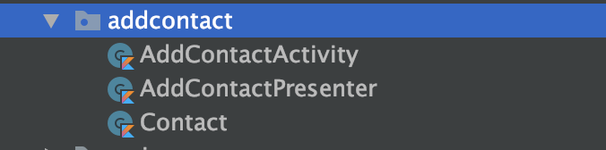

[`Kotlin Avanzado`](../../Readme.md) > [`Sesión 07`](../Readme.md) > `Ejemplo 1`

## Patrón de arquitectura: Model-View-Presenter :

<div style="text-align: justify;">


### 1. Objetivos :dart:

- Migrar una actividad convencional al patrón Model-View-Presenter

### 2. Requisitos :clipboard:

* Haber leído previamente el tema de Patrones de arquitectura para android en el Prework

### 3. Desarrollo :computer:

Vamos a aprender implementar lo esencial del patrón MVP en un proyecto previamente creado.

Para esto, utilizaremos el [Proyecto base](base) en esta carpeta e iremos implementando las modificaciones.

1. Vamos a utilizar a AddContactActivity para hacer nuestra migración, para eso creamos un nuevo package llamado *addcontact* en donde se encuentra nuestro *MainActivity*.

2. Ahí colocaremos nuestros archivos *AddContactActivity* (nuestro View) y la clase *Contact* (nuestro Model) y creamos una tercera clase llamado *AddContactPresenter*



3. Agregamos al *AddContactPresenter* el siguiente código comentado:

```kotlin
package org.bedu.recyclercontacts.addcontact

import android.app.Activity
import android.content.Intent


class AddContactPresenter( view: View) { //view es la vista a la que estará atado (AddContactPresenter)

    //el Model al que estamos atados
    var contact=Contact()

    //Actualizamos nuestro Model desde el presenter cada que se actualiza el nombre
    fun updateName(name: String){
        contact.name = name
    }

    //Actualizamos nuestro Model desde el presenter cada que se actualiza el teléfono
    fun updatePhone(phone: String){
        contact.phone = phone
    }

    //Acción a tomar cuando se presiona el botón addContact
    fun addContact(activity:Activity){

        val returnIntent = Intent()
        returnIntent.putExtra("new_contact", contact)
        activity.setResult(Activity.RESULT_OK, returnIntent)
        activity.finish()
    }

    //interfaz que define nuestra vista
    interface View{
        fun addContact()
    }
}
```

4. Cambiaremos la lógica de AddContactActivity para que se vuelva presenter:

```kotlin
class AddContactActivity : AppCompatActivity(),AddContactPresenter.View {

    //nueva instancia de nuestro presentador
    private val presenter = AddContactPresenter(this)


    override fun onCreate(savedInstanceState: Bundle?) {
        super.onCreate(savedInstanceState)
        setContentView(R.layout.activity_add_contact)

        //llamamos la función addContact
        buttonAdd.setOnClickListener{
            addContact()
        }

        //Cuando el texto cambia (onTextChanged), el presenter hace una actualización de nuestro nombre
        editName.addTextChangedListener(object : TextWatcher {
            override fun afterTextChanged(p0: Editable?) {
            }

            override fun beforeTextChanged(s: CharSequence?, p1: Int, p2: Int, p3: Int) {

            }

            override fun onTextChanged(s: CharSequence?, p1: Int, p2: Int, p3: Int) {
                presenter.updateName(s.toString())
            }
        })

        //Cuando el texto cambia (onTextChanged), el presenter hace una actualización de nuestro teléfono
        editPhone.addTextChangedListener(object : TextWatcher {
            override fun afterTextChanged(p0: Editable?) {
            }

            override fun beforeTextChanged(s: CharSequence?, p1: Int, p2: Int, p3: Int) {

            }

            override fun onTextChanged(s: CharSequence?, p1: Int, p2: Int, p3: Int) {
                presenter.updatePhone(s.toString())
            }
        })
    }

    //implementación de la interfaz definida en presenter, en este caso sólo llama a la función del presenter
    //pero aquí podría actualizarse algún estado de un elemento de la Vista
    override fun addContact() {
        presenter.addContact(this)
    }

}
```

5. Corremos la app, el funcionamiento no debió ser alterado.

[`Anterior`](../) | [`Siguiente`](../Reto-01)      

</div>