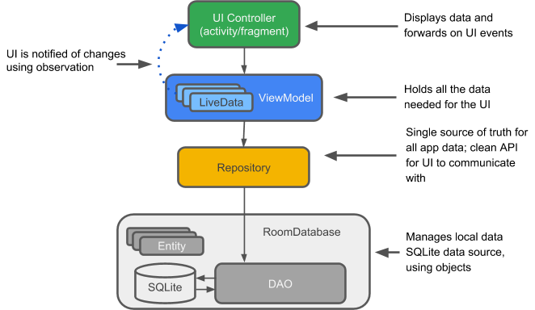
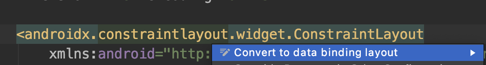

[`Kotlin Avanzado`](../../Readme.md) > [`Sesión 07`](../Readme.md) > `Ejemplo 3`

## Architecture Components

<div style="text-align: justify;">

### 1. Objetivos :dart:


- Migrar una actividad convencional al patrón Model-View-Presenter

### 2. Requisitos :clipboard:

* Haber leído previamente el tema de Patrones de arquitectura para android en el Prework

### 3. Desarrollo :computer:

Un proyecto de android puede variar en cuanto a la complejidad de su estructura, dependiendo de muchos factores que afectan al performance, escalabilidad y al peso de una app. Una de estas características es la estructura que siga el proyecto.

Además de los distintos patrones de arquitectura que se han utilizado desde el desarrollo de las primeras aplicaciones para android, tales como MVC o MVP, la plataforma de android sugiere una arquitectura adecuado para muchos de los flujos de trabajo. Dicha estructura utiliza ___Android Architecture Components___.

_Android Architecture Components_ es una serie de librerías que proveen de herramientas para facilitar la estructuración de un código mantenible y testeable. Dentro de estas, podemos encontrar los siguientes componentes:

* ***Room***, librería para gestionar bases de datos SQLite de manera local de forma óptima y sintetizada. Este fue abordado en el [Ejemplo 2](../../Sesion-04/Ejemplo-02) de la [Sesión 4](../../Sesion-04/Readme.md)
* ***LiveData***, Un wrapper que da la capacidad a un objeto de ser observable.
* ***ViewModel***, Es encargada de gestionar los datos correspondientes a la UI (podríamos decir,  relacionados a un Activity o Fragment) y su procesamiento.


La estructura sugerida para utilizarse con _Architecture Components_ es la siguiente:


* Al primer nivel, que está compuesto por un *Activity* o *Fragment*,  se le llama ***UI Controller*** y se encarga de dirigir los eventos asociados a la interfaz de usuario. 
* El segundo nivel está conformado con el ___ViewModel___, un contenedor de datos requeridos por la UI. Los datos contenidos pueden ser envueltos por una clase ***LiveData***, que se encarga de volver dicho objeto observable, entre otras propiedades.
* En el tercer nivel se encuentra el ___Repositorio___, quien controla y administra el acceso a diferentes fuentes de datos. Como tal es una ___Single source of thruth___ (Única fuente de verdad), es decir, que es la única que debe realizar esta tarea.
* Los últimos niveles son como tal fuentes de información que están bajo la dirección del repositorio. En este diagrama contemplamos un modelo de datos relacionado a Room, quien maneja instancias de dicho modelo en una DB. También tenemos una fuente remota manejada por el cliente http _Retrofit_.


Este es un esquema general, sin embargo, utilizaremos una versión reducida de este esquema para implementarlo en una aplicación y comprender el alcance de los Architecture Components. En este caso, utilizaremos nuestra Base de Datos local como única fuente de datos.





#### Setup inicial 

Para este ejemplo, volveremos a desarrollar el ejercicio del  [Ejemplo 2](../../Sesion-04/Ejemplo-02) de la [Sesión 4](../../Sesion-04/Readme.md), para esto, volveremos a tomar la [base del proyecto](base) (incluído aquí).


Editaremos el archivo ***app/buid.gradle***. Agregaremos la opción de databinding, que abordaremos más adelante, mediante las siguientes líneas: 

```groovy
android{
  ...
  buildFeatures {
        dataBinding true
    }
} 

```


Utilizaremos la siguiente dependencia, para utilizar las clases necesarias de Architecture components.

```groovy
implementation 'androidx.lifecycle:lifecycle-viewmodel-ktx:2.6.1'
```


#### Repositorio

Lo siguiente es crear una clase que actúe como interfaz entre el Dao y quien requiera la información. Esta clase será nuestro __Repositorio__.  

```kotlin
class VehicleRepository(
    private val vehicleDao: VehicleDao,
    private val ioDispatcher: CoroutineDispatcher = Dispatchers.IO
    ) {
    
    
}
```

El _CoroutineDispatcher_ determina el _Thread_ donde se ejecuta nuestra corrutina, por eso lo necesitamos. (Dispatchers.IO envía nuestro proceso a un Thread Pool).

Agregaremos por el momento un método para recuperar todos los vehículos guardados y otro para agregar un set de vehículos.

```kotlin
fun getVehicles(): List<Vehicle> {
        return vehicleDao.getVehicles()
    }

suspend fun populateVehicles(vehicles: List<Vehicle>) = withContext(ioDispatcher){
        return@withContext vehicleDao.insertAll(vehicles)
    }
```


El repositorio deberá ser único y accesible para todos los ViewModels, es por eso que crearemos una instancia en nuestra aplicación y desde ahí realizaremos las operaciones.

```kotlin
val vehicleRepository: VehicleRepository
        get() = VehicleRepository(
            VehicleDb.getInstance(this)!!.vehicleDao()
        )
```

Debido a que nuestro constructor requiere al menos el ___Dao___, se lo proporcionamos mediante nuesto database obtenido con el singleton ___getInstance()___. 

Asegúrate de que el nuevo componente _Application_ sea asignado en nuestro __Manifest__.

```xml
<application
    android:name=".VehiclesApplication"
             ...
```


#### Creando los ViewModels 

Ahora requeriremos guardar los datos que utilizaremos en el Fragment, esto lo determinaremos en una nueva clase ___VehicleListViewModel___, dentro del package _vehiclelist_. Nuestro ViewModel recibirá una instancia del repositorio en su constructor.


```kotlin
class VehicleListViewModel(
    private val vehicleRepository: VehicleRepository): ViewModel(){

}
```

por el momento, requeriremos únicamente de la lista de vehículos, por lo que declaramos esta variable. También utilizaremos un método temporal para poblar nuestra base de datos (es un truco que usaremos una sola vez ;) ).

```kotlin

  private var _vehicles: List<Vehicle> = listOf()

  init{
      prepopulate()
  }

  fun getVehicleList(): List<Vehicle>{
      _vehicles = vehicleRepository.getVehicles()
      return _vehicles
  }

  fun prepopulate(){
      val vehicles = listOf(
          Vehicle(model = "Vento",brand = "Volkswagen",platesNumber = "STF0321",isWorking = true),
          Vehicle(model = "Jetta",brand = "Volkswagen",platesNumber = "FBN6745",isWorking = true)
      )

      viewModelScope.launch {
          vehicleRepository.populateVehicles(vehicles)
      }

```

Ahora, en ___VehicleListFragment___, Crearemos un atributo que almacenará una instancia de nuestro `ViewModel`

```kotlin
 private lateinit var viewModel: VehicleListViewModel
```

Y le asignamos una instancia en `onCreateView`

```kotlin
viewModel = VehicleListViewModel(
    (requireContext().applicationContext as VehiclesApplication).vehicleRepository
)
```

Crearemos un nuevo método para llenar la lista de vehículos

```kotlin
private fun setupVehicleList(){

    lifecycleScope.launch {
        withContext(Dispatchers.IO) {
            val vehicleList = viewModel.getVehicleList().toMutableList()
						adapter = VehicleAdapter(vehicleList, this@VehicleListFragment)   
        }
      recyclerVehicle.adapter = adapter
    }
}
```


Y la utilizaremos en el método `onViewCreated`

```kotlin
override fun onViewCreated(view: View, savedInstanceState: Bundle?) {
    super.onViewCreated(view, savedInstanceState)

    setupVehicleList()
}
```

Corremos la aplicación y verificamos que los vehículos estén en la lista:


Recuerda comentar el código ___prepopulate___ en nuestro ___ViewModel___.

```kotlin
// prepopulate()
```

#### Explorando el Adapter

Anteriormente hemos utilizado los adapters recibiendo una lista de items en su constructor, algo indeseable puesto que la información debe ser manejada únicamente por el ViewModel, además de que esta aproximación tiene el inconveniente de tener qué actualizar cada modificación en la lista, por lo que para este adapter utilizaremos una aproximación más sencilla: ___DiffUtil___. Esta herramienta compara una lista vieja de la nueva y si existen diferencias, determina la acción realizada (agregar, eliminar, editar), haciendo el trabajo por nosotros. Crearemos una clase que la implemente:

```kotlin
class VehicleDiffCallback : DiffUtil.ItemCallback<Vehicle>() {
    override fun areItemsTheSame(oldItem: Vehicle, newItem: Vehicle): Boolean {
        return oldItem.id == newItem.id
    }

    override fun areContentsTheSame(oldItem: Vehicle, newItem: Vehicle): Boolean {
        return oldItem == newItem
    }
}
```

* ___areItemsTheSame___ compara que dos objetos sean los mismos a través de alguna propiedad única, devolviendo true si es el caso, o false si no. Aquí compararemos los objetos por su id. Con esta propiedad sabremos si un item fue actualizado.
* ___areContentsTheSame___ verifica todos los campos entre un objeto viejo y uno nuevo para saber si algún elemento fue actualizado. En este caso, compararemos los dos objetos como tal.


#### Binding 

Ahora utilizaremos Data Binding en nuestro Adapter, esto implica que un dato de nuestro _ViewModel_ va irremediablemente atado a un view de nuestro _layout_ sin necesidad de asignarlo programáticamente.

Abrimos ___vehicle_item.xml___, damos click derecho en el  ___ConstraintLayout___ y seleccionamos la opción __Convert to data binding layout__. 



Esta opción Agregará un elemento <layout> junto a un <data></data>. Aquí declararemos nuestra variable vehicle y viewModel que estará atado al layout. 

```kotlin
<data>
        <variable
            name="vehicle"
            type="org.bedu.architecturecomponents.data.local.Vehicle" />

        <variable
            name="viewModel"
            type="org.bedu.architecturecomponents.vehiclelist.VehicleListViewModel" />
    </data>
```

Como la variable ___vehicle___ contiene los datos que van en nuestros ___TextView___, vamos a asignarlos directamente a sus respectivas propiedades ___text___.

```xml
<TextView
    android:id="@+id/plates_number"
    android:text="@{vehicle.platesNumber}"
    ...
/>

<TextView
	  android:id="@+id/model_name"
    android:text="@{vehicle.model}"
    .../>
```

Cada vez que los datos cambien, el texto en estos ___Views___ serán actualizados automáticamente.

Estas dos variables serán asignadas en el código del adapter a través de un objeto Binding creado automáticamente, su nombre es una conversión del nombre del layout en formato CamelCase + el sufijo __Binding__. Para _vehicle_item_, el nombre de la clase sería ___VehicleItemBinding___. Este elemento también contiene las referencias a las vistas, por lo cual ya no es necesario identificarlos por id. Con estas modificaciones, nuestro _ViewHolder_ quedaría así:

```kotlin
    class ViewHolder private constructor(val binding: VehicleItemBinding) :
        RecyclerView.ViewHolder(binding.root) {
        fun bind(viewModel: VehicleListViewModel, item: Vehicle) {
            binding.viewModel = viewModel
            binding.vehicle = item
            binding.executePendingBindings()
        }

        companion object {
            fun from(parent: ViewGroup): ViewHolder {
                val layoutInflater = LayoutInflater.from(parent.context)
                val binding = VehicleItemBinding.inflate(layoutInflater, parent, false)

                return ViewHolder(binding)
            }
        }
    }
```


Notese que en la función bind es donde asignamos el valor de nuestras variables ___vehicle___ y ___viewModel___ declaradas en el layout. El método ___executePendingBindings___ fuerza a atar datos pendientes. El método ___from___ en nuestro companion object regresa una instancia de nuestro ViewHolder, resaltando que ahora inflamos mediante VehicleItemBinding en vez de nuestra ___View___ raíz y sin enlazar Views a objetos mediante su id.

Finalmente, toca modificar como tal los métodos del ___Adapter___. El método ___getItemCount__ ya no es requerido, pues un ___ListAdapter___ realiza el conteo internamente. Por lo tanto, su implementación se reduce a estos dos callbacks:

```kotlin
override fun onCreateViewHolder(viewGroup: ViewGroup, viewType: Int): ViewHolder {
   return ViewHolder.from(viewGroup)
}

override fun onBindViewHolder(viewHolder: ViewHolder, position: Int) {
    val item = getItem(position)
    viewHolder.bind(viewModel,item)
}
```


Corremos el código y observamos que los datos se siguen desplegando de forma normal. 


#### Gestión de eventos

Para que los botones de edición y eliminación funcionen, debemos agregar dicho método al repositorio, llamando a su vez al respectivo método del DAO.

````kotlin
suspend fun removeVehicle(vehicle: Vehicle){
        coroutineScope {
            launch { vehicleDao.removeVehicle(vehicle ) }
        }
    }
````

Con esto, lanzamos una corrutina que lanza nuestra operación asíncrona de eliminar vehículo de la base de datos.

Ahora, desde nuestro ViewModel, llamamos este método a través de otro en nuestro ___viewModel___ (por que es él quien se encarga de gestionar los datos a final de cuentas).

```kotlin
fun removeVehicle(vehicle: Vehicle) = viewModelScope.launch{
        vehicleRepository.removeVehicle(vehicle)
    }
```

Para que esto se accione desde el botón de eliminar, ataremos dicha acción a nuestro atributo ___onClick___ de nuestro ___Button___.

```kotlin
       <ImageButton
            android:id="@+id/button_delete"
						...
            android:onClick="@{() -> viewModel.removeVehicle(vehicle)}"
           .../>
```

Ahora, probamos a eliminar un elemento. Al accionar el botón, el elemento desaparecerá de la lista.

Para el botón editar, enviaremos el id del vehículo a nuestra pantalla de edición.

Crearemos las siguientes variables y el método en el ___viewModel___:

```kotlin
private var _editVehicleId = MutableLiveData<Int?>()
val eventEditVehicle = _editVehicleId

fun onEdit(vehicleId: Int){
        eventEditVehicle.value = vehicleId
    }
```

Como observamos, ***_editVehicle*** es un LiveData privado que guardará el id del vehículo a editar, su contraparte ___eventEditVehicle___ nos sirve para acceder a dicho valor. El id está envuelto por el LiveData para que al tener un nuevo valor, este pueda ser observado. ***onEdit*** es el método que llamaremos para asignar el id del coche a editar al dar click al botón editar. Para que se active el evento, debemos indicarlo en el bottón Edit de nuestro _vehicle_item_:

```xml
<ImageButton
    android:id="@+id/button_edit"
    android:onClick="@{() -> viewModel.onEdit(vehicle.id)}"
    ...
    />
```


Para que nuestro ___Fragment___ pueda reaccionar al asignarse este nuevo id y navegar a la pantalla de edición, habrá que observar dicho evento mediante la siguiente línea:

```kotlin
eventEditVehicle.observe(viewLifecycleOwner, Observer {
                   
                })
```

Dentro de los curly brackets irá el callback a ejecutarse cuando se observe un cambio en el id. Aquí verificaremos que el id no sea nulo y en ese caso, navegaremos al ___AddEditFragment___.

```kotlin
private fun setupEditVehicle(){
    if(viewModel!=null){

        with(viewModel){

            eventEditVehicle.observe(viewLifecycleOwner, Observer {
                if(eventEditVehicle.value!=null){
                    findNavController().navigate(
                            R.id.action_vehicleListFragment_to_addEditFragment,
                            bundleOf("vehicle_id" to eventEditVehicle.value!!)
                    )
                    eventEditVehicle.value = null
                }
            })
        }
    }

}
```


Este método se ejecuta en ___onCreateView___, después de crear el __viewModel__.


Para terminar este ___Fragment___, ataremos nuestro viewModel al su layout. El código extra para el data binding es el siguiente:

```xml
<data>
    <variable
        name="vehicleListViewModel"
        type="org.bedu.architecturecomponents.vehiclelist.VehicleListViewModel"
        />
</data>
```


De vuelta al _Fragment_, eliminamos todas las variables que hacen referencia aun ___View___ y agregamos una variable binding:

```kotlin
private lateinit var binding: FragmentVehicleListBinding
```


 pondremos el siguiente código al principio para inflar las views (eliminamos la inicialización del view raíz):

```kotlin
binding = DataBindingUtil.inflate(
    inflater,
    R.layout.fragment_vehicle_list,
    container,
    false
)
```

Debemos asegurarnos de que ___onCreateView___ regrese ___return binding.root___ en vez de ___view___.

 Como ahora los nombres de los views son la versión CamelCase de sus id, reemplazaremo

* addButton por binding.buttonAdd
* recycleVehicle por binding.list

Eliminamos todos las líneas que contengan el método ___findViewByID___ y corremos la aplicación,


#### Lista de vehículos y LiveData

Para hacer que la lista de vehículos se actualice cuando haya una modificación en la base de datos, podemos envolver la lista en un objeto `LiveData`. Dicho wrapper dará la opción de ejecutar una función cada vez que se modifique la lista, por lo cual avisaremos al recyclerview que hubo una modificación.

Primero, tenemos qué hacer que nuestra query `getVehicles` devuelva un `LiveData`.

```kotlin
@Query("SELECT * FROM Vehicle")
fun getVehicles(): LiveData<List<Vehicle>>
```

Después, actualizamos nuestra función `getVehicles ` de nuestro `VehicleRepository`.

```kotlin
fun getVehicles() = vehicleDao.getVehicles()
```

Declaramos la siguiente variable que será el elemento del ViewModel a observar desde nuestro fragment.

```kotlin
val vehicleList = vehicleRepository.getVehicles()
```

Y finalmente, en `VehicleListFragment` observaremos cualquier cambio y actualizaremos la lista cuando eso suceda.

```kotlin
viewModel.vehicleList.observe(viewLifecycleOwner, Observer {
    it?.let {
        adapter.submitList(it)
    }
})
```

Después de estos cambios, la lista debe seguir desplegándose.

#### Agregar un vehículo

Para agregar un vehículo, utilizamos AddEditFragment. Este tendrá básicamente los mismos componentes que el Fragment anterior.

Crearemos un ___AddEditViewModel___ para el fragment, 

```kotlin
class AddEditViewModel(private val vehicleRepository: VehicleRepository): ViewModel() {}
```

Dentro de esta, vamos a definir algunas de las variables que utilizaremos. En este caso, serán las características de un vehículo:

```kotlin
    var model: String? = null
    var brand: String? = null
    var platesNumber: String? = null
    var isWorking = false
```


Los usaremos al crear un nuevo vehículo. Para esto, requeriremos crear un método en nuestro repositorio para agregar el vehículo. Escribimos el siguiente método en `VehicleRepository`.


```kotlin
suspend fun addVehicle(vehicle: Vehicle){
        coroutineScope {
            launch { vehicleDao.insertVehicle(vehicle ) }
        }
    }
```


Para agregar un nuevo vehículo, debemos verificar que todos los campos no estén vacíos; si se cumple la condición anterior, crearemos un nuevo vehículo con las características contenidas en el _viewModel_ y agregareos el vehículo a la base de datos, a través del repositorio. Esto lo hacemos mediante el siguiente código:

```kotlin
fun newVehicle() = viewModelScope.launch{
        if ( !model.isNullOrBlank() && !brand.isNullOrBlank() && !platesNumber.isNullOrBlank() ){
            val vehicle = Vehicle(
                    brand = brand,
                    model = model,
                    platesNumber = platesNumber,
                    isWorking = isWorking
            )

            vehicleRepository.addVehicle(vehicle)
        } 
    }
```

Ahora agregaremos nuestro viewModel a ___AddEditFragment___.

```kotlin
private lateinit var viewModel: AddEditViewModel
```

en ___onCreateView___ instanciamos dicho *viewModel*:

```kotlin
  viewModel = AddEditViewModel(
                (requireContext().applicationContext as VehiclesApplication).vehicleRepository
        )
```


También accionaremos la creación del nuevo vehículo desde nuestro botón:

```kotlin
buttonAddCar.setOnClickListener{
            viewModel.newVehicle()
        }
```


 Agregaremos Data Binding a este fragment. Abrimos ___fragment_add_edit.xml___ y agregaremos nuestra variable ___viewModel___:

```kotlin
    <data>
        <variable
            name="viewModel"
						type="org.bedu.architecturecomponents.addeditvehicle.AddEditViewModel"
            />
    </data>
```

 Con esto, podríamos definir métodos a través de nuestro ViewModel que sean disparados al editar el texto de nuestros ___EditText___ o al mover el switch.

Crearemos esos métodos en ___AddEditViewModel___. Para un EditText, usaremos el atributo ___onTextChanged___, por lo que utilizaremos los siguientes:


```kotlin
fun setPlates(s: CharSequence, start:Int, before: Int, count:Int) {
        platesNumber = s.toString()
    }

    fun setBrandName(s: CharSequence, start:Int, before: Int, count:Int) {
        brand = s.toString()
    }

    fun setModelName(s: CharSequence, start:Int, before: Int, count:Int) {
            model = s.toString()
        }
```


Para el caso del booleano ___isWorking___, utilizaremos el siguiente:

```kotlin
    fun setIsWorking(button: CompoundButton,value: Boolean) {
        isWorking = value
    }
```


Estos métodos los proporcionaremos a los atributos de los respectivos views en el layout.


```kotlin
 <EditText
            android:id="@+id/edit_plates"
           ...
            android:onTextChanged="@{viewModel::setPlates}"
            />

        <EditText
            android:id="@+id/edit_brand"
           ...
            android:onTextChanged="@{viewModel::setBrandName}"
            />

        <EditText
            android:id="@+id/edit_model"
            ...
            android:onTextChanged="@{viewModel::setModelName}"
            />

        <Switch
            android:id="@+id/switch_working"
            ...
            android:onCheckedChanged="@{viewModel::setIsWorking}"
           />

```


Con esto, nuestras variables se actualizarán constantemente. 

Ahora, requerimos declarar el binding en nuestro fragment.

```kotlin
private lateinit var binding: FragmentAddEditBinding
```

Podemos remover los ___Views___ y sus asignaciones por id, ya que utilizaremos el binding, con el que inflaremos nuestras vistas:

```kotlin
binding = DataBindingUtil.inflate(
                inflater,
                R.layout.fragment_add_edit,
                container,
                false
        )
```


Tenemos qué notificarle al binding el ___lifeCycleOwner___ y el ***viewModel***:

````kotlin
  binding.lifecycleOwner = this
  binding.viewModel = viewModel
````

y finalmente reemplazamos toda referencia a los views restantes con atributos de ___binding___.


```kotlin
  binding.buttonAddCar.setOnClickListener{...}
...
   return binding.root                                       
                                       
```


Por último, navegaremos a nuestra lista de vehículos al terminar de guardar nuestro vehículo. Para esto, observaremos un ___LiveData___ bandera que se levantará al terminar de guardar el vehículo a la DB. 

Creamos la bandera y una variable pública para leerla:

```kotlin
private var _vehicleDone = MutableLiveData<Boolean>(false)
val vehicleDone = _vehicleDone
```

*_vehicleDone* cambiará después de la ejecución del método ___addVehicle___:

```kotlin
fun newVehicle() = viewModelScope.launch{
        ...

        vehicleRepository.addVehicle(vehicle)
        _vehicleDone.value = true
        }
    }
```


Para observar nuestra bandera y navegar cuando se levante implementamos lo siguiente:

```kotlin
fun setupNavigation() {
        viewModel.vehicleDone.observe(viewLifecycleOwner, Observer {
            if(it){
                findNavController().navigate(
                        R.id.action_addEditFragment_to_vehicleListFragment
                )
            }
        })
    }
```


Este método se utiliza en ___onCreateView___.

[`Anterior`](../Ejemplo-02) | [`Siguiente`](../Proyecto/Readme.md)      

</div>