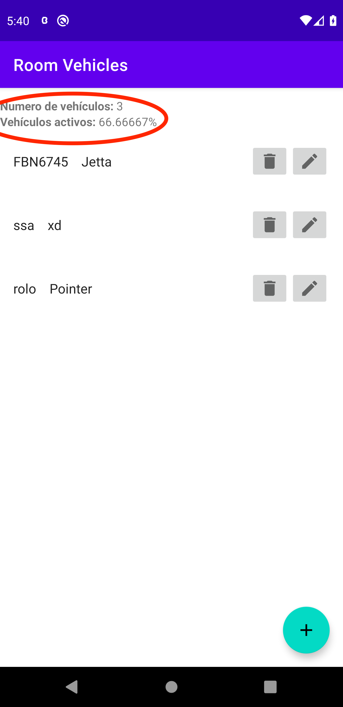
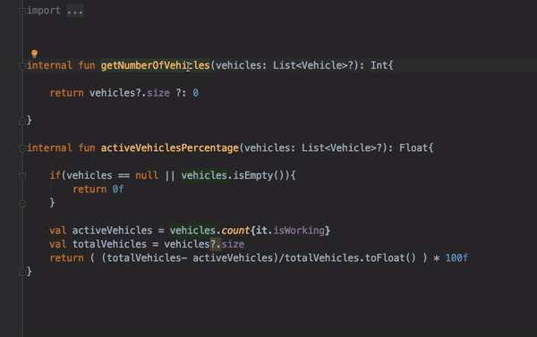

[`Kotlin Avanzado`](../../Readme.md) > [`Sesión 08`](../Readme.md) > `Ejemplo 1`

## Ejemplo 1: Pruebas unitarias

<div style="text-align: justify;">


### 1. Objetivos :dart:

* Realizar pruebas de clases y métodos aislados  en específico en la JVM.

### 2. Requisitos :clipboard:

* JUnit y Thruth instalados.

### 3. Desarrollo :computer:

Vamos a realizar ahora test unitarios. Para esto, utilizaremos el [proyecto base](base). A continuación repasamos lo agregado:


* Creamos una nuevo archivo ___VehicleUtils.kt___ dentro de un nuevo package (utils). Aquí estarán contenidos los dos métodos que calcularán nuestros datos extra.

```kotlin
internal fun getNumberOfVehicles(vehicles: List<Vehicle>?) = vehicles?.size ?: 0

internal fun activeVehiclesPercentage(vehicles: List<Vehicle>?): Float {
    val activeVehicles = vehicles?.count{it.isWorking} ?: 0
    val totalVehicles = vehicles?.size ?: 0
    return ( activeVehicles/totalVehicles.toFloat() ) * 100f
}
```


* Agregaremos un nuevo layout donde tendremos el número de vehículos, y el porcentage de vehículos activos:



#### Creando un nuevo Test

 Empezaremos agregando la siguiente dependencia (solo para testing):

```kotlin
dependencies {
   // test
    testImplementation "com.google.truth:truth:1.1.2"
}
```

Esta es una librería de assertion (existen otras como hamcrest).

Después, dentro de ___VehicleUtils.kt___, damos click derecho a cualquier función de las dos  luego _Generate>Test_.

Se abrirá una nueva ventana, seleccionamos la versión de JUnit a utilizar, seleccionamos la carpeta donde se guardará el Test (verificar que sea app/src/test... y no app/src/androidTest) y damos aceptar.




Se creará la siguiente clase vacía:

```kotlin
class VehicleUtilsKtTest{

}
```


Aquí escribiremos nuestras pruebas unitarias


#### Ejecutando una prueba unitaria

Antes de crear nuestra primera prueba, encontraremos ya creada una clase llamada ___ExampleUnitTest___ con un solo método:

```kotlin
class ExampleUnitTest {
    @Test
    fun addition_isCorrect() {
        assertEquals(4, 2 + 2)
    }
}
```

Analizamos la estructura:

* ___ExampleUnitTest___: es una clase simple que contiene todos los tests a ejecutar.
* Addition_isCorrect: es un método que verifica un caso específico.
* @Test: Es una anotación que debe ir siempre como cabecera de cualquier función de testing
* assertEquals(): Método que verifica que dos expresiones sean correctas.

Corremos el ejemplo y pasaremos el test. Modificamos el número 4. Comentar lo que sucede.


#### Creando pruebas unitarias

Con la estructura analizada, verificaremos que nuestro método ___getNumberOfVehicles___ funcione correctamente. para esto, haremos tres pruebas:

1. Enviaremos una lista de vehículos vacía. El resultado debe ser cero.
2. Pasamos un valor nulo, el resultado debe ser cero.
3. Pasamos dos vehículos, el resultado debe ser dos.


Para el primer caso, creamos la lista de vehículos vacío; luego, obtenemos el resultado y finalmente verificamos que este equivalga a cero.


```kotlin
@Test
fun getNumberOfVehicles_empty_returnsZero(){
    val vehicles = listOf<Vehicle>()

    val result = getNumberOfVehicles(vehicles)

    assertThat(result).isEqualTo(0)
}
```


Para el segundo caso, creamos la lista nula; luego, obtenemos el resultado y finalmente verificamos que este equivalga a cero.


```kotlin
@Test
fun getNumberOfVehicles_null_returnsZero(){
    val vehicles = null

    val result = getNumberOfVehicles(vehicles)

    assertThat(result).isEqualTo(0)
}
```


Para el tercer caso, creamos la lista con dos vehículos; luego, obtenemos el resultado y finalmente verificamos que este equivalga a dos.

```kotlin
@Test
fun getNumberOfVehicles_two_returnsTwo(){
    val vehicles = listOf(
        Vehicle(
            0,
            "pointer",
            "Volkswagen",
            "SMT01",
            true
        ),
        Vehicle(
            1,
            "Vento",
            "Volkswagen",
            "GTA05",
            true
        )
    )

    val result = getNumberOfVehicles(vehicles)

    assertThat(result).isEqualTo(2)
}
```

[`Anterior`](../) | [`Siguiente`](../Reto-01)      

</div>

