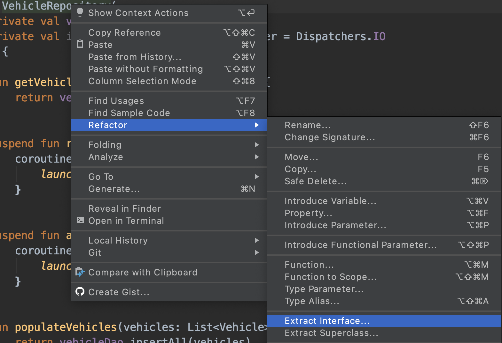
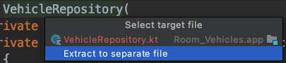
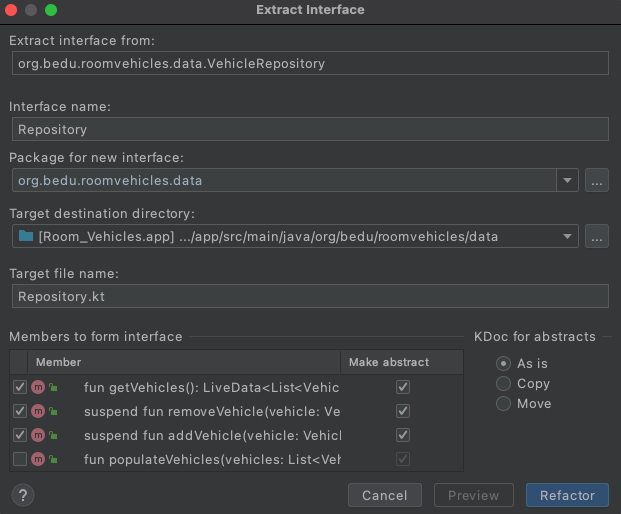

[`Kotlin Avanzado`](../../Readme.md) > [`Sesión 08`](../Readme.md) > `Ejemplo 2`

## Ejemplo 2: Local Tests con Dependencias Android

<div style="text-align: justify;">

### 1. Objetivos :dart:


* Realizar pruebas entre clases interactuando entre sí. 
* Ejecutar pruebas en la interfaz gráfica de la app.

### 2. Requisitos :clipboard:

* Instalar las dependencias enunciadas a continuación.

### 3. Desarrollo :computer:


#### Setup inicial

Reorganizamos nuestro _build.gradle_ y agregamos dependencias

Estas son las dependencias para test unitario

```groovy
// librerías de test unitario
testImplementation 'junit:junit:4.+'
testImplementation "com.google.truth:truth:1.1"
testImplementation "org.jetbrains.kotlinx:kotlinx-coroutines-test:1.2.1"
testImplementation "androidx.arch.core:core-testing:2.0.0"
```


#### Test Doubles

Al probar ciertos módulos específicos de nuestro código, podemos tener problemas al encontrar dependencias con alguna clase que no planeamos verificar en un test específico debido a su complejidad o dependencia de algún servicio externo (como repositorios remotos); para eso nos apoyamos de un _Test Double_, que suplirá la función para que el test pueda ser ejecutado. Hay distintos tipos de _Test Doubles_ que sirven para distintos contextos, los dos principales son:

* ***Fakes***: Versiones modificadas de la dependencia real para ser funcionales en un _Test_.
* ___Mocks___: Clases que provocan que un test sea correcto o falle, dependiendo de cómo sean llamados sus métodos. No tienen una implementación que simule el comportamiento de la dependencia. Existen varios frameworks que facilitan la creación de estos.
*  ___Stubs___: Estos dobles se encargan únicamente de regresar valores esperados en cada uno de sus métodos y por lo tanto, carecen de lógica.

En este caso, vamos a crear un _Fake_ para nuestro repositorio de vehículos, por lo cual crearemos una interfaz que dictará la estructura del repositorio para la implementación real como el fake.

Para volver ___VehicleRepository___ en interfaz, daremos click derecho al _nombre de la clase>Refactor>Extract Interface_




Nos aparecerá un menú para seleccionar el archivo destino. Seleccionaremos _Extract to separate file_



Ahora tenemos una ventana para seleccionar nombre de la interfaz (en este caso la nombramos _Repository_), directorio, nombre del archivo y los métodos a agregar: seleccionamos todos y damos _Refactor_. 




Ahora crearemos nuestro repositorio fake. Crearemos la clase ___FakeVehicleRepository___ en ___src>test>java...>data___ (si algunos de los packages para la ruta no existen, crearlos).

la clase deberá implementar la interfaz ___Repository___, y aquí simularemos el almacenamiento a la base de datos local, mediante una lista inicialmente vacía a la que manipularemos a través de los métodos de nuestro repositorio.

declaramos nuestra lista observable:

```kotlin
private var observableVehicles = MutableLiveData<List<Vehicle>>()
```


Para obtener nuestros vehículos, sobreescribimos ___getVehicles___, únicamente retornando nuestro observable:


```kotlin
override fun getVehicles(): LiveData<List<Vehicle>> {
    return observableVehicles
}
```

Para remover un vehículo, debemos recuperar la lista dentro del observable y asignarlo a una lista mutable para poder eliminar el vehículo dado y reasignarlo al observable.

```kotlin
override suspend fun removeVehicle(vehicle: Vehicle) {
        val newList: MutableList<Vehicle> = observableVehicles.value?.toMutableList() ?: mutableListOf()
        newList.remove(vehicle)
        observableVehicles.value = newList
    }
```

De forma similar, sobreescribimos ___addVehicle___ para poder agregar un nuevo elemento al observable.

```kotlin
    override suspend fun addVehicle(vehicle: Vehicle) {
        val newList: MutableList<Vehicle> = observableVehicles.value?.toMutableList() ?: mutableListOf()
        newList.add(vehicle)
        observableVehicles.value = newList
    }
```

Para ___populateVehicles___, basta con asignar la lista al valor del observable.

```kotlin
override fun populateVehicles(vehicles: List<Vehicle>) {
    observableVehicles.value = vehicles
}
```

#### Local Test de un ViewModel

Con nuestro repositorio fake, podremos ahora probar nuestro ___VehicleListViewModel___, cuya única dependencia es nuestro repositorio. Haremos un par de modificaciones:

Este es el constructor actual de nuestro _viewModel_:

```kotlin
class VehicleListViewModel(private val vehicleRepository: VehicleRepository): ViewModel() 
```

 Para poder pasar como argumento nuestro repositorio fake, cambiaremos el tipo a ___Repository___:

```kotlin
class VehicleListViewModel(private val vehicleRepository: Repository): ViewModel() 
```

debido a que el método prepopulate asume que tenemos un método populateVehicles que no está en nuestra interfaz, lo eliminaremos.

```kotlin
// Eliminar este método
fun prepopulate(){

    val vehicles = listOf(
        Vehicle(model = "Vento",brand = "Volkswagen",platesNumber = "STF0321",isWorking = true),
        Vehicle(model = "Jetta",brand = "Volkswagen",platesNumber = "FBN6745",isWorking = true)
    )
    vehicleRepository.populateVehicles(vehicles)

}
```


Ahora crearemos un test para nuestro ViewModel (el test debe ir dentro de ___test___). Utilizaremos __AndroidJUnitRunner__ para poder ejectutar nuestras pruebas a través de un dispositivo android.

```kotlin
class VehicleListViewModelTest{


}
```


Dentro de la clase, declaramos un atributo _vehicleRepository_ que será utilizado en los tests. También declaramos una instancia del viewModel que va ser sometido a testing

```kotlin
private lateinit var vehicleRepository: VehicleRepository
private lateinit var viewModel: VehicleListViewModel
```

Crearemos tres modelos de vehículos dentro de nuestra clase para utilizarlos posteriormente.

```kotlin
private val vento = Vehicle(model = "Vento",brand = "Volkswagen",platesNumber = "STF0321",isWorking = true)
private val jetta = Vehicle(model = "Jetta",brand = "Volkswagen",platesNumber = "FBN6745",isWorking = true)
private val tsuru = Vehicle(model = "Tsuru",brand = "Nissan",platesNumber = "RFG4583",isWorking = true)
```


Mediante el _annotation_ ___Before___, determinaremos el método setup que se correrá al principio de cada test. En este caso, inicializamos nuestro repositorio, agregamos dos de los vehículos a una lista para pasarlo al repositorio y finalmente, inicializamos nuestro *viewModel*.

```kotlin
@Before
    fun setup(){
        vehicleRepository = FakeVehicleRepository()

        val vehicles = listOf(vento,jetta)

        vehicleRepository.populateVehicles(vehicles)
        viewModel = VehicleListViewModel(vehicleRepository)
    }
```


Ahora escribiremos nuestro primer test que verificará que al eliminar un coche, este ya no se encuentre disponible en el _viewModel_. Crearemos un observer que observará nuestra lista de vehículos, el método ___observeForever___ es utilizado a falta de un _viewLifeCycleOwner_ que pueda determinar cuando se observa nuestro _LiveData_. A continuación eliminamos un vehículo de nuestro _viewModel_, volvemos a obtener la lista de vehículos y verificamos que el vehículo eliminado ya no se encuentre en la lista. No hay qué olvidarse de remover el observer al final de la prueba para evitar un memory leak.

```kotlin
@Test
fun removeVehicle_removesVehicle(){
    val observer = Observer<List<Vehicle>>{}

    try {

        viewModel.vehicleList.observeForever(observer)

        // When: Cuando probamos agregar un nuevo evento con nuestro ViewModel
        viewModel.removeVehicle(jetta)

        //Then: Entonces el evento fue disparado (eso provoca que no sea nulo y que tenga alguno de los estados:
        //      loading, success, error)
        val vehicles = viewModel.vehicleList.value

        assertThat(vehicles).contains(jetta)

    } finally {
        viewModel.vehicleList.removeObserver(observer) // eliminamos el observer para evitar memory leaks
    }
    viewModel.removeVehicle(jetta)
}
```


Si intentamos correr la prueba, obtendremos el siguiente error:

> java.lang.RuntimeException: Method getMainLooper in android.os.Looper not mocked.


Esto se debe a que el scheduler por defecto utiliza dependencias de Android no presentes en JUnit, por lo que podríamos utilizar el framework ___robolectric___ para suplir esto, pero para este caso, utilizaremos la siguiente regla:


```kotlin
@get:Rule
var instantExecutorRule = InstantTaskExecutorRule()
```


Ahora al intentar correr el test, obtenemos el siguiente error:

> Exception in thread "main" java.lang.IllegalStateException: Module with the Main dispatcher had failed to initialize. For tests Dispatchers.setMain from kotlinx-coroutines-test module can be used

La razón por la cual sucede esto, es que se requiere un ___coroutine dispatcher___ para operar con las corrutinas de nuestro repositorio. Crearemos una regle que asigne un ___TestCoroutineDispatcher___ al principio de nuestro test y lo limpie al final.

```kotlin
@ExperimentalCoroutinesApi
class CoroutineTestRule(val dispatcher: TestCoroutineDispatcher = TestCoroutineDispatcher()) : TestWatcher() {

    override fun starting(description: Description?) {
        super.starting(description)
        Dispatchers.setMain(dispatcher)
    }

    override fun finished(description: Description?) {
        super.finished(description)
        Dispatchers.resetMain()
        dispatcher.cleanupTestCoroutines()
    }

}
```

Esta regla debe ser declarada en nuestra clase de testing.

```kotlin
@get:Rule
var coroutineTestRule = CoroutineTestRule()
```


Finalmente, ejecutamos nuestro test y verificamos que funcione correctamente.

[`Anterior`](../Reto-01) | [`Siguiente`](../Ejemplo-03)      

</div>