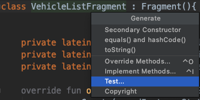
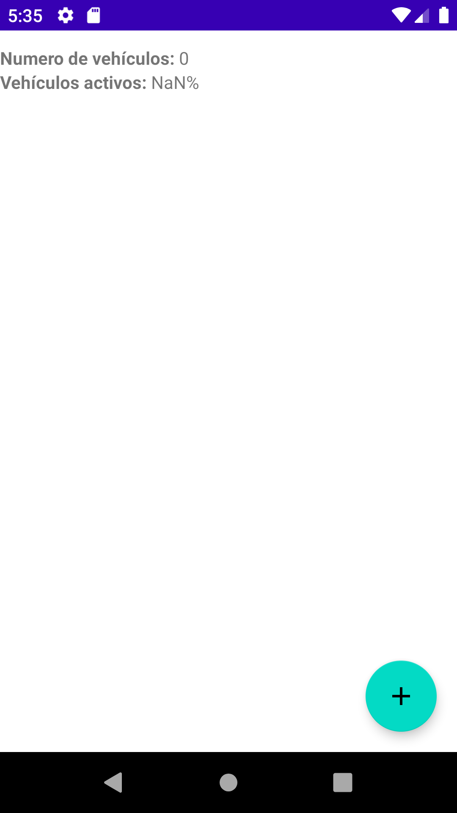
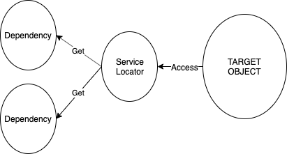
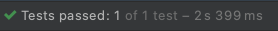
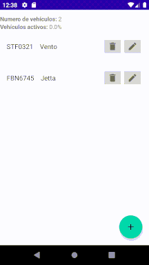

[`Kotlin Avanzado`](../../Readme.md) > [`Sesión 08`](../Readme.md) > `Ejemplo 3`

## Ejemplo 3: Integrated tests y Tests instrumentados

<div style="text-align: justify;">
### 1. Objetivos :dart:

* Realizar pruebas de flujo mediante el emulador de android.

### 2. Requisitos :clipboard:

* Instalar las dependencias descritas a continuación.

### 3. Desarrollo :computer:


Los tests instrumentados unitarios son las pruebas que corren en emuladores y dispositivos android, utilizando las APIs que el SDK proporciona, a diferencia de los Unit Test simples que no tienen dependencias relacionadas con Android.  





Daremos ok y verificamos que la clase creada esté en ___androidTest___.


```kotlin
@SmallTest
@RunWith(AndroidJUnit4::class)
class VehicleListFragmentTest{


}
```


Ahora crearemos un test para nuestro ViewModel (el test debe ir dentro de ***androidTest\***). En este caso, AndroidJUnit4 nos proveerá de una versión de JUnit capaz de ejecutar pruebas de instrumentación en un dispositivo físico o emulador.

#### Corriendo un Fragment en Testing

Para poder lanzar un Fragment y desplegar su interfaz de usuario, se requiere de un view raíz dentro de un _Activity_ que la contenga, este view lo determinamos en el layout de nuestro activity y a este se le asignan los fragments de forma estático o dinámicamente (a través de la clase o con ayuda de un navigation grpah). Sin embargo, para realizar una prueba instrumentada no existe un root que albergue nuestro fragment y su UI, por lo cual utilizamos el método ___launchFragmentInContainer___ para adjuntar el fragment a un view container. Agregaremos el método _sleep_ para congelar el hilo 4 segundos y poder apreciar la interfaz.

```kotlin
launchFragmentInContainer<VehicleListFragment>()
Thread.sleep(4000)
```

Si corremos el test, obtendremos el siguiente error:

> line #62: Error inflating class com.google.android.material.floatingactionbutton.FloatingActionButton

La razón se muestra más abajo en el stack trace:

> Caused by: java.lang.IllegalArgumentException: The style on this component requires your app theme to be Theme.AppCompat (or a descendant).

Debido a que el fragment se lanza en un contenedor vacío  ypor ende, sin theme, debemos definir uno:

```kotlin
launchFragmentInContainer<VehicleListFragment>(null, R.style.Theme_RoomVehicles)
```

El primer argumento es nulo ya que no requerimos ningún argumento para este fragment, el segundo parámetro es el tema por defecto en nuestra aplicación. Se desplegará lo siguiente:



 

#### Compartiendo recursos entre tests

Para realizar pruebas es conveniente compartir clases entre todos los tests , sin embargo, por defecto no es posible utilizar un recurso de la carpeta *test* en *androidTest*, por lo que hay que configurar un directorio de recursos común en ***build.gradle***. A continuación, crearemos una clase donde guardaremos los vehículos de prueba para compartirlo entre los proyectos.

1. En ___src___, damos ___click derecho > new > directory___. Al pedir el nombre, ingresamos ___sharedTest/java___.
2. Crearemos un nuevo paquete dando ___click derecho > new > package___. al pedir el nombre, ingresamos ___org.bedu.roomvehicles.data___ que es donde irá almacenado nuestro objeto. A continuación, agregamos el siguiente bloque de código en ___app/build.gradle___. 

```groovy
android {
  ...
  sourceSets {
      String sharedTestDir = 'src/sharedTest/java'
      test {
          java.srcDir sharedTestDir
      }
      androidTest {
          java.srcDir sharedTestDir
      }
  }
  ...
}
```

3. Sincronizamos nuestro proyecto y creamos nuestra clase ___VehicleHelper___ en ___org.bedu.roomvehicles.data___ dentro de _sharedTest/java_. Agregamos el siguiente código:

   ```kotlin
   object VehicleHelper {
   
       val vento = Vehicle(model = "Vento",brand = "Volkswagen",platesNumber = "STF0321",isWorking = true)
       val jetta = Vehicle(model = "Jetta",brand = "Volkswagen",platesNumber = "FBN6745",isWorking = true)
       val tsuru = Vehicle(model = "Tsuru",brand = "Nissan",platesNumber = "RFG4583",isWorking = true)
   }
   ```

5. Eliminamos la creación de estos vehículos en ___VehicleListViewModelTest___ y reemplazamos su uso por una llamada externa a este helper.

#### Creando un Service Locator

El patrón Service Locator permite que una clase obtenga sus dependencias a través de un contenedor en específico, en vez de inyectárselas independientemente.  




En nuestro caso, nos será útil debido a que no podemos instanciar el Fragment que vamos a lanzar en nuestro test, eso lleva a no tener control de la creación del viewModel y por lo tanto, no podemos manipular el repositorio. Por esto, crearemos un locator, que contendrá una instancia del repositorio que será utilizada tanto por el viewModel como en el test para validar  la información de nuestras pruebas.


Mediante nuestro ServiceLocator haremos lo siguiente:

* Proveer de un repositorio, si este no existe aún, crear una nueva instancia.
* Resetear el repositorio, que permitirá reiniciar los datos para cada prueba.

Una de las características de este locator es la de implementar una forma de gestionar el uso de nuestra base de datos de modo que no se creen inconsistencias de información debido a consultas simultáneas de las pruebas.

```kotlin
object ServiceLocator {

    private var database: VehicleDb? = null
    var repository: Repository? = null

    private val lock = Any()

    fun resetRepository(){

        synchronized(lock){
            database?.apply {
                clearAllTables()
                close()
            }
            database = null
            repository = null
        }

    }

    fun provideRepository(context: Context): Repository{
        synchronized(lock){
            return repository ?: createRepository(context)
        }
    }

    private fun createRepository(context: Context): Repository{
        database = VehicleDb.getInstance(context)
        val repo = VehicleRepository(database!!.vehicleDao())
        repository = repo
        return repo
    }

}
```


el repositorio guardado en la aplicación ahora debe utilizar el método ___provideRepository___ del ServiceLocator.

```kotlin
val vehicleRepository: Repository
    get() = ServiceLocator.provideRepository(this)
```


AddEditViewModel debe recibir un ___Repository___ en vez de ___VehicleRepository___, para poder usar el fake y el real.

```kotlin
class AddEditViewModel(private val vehicleRepository: Repository): ViewModel() {}
```


#### Probando el botón eliminar vehículo.

El código general de nuestra test class de ListFragment es el siguiente:

```kotlin
@Volatile
private lateinit var vehicleRepository: FakeVehicleAndroidRepository
    @VisibleForTesting set


@Before
fun setup(){
    vehicleRepository = FakeVehicleAndroidRepository()
    ServiceLocator.repository = vehicleRepository
}

@After
fun close(){
    ServiceLocator.resetRepository()
}
```


En nestro método de test ***removeButton_RemovesVehicle***, poblamos nuestro repositorio con un par de vehículos.

```kotlin
val vehicles = listOf(
    VehicleHelper.vento,
    VehicleHelper.jetta
)

vehicleRepository.populateVehicles(vehicles)
```


Se lanza el fragmento ___VehicleListFragment___, y mediante espresso, activaremos la acción de eliminar un vehículo simulando un click en el botón delete.

```kotlin
Espresso.onView(withId(R.id.list))
    .perform(
        RecyclerViewActions.actionOnItem<RecyclerView.ViewHolder>(
            ViewMatchers.hasDescendant(
                ViewMatchers.withText("Jetta")
            ),
            itemAction(R.id.button_delete)
        ))
```

Fda\

Finalmente, debemos corroborar que el elemento eliminado ya no se encuentre en nuestro repositorio de vehículos.

Si corremos la aplicación, probablemente obtendremos el siguiente error:

> on view 'Animations or transitions are enabled on the target device.


Esto se debe a que tenemos habilitados los servicios de animación que vuelven más lento el proceso de testing. Para que el test funcione bien, habría qué deshabilitarlos. Generalmente, esta fórmula sirve para todas las versiones modernas de android (a menos que tu versión contenga una capa de personalización de la empresa y/o una versión vieja).

Settings > System > Advanced > About (emulated device) > Build number (click múltiples veces)

Settings > System > Advanced > Developer options . Aquí hay qué deshabilitar los siguientes parámetros:

- Window animation scale
- Transition animation scale
- Animator duration scale


Al correr nuevamente esto, la prueba funcionará. Veremos en la parte superior de la opción __Run__ el siguiente mensaje:





 El siguiente gif muestra la reproducción del test:




__NOTA:__ Con motivo de visualizar la UI, se utilizó ___Thread.sleep()___, sin embargo no debe utilizarse porque realentiza de forma considerable los tests instrumentados.


[`Anterior`](../Ejemplo-02) | [`Siguiente`](../Proyecto/Readme.md)      

</div>

